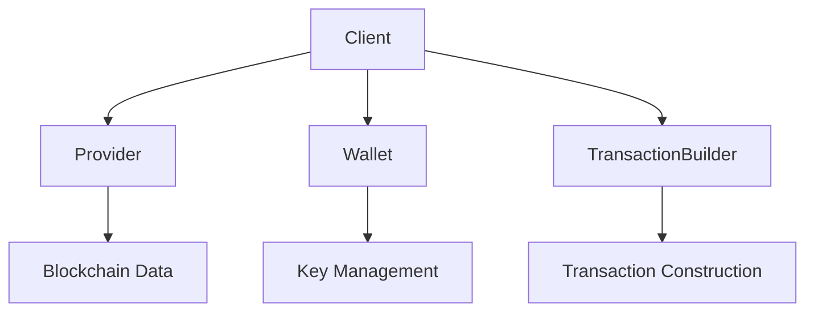
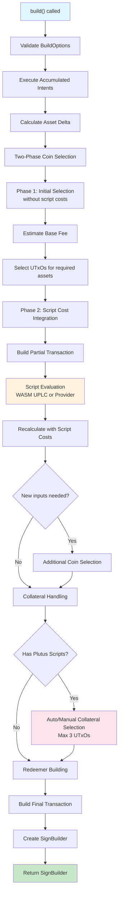
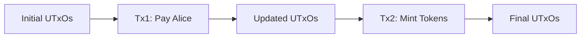

# Client Interface Specification

## Table of Contents

1. [Overview](#overview)
2. [Architecture](#architecture)
3. [Client Configuration](#client-configuration)
4. [Comprehensive Examples](#comprehensive-examples)
5. [Optional Provider & Wallet Design](#optional-provider--wallet-design-benefits)
6. [Best Practices](#best-practices)
7. [Core Interfaces](#core-interfaces)
8. [UTxO-Based Transaction Building](#utxo-based-transaction-building)
9. [Integration Patterns](#integration-patterns)
10. [Migration Guide](#migration-guide)
11. [Future Enhancements](#future-enhancements)
12. [Conclusion](#conclusion)

## Overview

The Evolution SDK Client interface is a unified API that combines blockchain data access (Provider), wallet operations (Wallet), and transaction building capabilities into a single, cohesive interface. Inspired by Viem's design patterns, the Client provides a fluent API for interacting with the Cardano blockchain.

## Architecture

The Client interface serves as the primary entry point for developers, abstracting away the complexity of managing separate Provider and Wallet instances while providing a streamlined API for common blockchain operations.



## Client Configuration

The Evolution SDK Client provides built-in support for popular Cardano providers, making it easy to get started with just an API key:

### Built-in Provider Support

```typescript
// Create clients with built-in provider support and just an API key
const kupmiosClient = createKupmiosClient({
  apiKey: "your-kupmios-api-key",
  network: "mainnet",
  wallet: { type: "seed", mnemonic: "..." }
})

const blockfrostClient = createBlockfrostClient({
  apiKey: "your-blockfrost-project-id", 
  network: "mainnet",
  wallet: { type: "cip30", walletName: "nami" }
})

const koiosClient = createKoiosClient({
  network: "mainnet", // API key optional for public instances
  wallet: { type: "readOnly", address: "addr1..." }
})

const maestroClient = createMaestroClient({
  apiKey: "your-maestro-api-key",
  network: "mainnet",
  wallet: { type: "privateKey", privateKey: "..." }
})
```

## Comprehensive Examples

### SignBuilder Pattern

The `build()` method returns a `SignBuilder` which provides fine-grained control over signing and submission:

```typescript
// Basic SignBuilder usage
const signBuilder = await client
  .newTx()
  .payToAddress({
    address: recipientAddress,
    assets: { coin: 1000000n }
  })
  .build() // Returns SignBuilder

// Access the built transaction
console.log("Transaction CBOR:", signBuilder.transaction.toCbor())
console.log("Estimated cost:", signBuilder.cost)

// Option 1: Sign and submit in one step (most common)
const txHash = await signBuilder.sign().then(submitBuilder => 
  submitBuilder.submit()
)

// Option 2: Separate signing and submission for inspection
const submitBuilder = await signBuilder.sign()
console.log("Signed transaction:", submitBuilder.cbor)
const txHash = await submitBuilder.submit()

// Option 3: Partial signing for multi-sig workflows
const witnessSet = await signBuilder.partialSign()
// Collect additional witnesses from other signers...
const finalSubmitBuilder = await signBuilder.assemble([witnessSet, otherWitness])
const txHash = await finalSubmitBuilder.submit()
```

### 1. Basic Payment Transaction

```typescript
// Create client with seed wallet
const client = createKupmiosClient({
  apiKey: "your-kupmios-api-key",
  network: "mainnet",
  wallet: {
    type: "seed",
    mnemonic: "word1 word2 ... word24",
    accountIndex: 0
  }
})

// Simple payment using SignBuilder
const txHash = await client
  .newTx()
  .payToAddress({
    address: "addr1...",
    assets: { coin: 1_000_000n } // 1 ADA
  })
  .build()
  .then(sb => sb.sign())
  .then(sb => sb.submit())

console.log("Transaction submitted:", txHash)
```

### 2. Multi-Asset Transfer with Metadata

```typescript
// Create client with Blockfrost provider and private key wallet
const client = createBlockfrostClient({
  apiKey: "your-blockfrost-project-id",
  network: "mainnet",
  wallet: {
    type: "privateKey",
    privateKey: "your-private-key"
  }
})

// Build complex transaction
const txBuilder = client.newTx()
  .payToAddress("addr1...", 2_000_000n)
  .payToAddressWithData(
    "addr2...",
    1_500_000n,
    new Map([
      ["asset1policy123", 1000n], // Native tokens
      ["asset2policy456", 500n]
    ]),
    { inline: "Hello from Evolution SDK!" } // Inline datum
  )
  .addMetadata(674, { msg: ["Payment with metadata"] })

const { transaction, fee } = await txBuilder.build()
console.log("Transaction fee:", fee)

const witnessSet = await txBuilder.sign()
const txHash = await txBuilder.submit()
```

### 3. Transaction Chaining with UTxO Management

```typescript
const client = createMaestroClient({
  apiKey: "your-maestro-api-key", 
  network: "mainnet",
  wallet: {
    type: "seed",
    mnemonic: "word1 word2 ... word24"
  }
})

// First transaction
const tx1Result = await client
  .newTx()
  .payToAddress("addr1...", 1_000_000n)
  .chain() // Returns ChainResult with new UTxOs

// Chain second transaction using outputs from first (off-chain)
const tx2Hash = await client
  .newTx(tx1Result.updatedUtxos) // Use UTxOs from first transaction
  .payToAddress("addr2...", 500_000n)
  .build()
  .then(sb => sb.sign())
  .then(sb => sb.submit())
```

### 4. Smart Contract Interaction

```typescript
const client = createKoiosClient({
  network: "mainnet",
  wallet: {
    type: "seed",
    mnemonic: "word1 word2 ... word24"
  }
  // Note: Koios doesn't require API key for basic usage
})

// Interact with Plutus script
const scriptRef = { txHash: "abc123...", outputIndex: 0 }
const datum = { constructor: 0, fields: [42n] }
const redeemer = { constructor: 1, fields: ["unlock"] }

const txHash = await client
  .newTx()
  .payToScript(scriptRef, 5_000_000n, datum)
  .spendFromScript(
    scriptRef,
    { txHash: "def456...", outputIndex: 1 },
    redeemer
  )
  .buildSignAndSubmit()
```

### 5. Token Minting with Native Scripts

```typescript
const client = createBlockfrostClient({
  apiKey: "your-blockfrost-project-id",
  network: "testnet", // Using testnet for minting example
  wallet: {
    type: "seed",
    mnemonic: "word1 word2 ... word24"
  }
})

// Create minting policy (simple signature policy)
const paymentKey = await client.wallet.getPaymentKey()
const nativeScript = {
  type: "sig",
  keyHash: paymentKey.hash()
}

const policyId = calculatePolicyId(nativeScript)
const assetName = "MyToken"

const txHash = await client
  .newTx()
  .mintTokens(
    policyId,
    new Map([[assetName, 1000n]]),
    undefined // No redeemer needed for native scripts
  )
  .attachNativeScript(nativeScript)
  .buildSignAndSubmit()
```

### 6. CIP-30 Browser Wallet Integration

```typescript
// CIP-30 wallets require async initialization
const wallet = await createCIP30Wallet({
  walletName: "nami",
  network: "mainnet"
})

const client = createKupmiosClient({
  apiKey: "your-kupmios-api-key",
  network: "mainnet",
  wallet
})

// Request user permission for each transaction
const txHash = await client
  .newTx()
  .payToAddress("addr1...", 1_000_000n)
  .buildSignAndSubmit() // Will trigger wallet popup for signing
```

### 7. Read-Only Wallet (Compile-Time Safety)

```typescript
// Read-only wallet for blockchain analysis and monitoring
const readOnlyClient = createKupmiosClient({
  apiKey: "your-kupmios-api-key",
  network: "mainnet",
  wallet: {
    type: "readOnly",
    address: "addr1qx2fxv2umyhttkxyxp8x0dlpdt3k6cwng5pxj3jhsydzer3n0d3vllmyqwsx5wktcd8cc3sq835lu7drv2xwl2wywfgs2x5nej"
  }
})

// Supported read-only operations
const utxos = await readOnlyClient.getUtxos(someAddress)
const balance = await readOnlyClient.getWalletUtxos()
const protocolParams = await readOnlyClient.getProtocolParameters()

// Transaction construction for analysis (no signing capability)
const unsignedTx = await readOnlyClient
  .newTx()
  .payToAddress("addr1...", 1_000_000n)
  .build() // Returns { transaction, cost } - no signing capability

// Operations intentionally unavailable (compile-time errors):
// readOnlyClient.signTx(transaction)           // Property 'signTx' does not exist
// readOnlyClient.signMessage(address, payload) // Property 'signMessage' does not exist  
// readOnlyClient.submitTx(transaction)         // Property 'submitTx' does not exist

// Transaction builder has no signing methods:
// readOnlyClient.newTx().payToAddress(addr, value).sign()    // Property 'sign' does not exist
// readOnlyClient.newTx().payToAddress(addr, value).submit()  // Property 'submit' does not exist
// readOnlyClient.newTx().payToAddress(addr, value).buildSignAndSubmit() // Property 'buildSignAndSubmit' does not exist

// Type-safe comparison - these return different types:
const signingClient: SigningClient = createKupmiosClient({
  apiKey: "key",
  network: "mainnet", 
  wallet: { type: "seed", mnemonic: "..." }
})

const readClient: ReadOnlyClient = createKupmiosClient({
  apiKey: "key",
  network: "mainnet",
  wallet: { type: "readOnly", address: "addr1..." }
})

// TypeScript knows at compile-time which operations are available
if (typeof signingClient.signTx === 'function') {
  // This code only compiles for SigningClient
  const signature = await signingClient.signTx(transaction)
}

// Factory function also works with pre-created read-only wallet
const readOnlyWallet = createReadOnlyWallet({
  address: "addr1qx2fxv2umyhttkxyxp8x0dlpdt3k6cwng5pxj3jhsydzer3n0d3vllmyqwsx5wktcd8cc3sq835lu7drv2xwl2wywfgs2x5nej"
})

const analysisClient = createBlockfrostClient({
  apiKey: "your-blockfrost-project-id",
  network: "mainnet",
  wallet: readOnlyWallet // Type system knows this produces ReadOnlyClient
})
```

### Read-Only Wallet Design Benefits

The read-only wallet design provides several key advantages:

1. **Compile-Time Safety**: TypeScript prevents calling signing methods on read-only clients
2. **Zero Private Key Risk**: No possibility of accidental key exposure in monitoring/analysis code
3. **Clear Intent**: Code clearly communicates whether signing is intended or not
4. **Performance**: Read-only wallets are lightweight with no key management overhead
5. **Flexible Integration**: Suitable for portfolio trackers, block explorers, and analytics tools

```typescript
// Example: Portfolio tracking service
class PortfolioTracker {
  private readOnlyClients: Map<string, ReadOnlyClient> = new Map()
  
  async trackAddress(address: string, apiKey: string) {
    // Type system ensures we can't accidentally sign transactions
    const client = createKupmiosClient({
      apiKey,
      network: "mainnet",
      wallet: { type: "readOnly", address }
    })
    
    this.readOnlyClients.set(address, client)
    
  // Available operations only
    const utxos = await client.getWalletUtxos()
    const balance = this.calculateBalance(utxos)
    
  // Unsupported operations (compile-time errors):
    // await client.signTx(transaction)  // Compile error!
    // await client.submitTx(tx)         // Compile error!
    
    return { address, balance, utxos }
  }
  
  private calculateBalance(utxos: ReadonlyArray<UTxO.UTxO>): Value.Value {
    return utxos.reduce((total, utxo) => 
      Value.merge(total, utxo.output.amount), Value.zero())
  }
}
```

### 8. Optional Provider & Wallet (Advanced Compile-Time Safety)

```typescript
// 1. Provider-only client - blockchain data access without wallet operations
const providerOnlyClient = createKupmiosClient({
  apiKey: "your-kupmios-api-key",
  network: "mainnet"
  // wallet: undefined (explicitly or implicitly)
})

// Provider-only operations
const protocolParams = await providerOnlyClient.getProtocolParameters()
const utxos = await providerOnlyClient.getUtxos("addr1...")
const delegation = await providerOnlyClient.getDelegation(rewardAddress)

// Operations unavailable without wallet (compile-time errors):
// providerOnlyClient.address()           // Property 'address' does not exist
// providerOnlyClient.getWalletUtxos()    // Property 'getWalletUtxos' does not exist
// providerOnlyClient.signTx(tx)          // Property 'signTx' does not exist
// providerOnlyClient.newTx()             // Property 'newTx' does not exist

// 2. Wallet-only client with signing - uses default provider
const walletOnlyClient = createClient({
  network: "mainnet",
  wallet: {
    type: "seed",
    mnemonic: "word1 word2 ... word24"
  }
  // provider: undefined (uses default)
})

// Wallet-only operations (signing enabled)
const walletAddress = await walletOnlyClient.address()
const walletUtxos = await walletOnlyClient.getWalletUtxos()
const signature = await walletOnlyClient.signTx(transaction)
const txHash = await walletOnlyClient.submitTx(transaction)

// Transaction construction using wallet UTxOs
const signedTx = await walletOnlyClient
  .newTx() // Uses wallet's UTxOs automatically
  .payToAddress("addr1...", 1_000_000n)
  .buildSignAndSubmit()

// Operations requiring provider (compile-time errors):
// walletOnlyClient.getProtocolParameters() // Property 'getProtocolParameters' does not exist
// walletOnlyClient.getUtxos(address)       // Property 'getUtxos' does not exist
// walletOnlyClient.getDelegation(addr)     // Property 'getDelegation' does not exist

// 3. Wallet-only client with read-only - uses default provider
const readOnlyWalletOnlyClient = createClient({
  network: "mainnet",
  wallet: {
    type: "readOnly",
    address: "addr1..."
  }
  // provider: undefined (uses default)
})

// Read-only wallet operations
const readOnlyAddress = await readOnlyWalletOnlyClient.address()
const readOnlyUtxos = await readOnlyWalletOnlyClient.getWalletUtxos()

// Transaction construction for analysis (no signing)
const unsignedTx = await readOnlyWalletOnlyClient
  .newTx()
  .payToAddress("addr1...", 1_000_000n)
  .build() // Can only build, not sign or submit

// Operations requiring signing (compile-time errors):
// readOnlyWalletOnlyClient.signTx(tx)        // Property 'signTx' does not exist
// readOnlyWalletOnlyClient.submitTx(tx)      // Property 'submitTx' does not exist
// readOnlyWalletOnlyClient.getUtxos(address) // Property 'getUtxos' does not exist

// 4. Minimal client - neither provider nor wallet
const minimalClient = createClient({
  network: "mainnet"
  // provider: undefined, wallet: undefined
})

// Most operations unavailable at this stage (compile-time errors):
// minimalClient.getUtxos(address)     // Property 'getUtxos' does not exist
// minimalClient.address()             // Property 'address' does not exist
// minimalClient.newTx()               // Property 'newTx' does not exist

// Services can be attached later with type safety
const attachedProviderClient = minimalClient.attachProvider(kupmiosProvider)
// Now has provider operations but still no wallet operations

// Cannot attach wallet without provider (wallet requires provider)
// minimalClient.attachWallet(seedWallet)  // This method doesn't exist

const fullClient = minimalClient.attach(kupmiosProvider, seedWallet)
// Now has both provider and wallet operations

// 5. One Provider, Multiple Wallets Pattern
// Shared provider across multiple wallet clients
const sharedProvider = createKupmiosProvider({
  apiKey: "your-kupmios-api-key"
})

// Create provider-only client
const providerClient = createClient({
  network: "mainnet",
  provider: { type: "custom", provider: sharedProvider }
})

// Attach different wallets to the same provider
const userWallet1 = createSeedWallet({ mnemonic: "user1 mnemonic..." })
const userWallet2 = createSeedWallet({ mnemonic: "user2 mnemonic..." })
const readOnlyWallet = createReadOnlyWallet({ address: "addr1..." })

const client1 = providerClient.attachWallet(userWallet1) // SigningClient
const client2 = providerClient.attachWallet(userWallet2) // SigningClient  
const client3 = providerClient.attachWallet(readOnlyWallet) // ReadOnlyClient

// All clients share the same provider instance and connection
// Appropriate for services managing multiple user wallets

// Example: Multi-user transaction service
class MultiUserTransactionService {
  private providerClient: ProviderOnlyClient
  private userClients: Map<string, SigningClient> = new Map()

  constructor(apiKey: string) {
    this.providerClient = createKupmiosClient({
      apiKey,
      network: "mainnet"
      // No wallet - provider only
    })
  }

  addUser(userId: string, mnemonic: string) {
    const wallet = createSeedWallet({ mnemonic })
    const client = this.providerClient.attachWallet(wallet)
    this.userClients.set(userId, client)
  }

  async sendPayment(fromUserId: string, toAddress: string, amount: bigint) {
    const client = this.userClients.get(fromUserId)
    if (!client) throw new Error("User not found")
    
    return await client
      .newTx()
      .payToAddress(toAddress, amount)
      .buildSignAndSubmit()
  }

  // All users share the same provider connection
}

// 6. Type-safe progressive enhancement
function handleClientByCapability(client: unknown) {
  if ('getUtxos' in client && 'signTx' in client) {
    // TypeScript knows this is a SigningClient
    const signingClient = client as SigningClient
    return signingClient.newTx().payToAddress(addr, value).buildSignAndSubmit()
  }
  
  if ('getUtxos' in client && !('signTx' in client)) {
    // TypeScript knows this is a ProviderOnlyClient or ReadOnlyClient
    const readClient = client as ProviderOnlyClient | ReadOnlyClient
    return readClient.getUtxos(address)
  }
  
  // Minimal client (wallet-only is invalid - wallets need providers)
  const minimal = client as MinimalClient
  return minimal.network // Only basic properties available
}

// 4. Factory functions with different provider/wallet combinations
const combinations = {
  // Full combinations
  full: createKupmiosClient({ 
    apiKey: "key", 
    network: "mainnet", 
    wallet: { type: "seed", mnemonic: "..." } 
  }), // Returns SigningClient
  
  readOnly: createKupmiosClient({ 
    apiKey: "key", 
    network: "mainnet", 
    wallet: { type: "readOnly", address: "addr1..." } 
  }), // Returns ReadOnlyClient
  
  providerOnly: createKupmiosClient({ 
    apiKey: "key", 
    network: "mainnet" 
  }), // Returns ProviderOnlyClient
  
  minimal: createClient({ 
    network: "mainnet" 
  }) // Returns MinimalClient
}

// Note: Wallet-only combinations are invalid (wallets need providers)
// Each has different compile-time capabilities!
```

### Optional Provider & Wallet Design Benefits

The optional provider and wallet design provides unprecedented compile-time safety and flexibility:

#### 🔒 **Granular Security Model**
- **Provider-only**: Zero wallet risk - impossible to accidentally sign transactions
- **Wallet-only**: Limited scope - can't access arbitrary blockchain data
- **Read-only wallet**: Zero private key exposure even with wallet operations
- **Minimal client**: Zero external dependencies until explicitly attached

#### 🎯 **Compile-Time Guarantees**
- **Method Availability**: TypeScript prevents calling unavailable methods
- **Progressive Enhancement**: Start minimal, add capabilities as needed
- **Clear Intent**: Code structure shows exactly what operations are intended
- **Zero Runtime Errors**: All capability checks happen at compile time

#### 🛠️ **Flexible Architecture**
```typescript
// Service-specific clients for microservices
class AnalyticsService {
  // Only needs provider access
  private client: ProviderOnlyClient
  
  constructor(apiKey: string) {
    this.client = createKupmiosClient({ 
      apiKey, 
      network: "mainnet" 
    }) // TypeScript ensures no wallet operations
  }
  
  async analyzeAddress(address: string) {
  // Access to blockchain data
    const utxos = await this.client.getUtxos(address)
    
  // Restricted operations prevented at compile time
    // this.client.signTx(tx)  // Compile error!
    
    return this.processUtxos(utxos)
  }
}

class SigningService {
  // Needs both provider and wallet (wallet requires provider)
  private client: SigningClient
  
  constructor(mnemonic: string, apiKey: string) {
    this.client = createClient({
      network: "mainnet",
      provider: { type: "kupmios", apiKey },
      wallet: { type: "seed", mnemonic }
    }) // Wallet requires provider for blockchain access
  }
  
  async signTransaction(tx: Transaction.Transaction) {
  // Supports signing
    return await this.client.signTx(tx)
    
  // Also provides blockchain data access
    return await this.client.getUtxos(await this.client.address())
  }
}

class MinimalService {
  private client: MinimalClient
  
  constructor(network: NetworkId) {
    this.client = createClient({ network })
    // No external dependencies yet
  }
  
  // Services can be attached based on runtime configuration
  configureProvider(config: ProviderConfig) {
    return this.client.attachProvider(createProvider(config))
  }
  
  configureWallet(config: WalletConfig) {
    return this.client.attachWallet(createWallet(config))
  }
}
```

#### 📊 **Use Cases Enabled**

| Client Type | Provider | Wallet | Use Cases |
|-------------|----------|---------|-----------|
| `SigningClient` | Yes | Yes (Signing) | General DApp functionality and wallet-enabled applications |
| `ReadOnlyClient` | Yes | Yes (Read-only) | Portfolio tracking and transaction analysis |
| `ProviderOnlyClient` | Yes | No | Block explorers, analytics services, monitoring |
| `MinimalClient` | No | No | Configuration bootstrapping and dependency injection |

> **Note**: Wallet-only combinations are invalid because wallet operations require blockchain access through a provider.

## Best Practices

### Provider Selection
- **Kupmios**: Local nodes and high-performance applications
- **Blockfrost**: Production applications with reliable infrastructure  
- **Koios**: Community-driven applications and testing
- **Maestro**: Enterprise applications requiring advanced features

### Security Guidelines
- Use read-only wallets for portfolio tracking and analysis
- Implement provider-only clients for data-intensive services
- Keep wallet operations in isolated, minimal services
- Use minimal clients for configuration and dependency injection

### Progressive Enhancement Pattern
```typescript
// Start minimal and add capabilities as needed
const client = createClient({ network: "mainnet" })

// Add provider when blockchain access is needed
const withProvider = client.attachProvider(createBlockfrostProvider({
  projectId: "your-project-id"
}))

// Add wallet when signing is required
const withWallet = withProvider.attachWallet(createCIP30Wallet("nami"))

// Full client with all capabilities
const txHash = await withWallet
  .newTx()
  .payToAddress(address, Value.lovelace(2_000_000n))
  .buildSignAndSubmit()
```

### Factory Function Usage
```typescript
const client = createKupmiosClient({
  apiKey: "your-kupmios-api-key",
  network: "mainnet",
  wallet: {
    type: "seed",
    mnemonic: "word1 word2 ... word24"
  }
})

// Or with pre-created wallet
const wallet = createSeedWallet({
  mnemonic: "word1 word2 ... word24"
})
const client = createKupmiosClient({ apiKey: "...", network: "mainnet", wallet })

// Initialize and use
const utxos = await client.getUtxos(address) // First network call initializes provider
const txHash = await client.newTx().payToAddress(addr, value).buildSignAndSubmit()
```

### Manual Configuration

```typescript
// Manual configuration (for advanced use cases)
const provider = createKupmiosProvider({ apiKey: "your-api-key" })
const wallet = createSeedWallet({ 
  mnemonic: "word1 word2 ... word24"
})

const client = createClient({
  provider,
  wallet,
  network: "mainnet",
  options: {
    coinSelection: "largest-first",
    feeStrategy: "balanced"
  }
})

// Create client with Blockfrost provider and CIP-30 wallet  
const client = createClient({
  provider: {
    type: "blockfrost",
    apiKey: "your-blockfrost-project-id"
  },
  wallet: {
    type: "cip30",
    walletName: "nami" // "nami", "eternl", "flint", "typhon", etc.
  },
  network: "mainnet"
})

// Create client with Koios provider and private key wallet
const client = createClient({
  provider: {
    type: "koios", 
    apiKey: "your-koios-api-key", // Optional for public instances
    baseUrl: "https://api.koios.rest/api/v1" // Optional custom endpoint
  },
  wallet: {
    type: "privateKey",
    privateKey: "your-hex-encoded-private-key"
  },
  network: "mainnet"
})

// Create client with Maestro provider and seed wallet
const client = createClient({
  provider: {
    type: "maestro",
    apiKey: "your-maestro-api-key"
  },
  wallet: {
    type: "seed",
    mnemonic: "word1 word2 ... word24",
    accountIndex: 0
  },
  network: "mainnet"
})
```

### Wallet Configuration Examples

```typescript
// Create wallets separately and use with any provider
const seedWallet = createSeedWallet({
  mnemonic: "your twenty four word mnemonic phrase here...",
  accountIndex: 0 // Optional, defaults to 0
})

const privateKeyWallet = createPrivateKeyWallet({
  privateKey: "your-hex-encoded-private-key"
})

// CIP-30 wallets require async initialization
const cip30Wallet = await createCIP30Wallet({
  walletName: "nami"
})

// Read-only wallets for monitoring and analysis
const readOnlyWallet = createReadOnlyWallet({
  address: "addr1qx2fxv2umyhttkxyxp8x0dlpdt3k6cwng5pxj3jhsydzer3n0d3vllmyqwsx5wktcd8cc3sq835lu7drv2xwl2wywfgs2x5nej"
})

// Use any wallet with any provider
const client = createClient({
  provider: { type: "kupmios", apiKey: "..." },
  wallet: seedWallet, // or privateKeyWallet, cip30Wallet, readOnlyWallet
  network: "mainnet"
})

// Or use wallet config directly (recommended for most cases)
const client = createClient({
  provider: { type: "blockfrost", apiKey: "..." },
  wallet: {
    type: "seed", 
    mnemonic: "your mnemonic..."
  },
  network: "mainnet"
})
```

### Advanced Provider Configuration

```typescript
// Provider with custom configuration
const client = createClient({
  provider: {
    type: "kupmios",
    apiKey: "your-api-key",
    config: {
      timeout: 30000,          // Request timeout in ms
      retries: 3,              // Number of retries
      rateLimit: 100,          // Requests per second
      baseUrl: "https://custom-kupmios-endpoint.com" // Custom endpoint
    }
  },
  wallet: myWallet,
  network: "mainnet"
})

// Multiple providers with automatic failover
const client = createClient({
  provider: {
    type: "multi",
    providers: [
      {
        type: "kupmios",
        apiKey: "primary-key",
        priority: 1
      },
      {
        type: "blockfrost", 
        apiKey: "fallback-key",
        priority: 2
      }
    ],
    failoverStrategy: "round-robin" // or "priority", "random"
  },
  wallet: myWallet,
  network: "mainnet"
})
```

### Provider Configuration Types

```typescript
// Wallet requires provider - can't have wallet operations without blockchain access
export type ClientConfig = 
  | { 
      readonly network: NetworkId; 
      readonly provider: ProviderConfig; 
      readonly wallet: WalletConfig | Wallet;
      readonly options?: ClientOptions;
    }    // Provider + Wallet
  | { 
      readonly network: NetworkId; 
      readonly provider: ProviderConfig; 
      readonly wallet?: undefined;
      readonly options?: ClientOptions;
    }      // Provider only  
  | { 
      readonly network: NetworkId; 
      readonly provider?: undefined; 
      readonly wallet?: undefined;
      readonly options?: ClientOptions;
    }          // Minimal (neither)

export type ProviderConfig = 
  | KupmiosConfig
  | BlockfrostConfig  
  | KoiosConfig
  | MaestroConfig
  | MultiProviderConfig
  | CustomProviderConfig

export type WalletConfig = 
  | SeedWalletConfig
  | PrivateKeyWalletConfig
  | CIP30WalletConfig
  | ReadOnlyWalletConfig
  | CustomWalletConfig

export interface KupmiosConfig {
  readonly type: "kupmios"
  readonly apiKey: string
  readonly config?: ProviderOptions
}

export interface BlockfrostConfig {
  readonly type: "blockfrost"
  readonly apiKey: string // Project ID
  readonly config?: ProviderOptions
}

export interface KoiosConfig {
  readonly type: "koios"
  readonly apiKey?: string // Optional for public instances
  readonly baseUrl?: string // Custom endpoint
  readonly config?: ProviderOptions
}

export interface MaestroConfig {
  readonly type: "maestro"
  readonly apiKey: string
  readonly config?: ProviderOptions
}

export interface MultiProviderConfig {
  readonly type: "multi"
  readonly providers: ReadonlyArray<ProviderConfig & { priority?: number }>
  readonly failoverStrategy: "round-robin" | "priority" | "random"
  readonly healthCheck?: boolean
}

export interface CustomProviderConfig {
  readonly type: "custom"
  readonly provider: Provider // User-provided provider instance
}

export interface ProviderOptions {
  readonly timeout?: number        // Request timeout in milliseconds
  readonly retries?: number        // Number of retries for failed requests
  readonly rateLimit?: number      // Requests per second limit
  readonly baseUrl?: string        // Custom base URL
  readonly headers?: Record<string, string> // Additional headers
}

// Wallet Configuration Types
export interface SeedWalletConfig {
  readonly type: "seed"
  readonly mnemonic: string
  readonly accountIndex?: number    // Default: 0
  readonly addressIndex?: number    // Default: 0
  readonly passphrase?: string     // Optional passphrase
}

export interface PrivateKeyWalletConfig {
  readonly type: "privateKey"
  readonly privateKey: string      // Hex-encoded private key
}

export interface CIP30WalletConfig {
  readonly type: "cip30"
  readonly walletName: string      // e.g., "nami", "eternl", "flint", "typhon"
}

export interface ReadOnlyWalletConfig {
  readonly type: "readOnly"
  readonly address: string         // Base58 or Bech32 encoded address
}

export interface CustomWalletConfig {
  readonly type: "custom"
  readonly wallet: Wallet         // User-provided wallet instance
}

export type NetworkId = "mainnet" | "testnet" | "preview" | "preprod"

export interface ClientOptions {
  readonly caching?: CacheOptions
  readonly logging?: LoggingOptions
  readonly metrics?: MetricsOptions
}
```

## Core Interfaces

### Client Factory Function

```typescript
// Main client factory function with sophisticated type-safe overloads
// Based on provider and wallet presence/absence

// Full client - both provider and signing wallet
export function createClient(config: { network: NetworkId, provider: ProviderConfig, wallet: SeedWalletConfig | PrivateKeyWalletConfig | CIP30WalletConfig | SigningWallet, options?: ClientOptions }): SigningClient

// Read-only client - provider with read-only wallet
export function createClient(config: { network: NetworkId, provider: ProviderConfig, wallet: ReadOnlyWalletConfig | ReadOnlyWallet, options?: ClientOptions }): ReadOnlyClient

// Provider-only client - no wallet operations available
export function createClient(config: { network: NetworkId, provider: ProviderConfig, wallet?: undefined, options?: ClientOptions }): ProviderOnlyClient

// Minimal client - neither provider nor wallet specified (wallet-only combinations are invalid)
export function createClient(config: { network: NetworkId, provider?: undefined, wallet?: undefined, options?: ClientOptions }): MinimalClient
```

```typescript

// Fallback for any other combinations
export function createClient(config: ClientConfig): Client

// Alternative factory functions for specific providers (these require both provider and wallet)
export function createKupmiosClient(config: { apiKey: string, network: NetworkId, wallet?: ReadOnlyWalletConfig | ReadOnlyWallet, options?: ClientOptions }): ReadOnlyClient
export function createKupmiosClient(config: { apiKey: string, network: NetworkId, wallet?: SeedWalletConfig | PrivateKeyWalletConfig | CIP30WalletConfig | SigningWallet, options?: ClientOptions }): SigningClient
export function createKupmiosClient(config: { apiKey: string, network: NetworkId, wallet?: undefined, options?: ClientOptions }): ProviderOnlyClient
export function createKupmiosClient(config: { apiKey: string, network: NetworkId, wallet?: WalletConfig | Wallet, options?: ClientOptions }): Client // Fallback

export function createBlockfrostClient(config: { apiKey: string, network: NetworkId, wallet?: ReadOnlyWalletConfig | ReadOnlyWallet, options?: ClientOptions }): ReadOnlyClient
export function createBlockfrostClient(config: { apiKey: string, network: NetworkId, wallet?: SeedWalletConfig | PrivateKeyWalletConfig | CIP30WalletConfig | SigningWallet, options?: ClientOptions }): SigningClient
export function createBlockfrostClient(config: { apiKey: string, network: NetworkId, wallet?: undefined, options?: ClientOptions }): ProviderOnlyClient
export function createBlockfrostClient(config: { apiKey: string, network: NetworkId, wallet?: WalletConfig | Wallet, options?: ClientOptions }): Client // Fallback

export function createKoiosClient(config: { apiKey?: string, network: NetworkId, wallet?: ReadOnlyWalletConfig | ReadOnlyWallet, baseUrl?: string, options?: ClientOptions }): ReadOnlyClient
export function createKoiosClient(config: { apiKey?: string, network: NetworkId, wallet?: SeedWalletConfig | PrivateKeyWalletConfig | CIP30WalletConfig | SigningWallet, baseUrl?: string, options?: ClientOptions }): SigningClient
export function createKoiosClient(config: { apiKey?: string, network: NetworkId, wallet?: undefined, baseUrl?: string, options?: ClientOptions }): ProviderOnlyClient
export function createKoiosClient(config: { apiKey?: string, network: NetworkId, wallet?: WalletConfig | Wallet, baseUrl?: string, options?: ClientOptions }): Client // Fallback

export function createMaestroClient(config: { apiKey: string, network: NetworkId, wallet?: ReadOnlyWalletConfig | ReadOnlyWallet, options?: ClientOptions }): ReadOnlyClient
export function createMaestroClient(config: { apiKey: string, network: NetworkId, wallet?: SeedWalletConfig | PrivateKeyWalletConfig | CIP30WalletConfig | SigningWallet, options?: ClientOptions }): SigningClient
export function createMaestroClient(config: { apiKey: string, network: NetworkId, wallet?: undefined, options?: ClientOptions }): ProviderOnlyClient
export function createMaestroClient(config: { apiKey: string, network: NetworkId, wallet?: WalletConfig | Wallet, options?: ClientOptions }): Client // Fallback

// Wallet factory functions
export const createSeedWallet: (config: {
  mnemonic: string
  accountIndex?: number
  addressIndex?: number
  passphrase?: string
}) => Wallet

export const createPrivateKeyWallet: (config: {
  privateKey: string
}) => Wallet

export const createCIP30Wallet: (config: {
  walletName: string
}) => Promise<Wallet> // CIP-30 requires async initialization

export const createReadOnlyWallet: (config: {
  address: string
}) => ReadOnlyWallet
```

**Design Note: Synchronous Construction**

The client factory functions are synchronous - they return a `Client` instance immediately rather than a `Promise<Client>`. Provider initialization and network connections are handled lazily on first use, ensuring fast client construction while maintaining a clean, non-async API.

## Type-Safe Read-Only Wallets

The Evolution SDK provides compile-time safety for read-only wallets. When using a read-only wallet, the type system prevents signing operations at compile time:

```typescript
// Read-only wallet interface (subset of Wallet)
export interface ReadOnlyWallet {
  readonly address: Effect.Effect<Address.Address, WalletError>
  readonly rewardAddress: Effect.Effect<RewardAddress.RewardAddress | null, WalletError>
  readonly getWalletUtxos: Effect.Effect<ReadonlyArray<UTxO.UTxO>, WalletError>
  readonly getWalletDelegation: Effect.Effect<Delegation.Delegation, WalletError>
  // Note: NO signTx, signMessage, or submitTx methods
}

// Full wallet interface with signing capabilities
export interface SigningWallet extends ReadOnlyWallet {
  readonly signTx: (tx: Transaction.Transaction, virtualUtxos?: ReadonlyArray<UTxO.UTxO>) => Effect.Effect<TransactionWitnessSet.TransactionWitnessSet, WalletError>
  readonly signMessage: (address: Address.Address | RewardAddress.RewardAddress, payload: Payload) => Effect.Effect<SignedMessage, WalletError>
  readonly submitTx: (tx: Transaction.Transaction | string) => Effect.Effect<string, WalletError>
}

// Type alias for compatibility
export type Wallet = SigningWallet

// Type-safe client interfaces based on wallet capability
export interface ReadOnlyClient {
  // All provider operations (read-only blockchain access)
  readonly getProtocolParameters: () => Promise<ProtocolParameters.ProtocolParameters>
  readonly getUtxos: (addressOrCredential: Address.Address | { hash: string }) => Promise<Array<UTxO>>
  readonly getUtxosWithUnit: (addressOrCredential: Address.Address | { hash: string }, unit: string) => Promise<Array<UTxO>>
  readonly getUtxoByUnit: (unit: string) => Promise<UTxO>
  readonly getUtxosByOutRef: (outRefs: ReadonlyArray<OutRef.OutRef>) => Promise<Array<UTxO>>
  readonly getDelegation: (rewardAddress: RewardAddress.RewardAddress) => Promise<Delegation.Delegation>
  readonly getDatum: (datumHash: string) => Promise<string>
  readonly awaitTx: (txHash: string, checkInterval?: number) => Promise<boolean>
  readonly evaluateTx: (tx: string, additionalUTxOs?: Array<UTxO>) => Promise<Array<EvalRedeemer>>

  // Read-only wallet operations
  readonly address: () => Promise<Address.Address>
  readonly rewardAddress: () => Promise<RewardAddress.RewardAddress | null>
  readonly getWalletUtxos: () => Promise<ReadonlyArray<UTxO.UTxO>>
  readonly getWalletDelegation: () => Promise<Delegation.Delegation>

  // Build-only transaction operations (no signing)
  readonly newTx: (utxos?: ReadonlyArray<UTxO.UTxO>) => ReadOnlyTransactionBuilder

  // Effect namespace
  readonly Effect: ReadOnlyClientEffect

  // Underlying services
  readonly provider: Provider
  readonly wallet: ReadOnlyWallet
}

export interface SigningClient extends ReadOnlyClient {
  // Additional signing operations
  readonly signTx: (tx: Transaction.Transaction, virtualUtxos?: ReadonlyArray<UTxO.UTxO>) => Promise<TransactionWitnessSet.TransactionWitnessSet>
  readonly signMessage: (address: Address.Address | RewardAddress.RewardAddress, payload: Payload) => Promise<SignedMessage>
  readonly submitTx: (tx: Transaction.Transaction | string) => Promise<string>

  // Full transaction operations (with signing)
  readonly newTx: (utxos?: ReadonlyArray<UTxO.UTxO>) => TransactionBuilder

  // Override with signing capabilities
  readonly Effect: ClientEffect
  readonly wallet: SigningWallet
  readonly templates: TransactionTemplates
}

// Main Client type (backward compatibility)
export type Client = SigningClient

// Provider-only client (no wallet operations)
export interface ProviderOnlyClient {
  // All provider operations (blockchain data access)
  readonly getProtocolParameters: () => Promise<ProtocolParameters.ProtocolParameters>
  readonly getUtxos: (addressOrCredential: Address.Address | { hash: string }) => Promise<Array<UTxO>>
  readonly getUtxosWithUnit: (addressOrCredential: Address.Address | { hash: string }, unit: string) => Promise<Array<UTxO>>
  readonly getUtxoByUnit: (unit: string) => Promise<UTxO>
  readonly getUtxosByOutRef: (outRefs: ReadonlyArray<OutRef.OutRef>) => Promise<Array<UTxO>>
  readonly getDelegation: (rewardAddress: RewardAddress.RewardAddress) => Promise<Delegation.Delegation>
  readonly getDatum: (datumHash: string) => Promise<string>
  readonly awaitTx: (txHash: string, checkInterval?: number) => Promise<boolean>
  readonly evaluateTx: (tx: string, additionalUTxOs?: Array<UTxO>) => Promise<Array<EvalRedeemer>>

  // NO wallet operations available - these don't exist at compile time:
  // address, rewardAddress, getWalletUtxos, getWalletDelegation, signTx, signMessage, submitTx

  // Can't create transactions without a wallet
  // NO newTx method

  // Can attach wallets to create full clients (provider + wallet)
  readonly attachWallet: (wallet: SigningWallet) => SigningClient
  readonly attachWallet: (wallet: ReadOnlyWallet) => ReadOnlyClient

  // Effect namespace (provider only)
  readonly Effect: ProviderOnlyClientEffect

  // Only provider service available
  readonly provider: Provider
  // NO wallet property
}

// Minimal client (neither provider nor wallet specified)
export interface MinimalClient {
  // NO provider operations available
  // NO wallet operations available
  // NO transaction operations available

  // Only configuration and utility methods
  readonly network: NetworkId
  readonly options?: ClientOptions

  // Can attach provider only (wallet requires provider)
  readonly attachProvider: (provider: Provider) => ProviderOnlyClient
  
  // Can attach both provider and wallet together (wallet requires provider)
  readonly attach: (provider: Provider, wallet: SigningWallet) => SigningClient
  readonly attach: (provider: Provider, wallet: ReadOnlyWallet) => ReadOnlyClient

  // Effect namespace (minimal)
  readonly Effect: MinimalClientEffect
}

// Read-only transaction builder (no signing methods)
export interface ReadOnlyTransactionBuilder {
  // All the build methods but NO sign/submit methods
  readonly payToAddress: (address: Address.Address, value: Value.Value) => ReadOnlyTransactionBuilder
  readonly payToAddressWithData: (address: Address.Address, value: Value.Value, data: Datum) => ReadOnlyTransactionBuilder
  readonly payToScript: (scriptRef: ScriptRef, value: Value.Value, datum: Datum, redeemer?: Redeemer.Redeemer) => ReadOnlyTransactionBuilder
  readonly spendFromScript: (scriptRef: ScriptRef, utxo: UTxO.UTxO, redeemer: Redeemer.Redeemer) => ReadOnlyTransactionBuilder
  readonly mintTokens: (params: MintTokensParams) => ReadOnlyTransactionBuilder
  readonly burnTokens: (policyId: PolicyId.PolicyId, assets: Map<AssetName.AssetName, bigint>, redeemer?: Redeemer.Redeemer) => ReadOnlyTransactionBuilder
  readonly attachScript: (script: PlutusScript.PlutusScript) => ReadOnlyTransactionBuilder
  readonly attachNativeScript: (script: NativeScript.NativeScript) => ReadOnlyTransactionBuilder
  readonly attachScriptRef: (scriptRef: ScriptRef) => ReadOnlyTransactionBuilder
  readonly collectFrom: (params: CollectFromParams) => ReadOnlyTransactionBuilder
  readonly addSigner: (keyHash: string) => ReadOnlyTransactionBuilder
  readonly setValidityInterval: (start?: Slot, end?: Slot) => ReadOnlyTransactionBuilder
  readonly addMetadata: (label: MetadataLabel, metadata: TransactionMetadatum.TransactionMetadatum) => ReadOnlyTransactionBuilder
  readonly addCertificate: (cert: Certificate.Certificate) => ReadOnlyTransactionBuilder
  readonly withdraw: (rewardAddress: RewardAddress.RewardAddress, amount: Coin.Coin, redeemer?: Redeemer.Redeemer) => ReadOnlyTransactionBuilder

  // Build method returns transaction but no signing capabilities
  readonly build: (options?: BuildOptions) => Promise<{ transaction: Transaction.Transaction, cost: TransactionEstimate }>

  // Effect version
  readonly Effect: ReadOnlyTransactionBuilderEffect
}

export interface ReadOnlyTransactionBuilderEffect {
  // Same methods as ReadOnlyTransactionBuilder but returning Effect types
  readonly build: (options?: BuildOptions) => Effect.Effect<{ transaction: Transaction.Transaction, cost: TransactionEstimate }, TransactionBuilderError>
  // ... other methods with Effect return types
}

export interface ReadOnlyClientEffect {
  // Same as ClientEffect but without signing operations
  readonly getProtocolParameters: Effect.Effect<ProtocolParameters.ProtocolParameters, ProviderError>
  readonly getUtxos: (addressOrCredential: Address.Address | { hash: string }) => Effect.Effect<Array<UTxO>, ProviderError>
  // ... other read-only operations
  readonly newTx: (utxos?: ReadonlyArray<UTxO.UTxO>) => ReadOnlyTransactionBuilderEffect
}

// Provider-only Effect interface
export interface ProviderOnlyClientEffect {
  // Only provider operations, no wallet operations
  readonly getProtocolParameters: Effect.Effect<ProtocolParameters.ProtocolParameters, ProviderError>
  readonly getUtxos: (addressOrCredential: Address.Address | { hash: string }) => Effect.Effect<Array<UTxO>, ProviderError>
  readonly getUtxosWithUnit: (addressOrCredential: Address.Address | { hash: string }, unit: string) => Effect.Effect<Array<UTxO>, ProviderError>
  readonly getUtxoByUnit: (unit: string) => Effect.Effect<UTxO, ProviderError>
  readonly getUtxosByOutRef: (outRefs: ReadonlyArray<OutRef.OutRef>) => Effect.Effect<Array<UTxO>, ProviderError>
  readonly getDelegation: (rewardAddress: RewardAddress.RewardAddress) => Effect.Effect<Delegation.Delegation, ProviderError>
  readonly getDatum: (datumHash: string) => Effect.Effect<string, ProviderError>
  readonly awaitTx: (txHash: string, checkInterval?: number) => Effect.Effect<boolean, ProviderError>
  readonly evaluateTx: (tx: string, additionalUTxOs?: Array<UTxO>) => Effect.Effect<Array<EvalRedeemer>, ProviderError>
  // NO wallet operations, NO newTx

  // Can attach wallets to create full clients (provider + wallet)
  readonly attachWallet: (wallet: SigningWallet) => ClientEffect
  readonly attachWallet: (wallet: ReadOnlyWallet) => ReadOnlyClientEffect
}

// Minimal Effect interface (wallet requires provider)
export interface MinimalClientEffect {
  // Only provider attachment (can work standalone)
  readonly attachProvider: (provider: Provider) => ProviderOnlyClientEffect
  
  // Attach both provider and wallet together (wallet requires provider)
  readonly attach: (provider: Provider, wallet: SigningWallet) => ClientEffect
  readonly attach: (provider: Provider, wallet: ReadOnlyWallet) => ReadOnlyClientEffect
}

```typescript
// Client construction is immediate and synchronous
const client = createKupmiosClient({ apiKey: "...", network: "mainnet", wallet })

// Network operations are async when needed
const utxos = await client.getUtxos(address) // First network call initializes provider
const txHash = await client.newTx().payToAddress(addr, value).buildSignAndSubmit()
```

### Client Interface

```typescript
export interface Client extends EffectToPromiseAPI<ClientEffect> {
  // Effect namespace for Effect-based alternatives
  readonly Effect: ClientEffect
  
  // Underlying services
  readonly provider: Provider
  readonly wallet: Wallet
  
  // Transaction templates for common operations
  readonly templates: TransactionTemplates
}

export interface ClientEffect {
  // Provider operations (blockchain data access)
  readonly getProtocolParameters: Effect.Effect<ProtocolParameters.ProtocolParameters, ProviderError>
  readonly getUtxos: (addressOrCredential: Address.Address | { hash: string }) => Effect.Effect<Array<UTxO>, ProviderError>
  readonly getUtxosWithUnit: (addressOrCredential: Address.Address | { hash: string }, unit: string) => Effect.Effect<Array<UTxO>, ProviderError>
  readonly getUtxoByUnit: (unit: string) => Effect.Effect<UTxO, ProviderError>
  readonly getUtxosByOutRef: (outRefs: ReadonlyArray<OutRef.OutRef>) => Effect.Effect<Array<UTxO>, ProviderError>
  readonly getDelegation: (rewardAddress: RewardAddress.RewardAddress) => Effect.Effect<Delegation.Delegation, ProviderError>
  readonly getDatum: (datumHash: string) => Effect.Effect<string, ProviderError>
  readonly awaitTx: (txHash: string, checkInterval?: number) => Effect.Effect<boolean, ProviderError>
  readonly evaluateTx: (tx: string, additionalUTxOs?: Array<UTxO>) => Effect.Effect<Array<EvalRedeemer>, ProviderError>
  
  // Wallet operations (account management and signing)
  readonly address: Effect.Effect<Address.Address, WalletError>
  readonly rewardAddress: Effect.Effect<RewardAddress.RewardAddress | null, WalletError>
  readonly getWalletUtxos: Effect.Effect<ReadonlyArray<UTxO.UTxO>, WalletError>
  readonly getWalletDelegation: Effect.Effect<Delegation.Delegation, WalletError>
  readonly signTx: (tx: Transaction.Transaction, virtualUtxos?: ReadonlyArray<UTxO.UTxO>) => Effect.Effect<TransactionWitnessSet.TransactionWitnessSet, WalletError>
  readonly signMessage: (address: Address.Address | RewardAddress.RewardAddress, payload: Payload) => Effect.Effect<SignedMessage, WalletError>
  readonly submitTx: (tx: Transaction.Transaction | string) => Effect.Effect<string, WalletError>
  
  // Transaction building
  readonly newTx: (utxos?: ReadonlyArray<UTxO.UTxO>) => TransactionBuilderEffect
}
```

### TransactionBuilder Interface

The TransactionBuilder provides a fluent API for constructing transactions with method chaining:

```typescript
export interface TransactionBuilder extends EffectToPromiseAPI<TransactionBuilderEffect> {
  readonly Effect: TransactionBuilderEffect
}

export interface TransactionBuilderEffect {
  // Basic transaction operations
  readonly payToAddress: (params: PayToAddressParams) => TransactionBuilderEffect
  readonly payToScript: (scriptHash: ScriptHash.ScriptHash, value: Value.Value, datum: Data.Data) => TransactionBuilderEffect
  
  // Native token operations
  readonly mintTokens: (params: MintTokensParams) => TransactionBuilderEffect
  readonly burnTokens: (policyId: PolicyId.PolicyId, assets: Map<AssetName.AssetName, bigint>, redeemer?: Redeemer.Redeemer) => TransactionBuilderEffect
  
  // Staking operations
  readonly delegateStake: (poolId: PoolKeyHash.PoolKeyHash) => TransactionBuilderEffect
  readonly withdrawRewards: (amount?: Coin.Coin) => TransactionBuilderEffect
  readonly registerStakeKey: () => TransactionBuilderEffect
  readonly deregisterStakeKey: () => TransactionBuilderEffect
  
  // Governance operations
  readonly vote: (governanceActionId: string, vote: VotingChoice) => TransactionBuilderEffect
  readonly proposeGovernanceAction: (proposal: ProposalProcedure.ProposalProcedure) => TransactionBuilderEffect
  
  // Transaction metadata and configuration
  readonly addMetadata: (label: MetadataLabel, metadata: TransactionMetadatum.TransactionMetadatum) => TransactionBuilderEffect
  readonly setValidityInterval: (start?: Slot, end?: Slot) => TransactionBuilderEffect
  readonly addRequiredSigner: (keyHash: KeyHash.KeyHash) => TransactionBuilderEffect
  readonly addCollateral: (utxo: UTxO.UTxO) => TransactionBuilderEffect
  
  // Manual input/output management
  readonly collectFrom: (params: CollectFromParams) => TransactionBuilderEffect
  readonly addInput: (utxo: UTxO.UTxO, redeemer?: Redeemer.Redeemer) => TransactionBuilderEffect
  readonly addOutput: (output: TransactionOutput.TransactionOutput) => TransactionBuilderEffect
  readonly addChangeOutput: (address: Address.Address) => TransactionBuilderEffect
  
  // Script operations
  readonly attachScript: (script: Script.Script) => TransactionBuilderEffect
  readonly attachDatum: (datum: Data.Data) => TransactionBuilderEffect
  
  // Transaction finalization and execution
  readonly build: (options?: BuildOptions) => Effect.Effect<SignBuilder, TransactionBuilderError>
  readonly buildForEvaluation: (collateralAmount: Coin.Coin, changeAddress: Address.Address, options?: BuildOptions) => Effect.Effect<TransactionBuilder, TransactionBuilderError>
  readonly buildAndSign: (options?: BuildOptions) => Effect.Effect<TransactionWitnessSet.TransactionWitnessSet, TransactionBuilderError>
  readonly buildSignAndSubmit: (options?: BuildOptions) => Effect.Effect<string, TransactionBuilderError>
  readonly estimateFee: (options?: BuildOptions) => Effect.Effect<TransactionEstimate, TransactionBuilderError>
  
  // Script evaluation support
  readonly draftTx: () => Effect.Effect<Transaction, TransactionBuilderError>
  readonly applyUplcEval: (uplcResults: ReadonlyArray<Uint8Array>) => Effect.Effect<void, TransactionBuilderError>
  readonly applyProviderEval: (evalResults: ProviderEvaluationResult) => Effect.Effect<void, TransactionBuilderError>
  
  // Transaction chaining
  readonly chain: (options?: BuildOptions) => Effect.Effect<ChainResult, TransactionBuilderError>
}
```

### Supporting Types

```typescript
export interface PayToAddressParams {
  readonly address: Address.Address        // Mandatory: Recipient address
  readonly assets: Value.Value            // Mandatory: ADA and/or native tokens to send
  readonly datum?: Data.Data              // Optional: Inline datum
  readonly scriptRef?: Script.Script      // Optional: Reference script to attach
}

export interface CollectFromParams {
  readonly inputs: ReadonlyArray<UTxO.UTxO>  // Mandatory: UTxOs to consume as inputs
  readonly redeemer?: Redeemer.Redeemer      // Optional: Redeemer for script inputs
}

export interface MintTokensParams {
  readonly assets: Assets.Assets           // Mandatory: Tokens to mint (excluding lovelace)
  readonly redeemer?: Redeemer.Redeemer    // Optional: Redeemer for minting script
}

export interface BuiltTransaction {
  readonly transaction: Transaction.Transaction
  readonly cost: TransactionEstimate
}

export interface SignedTransaction {
  readonly transaction: Transaction.Transaction
  readonly witnessSet: TransactionWitnessSet.TransactionWitnessSet
  readonly cbor: string
}

export interface ChainResult {
  readonly transaction: Transaction.Transaction
  readonly newOutputs: ReadonlyArray<UTxO.UTxO>      // UTxOs created by this transaction
  readonly updatedUtxos: ReadonlyArray<UTxO.UTxO>    // Available UTxOs for next transaction (original - spent + new)
  readonly spentUtxos: ReadonlyArray<UTxO.UTxO>      // UTxOs consumed by this transaction
  readonly cost: TransactionEstimate
}

export interface TransactionEstimate {
  readonly fee: Coin.Coin
  readonly executionUnits?: ExecutionUnits
  readonly scriptDataHash?: ScriptDataHash.ScriptDataHash
}

export interface RedeemerWitnessKey {
  readonly tag: RedeemerTag
  readonly index: number
}

export enum RedeemerTag {
  Spend = 0,
  Mint = 1,
  Cert = 2,
  Reward = 3,
  Vote = 4,
  Propose = 5
}

export interface ProviderEvaluationResult {
  readonly redeemers: ReadonlyArray<EvaluatedRedeemer>
  readonly totalCost?: Coin.Coin
}

export interface EvaluatedRedeemer {
  readonly key: RedeemerWitnessKey
  readonly exUnits: ExUnits
  readonly redeemerData: Data.Data
}

// Progressive Builder Interfaces
export interface SignBuilder extends EffectToPromiseAPI<SignBuilderEffect> {
  readonly Effect: SignBuilderEffect
  readonly transaction: Transaction.Transaction
  readonly cost: TransactionEstimate
}

export interface SignBuilderEffect {
  // Main signing method - produces a fully signed transaction ready for submission
  readonly sign: () => Effect.Effect<SubmitBuilder, TransactionBuilderError>
  
  // Add external witness and proceed to submission
  readonly signWithWitness: (witnessSet: TransactionWitnessSet.TransactionWitnessSet) => Effect.Effect<SubmitBuilder, TransactionBuilderError>
  
  // Assemble multiple witnesses into a complete transaction ready for submission
  readonly assemble: (witnesses: ReadonlyArray<TransactionWitnessSet.TransactionWitnessSet>) => Effect.Effect<SubmitBuilder, TransactionBuilderError>
  
  // Partial signing - creates witness without advancing to submission (useful for multi-sig)
  readonly partialSign: () => Effect.Effect<TransactionWitnessSet.TransactionWitnessSet, TransactionBuilderError>
  
  // Get witness set without signing (for inspection)
  readonly getWitnessSet: () => Effect.Effect<TransactionWitnessSet.TransactionWitnessSet, TransactionBuilderError>
}

export interface SubmitBuilder extends EffectToPromiseAPI<SubmitBuilderEffect> {
  readonly Effect: SubmitBuilderEffect
  readonly transaction: Transaction.Transaction
  readonly witnessSet: TransactionWitnessSet.TransactionWitnessSet
  readonly cbor: string
}

export interface SubmitBuilderEffect {
  readonly submit: () => Effect.Effect<string, TransactionBuilderError>
  readonly simulate: () => Effect.Effect<TransactionSimulation, TransactionBuilderError>
}

export interface TransactionSimulation {
  readonly isValid: boolean
  readonly executionUnits?: ExecutionUnits
  readonly logs?: ReadonlyArray<string>
  readonly errors?: ReadonlyArray<string>
}

// Build Options - Comprehensive configuration for transaction building
export interface BuildOptions {
  // Coin selection strategy
  readonly coinSelection?: CoinSelectionAlgorithm | CoinSelectionFunction
  readonly coinSelectionOptions?: CoinSelectionOptions
  
  // Script evaluation options
  readonly uplcEval?: UplcEvaluationOptions
  
  // Collateral handling
  readonly collateral?: ReadonlyArray<UTxO.UTxO> // Manual collateral (max 3)
  readonly autoCollateral?: boolean // Default: true if Plutus scripts present
  
  // Fee and optimization
  readonly minFee?: Coin.Coin
  readonly feeMultiplier?: number
  
  // TODO: To be defined - optimization flags, debug options
  readonly debug?: boolean
  readonly optimizations?: TransactionOptimizations
}

export interface UplcEvaluationOptions {
  readonly type: "wasm" | "provider"
  readonly wasmModule?: any // TODO: Define WASM UPLC module interface
  readonly timeout?: number
  readonly maxMemory?: number
  readonly maxCpu?: number
}

export interface CoinSelectionOptions {
  readonly maxInputs?: number
  readonly includeUtxos?: ReadonlyArray<UTxO.UTxO>    // UTxOs that must be included
  readonly excludeUtxos?: ReadonlyArray<UTxO.UTxO>    // UTxOs that must be excluded
  readonly strategy?: "largest-first" | "random-improve" | "optimal"
  readonly allowPartialSpend?: boolean // For large UTxOs
}

export interface CoinSelectionResult {
  readonly selectedUtxos: ReadonlyArray<UTxO.UTxO>
  readonly changeOutput?: TransactionOutput.TransactionOutput
  readonly totalFee: Coin.Coin
  readonly excessAssets?: Assets.Assets // Assets that couldn't be included in change
}

// Custom coin selection function type
export type CoinSelectionFunction = (
  availableUtxos: ReadonlyArray<UTxO.UTxO>,
  requiredAssets: Assets.Assets,
  options: CoinSelectionOptions
) => Effect.Effect<CoinSelectionResult, CoinSelectionError>

// TODO: Define specific coin selection algorithms
export type CoinSelectionAlgorithm = "auto" | "largest-first" | "random-improve" | "optimal"

// TODO: To be defined - transaction optimization flags
export interface TransactionOptimizations {
  readonly mergeOutputs?: boolean
  readonly consolidateInputs?: boolean
  readonly minimizeFee?: boolean
}

// Transaction Templates
export interface TransactionTemplates extends EffectToPromiseAPI<TransactionTemplatesEffect> {
  readonly Effect: TransactionTemplatesEffect
}

export interface TransactionTemplatesEffect {
  // Simple operations
  readonly simplePayment: (recipient: Address.Address, amount: Value.Value) => Effect.Effect<string, ClientError>
  readonly multiPayment: (recipients: ReadonlyArray<{ address: Address.Address, amount: Value.Value }>) => Effect.Effect<string, ClientError>
  
  // Token operations
  readonly mintNFT: (metadata: NFTMetadata, recipient: Address.Address) => Effect.Effect<string, ClientError>
  readonly mintTokens: (policyId: PolicyId.PolicyId, tokens: Map<AssetName.AssetName, bigint>, recipient?: Address.Address) => Effect.Effect<string, ClientError>
  readonly tokenTransfer: (recipient: Address.Address, policyId: PolicyId.PolicyId, tokenName: AssetName.AssetName, amount: bigint) => Effect.Effect<string, ClientError>
  
  // Staking operations
  readonly delegateToPool: (poolId: PoolKeyHash.PoolKeyHash) => Effect.Effect<string, ClientError>
  readonly withdrawAllRewards: () => Effect.Effect<string, ClientError>
  readonly registerAndDelegate: (poolId: PoolKeyHash.PoolKeyHash) => Effect.Effect<string, ClientError>
  
  // Governance operations
  readonly voteOnProposal: (governanceActionId: string, vote: VotingChoice) => Effect.Effect<string, ClientError>
  readonly submitProposal: (proposal: ProposalProcedure.ProposalProcedure, deposit: Coin.Coin) => Effect.Effect<string, ClientError>
}

export interface NFTMetadata {
  readonly name: string
  readonly description?: string
  readonly image?: string
  readonly attributes?: ReadonlyArray<{ trait_type: string, value: string }>
  readonly [key: string]: unknown
}

export type ClientError = ProviderError | WalletError | TransactionBuilderError | CoinSelectionError

export interface TransactionBuilderError {
  readonly _tag: "TransactionBuilderError"
  readonly message: string
  readonly cause?: unknown
}

export interface CoinSelectionError {
  readonly _tag: "CoinSelectionError"
  readonly message: string
  readonly cause?: unknown
}
```

## UTxO-Based Transaction Building

The Evolution SDK embraces Cardano's UTxO model by making UTxO management explicit and transparent. This design provides several key benefits:

### TransactionBuilder Execution Model

The TransactionBuilder uses a deferred execution pattern where operations accumulate intents that are executed when `build()` is called:

```typescript
// Internal TransactionBuilder implementation concept
class TransactionBuilderImpl {
  private programs: Array<Effect.Effect<void, TransactionBuilderError>> = []
  private evaluationState: any = null // Holds state for buildForEvaluation workflow
  
  payToAddress(params: PayToAddressParams): TransactionBuilder {
    // Accumulate intent - doesn't execute immediately
    this.programs.push(
      Effect.sync(() => {
        this.addOutput({
          address: params.address,
          value: params.assets,
          datum: params.datum,
          scriptRef: params.scriptRef
        })
      })
    )
    return this
  }
  
  collectFrom(params: CollectFromParams): TransactionBuilder {
    // Accumulate intent - doesn't execute immediately  
    this.programs.push(
      Effect.sync(() => {
        params.inputs.forEach(utxo => this.addInput(utxo, params.redeemer))
      })
    )
    return this
  }
  
  mintTokens(params: MintTokensParams): TransactionBuilder {
    // Accumulate intent - doesn't execute immediately
    this.programs.push(
      Effect.sync(() => {
        // Process each asset in the Assets object (excluding lovelace)
        for (const [unit, amount] of Object.entries(params.assets)) {
          if (unit !== "lovelace" && amount > 0n) {
            const { policyId, assetName } = Unit.fromUnit(unit)
            this.addMint(policyId, assetName, amount, params.redeemer)
          }
        }
      })
    )
    return this
  }
  
  /**
   * Build transaction for script evaluation (matches CML build_for_evaluation pattern)
   * 
   * THE PROBLEM:
   * When building Plutus script transactions, you face a chicken-and-egg problem:
   * - To build a transaction, you need to know script execution units (ExUnits)
   * - To calculate ExUnits, you need to evaluate the scripts
   * - To evaluate scripts, you need a complete transaction
   * 
   * THE SOLUTION: 
   * CML's build_for_evaluation creates an intermediate transaction builder:
   * 
   * PHASE 1: buildForEvaluation(collateralAmount, changeAddress)
   * - Creates a transaction with dummy/placeholder ExUnits for all redeemers
   * - Sets script_data_hash to dummy value (all zeros) as safety mechanism  
   * - Returns the SAME TransactionBuilder type (not a different interface)
   * - The builder has a draftTx() method to access the transaction for evaluation
   * - Transaction would FAIL if accidentally submitted (prevents costly mistakes)
   * 
   * PHASE 2: After Script Evaluation
   * - Use applyUplcEval() or applyProviderEval() to apply real execution units
   * - Continue using the same builder to call build() for final transaction
   * - Final transaction has correct script_data_hash and is safe for submission
   * 
   * WORKFLOW (matching old implementation):
   * 1. evalBuilder = await txBuilder.buildForEvaluation(0, changeAddress)
   * 2. draftTx = await evalBuilder.draftTx() // Get transaction for evaluation  
   * 3. results = await evaluateScripts(draftTx) // UPLC or provider evaluation
   * 4. await evalBuilder.applyUplcEval(results) // Apply evaluation results
   * 5. signBuilder = await evalBuilder.build() // Build final transaction
   */
  async buildForEvaluation(
    collateralAmount: Coin.Coin = 0n, 
    changeAddress: Address.Address,
    options: BuildOptions = {}
  ): Promise<TransactionBuilder> {
    return Effect.runPromise(
      Effect.gen(function* () {
        // Phase 1: Validate and setup (same as regular build)
        yield* validateBuildOptions(options)
        
        // Phase 2: Execute accumulated intents
        
        // Phase 3: Initial coin selection and transaction building
        const hasScripts = yield* hasPlutusScripts(this.programs)
        
        // Phase 4: Build transaction with DUMMY ExUnits for evaluation
        // This matches CML's build_for_evaluation behavior exactly
        const evaluationBuilder = yield* buildTransactionForEvaluation(
          this.availableUtxos,
          this.outputs,
          this.minted,
          this.collectedInputs,
          collateralAmount,
          changeAddress,
          hasScripts,
          options
        )
        
        return evaluationBuilder
      }.bind(this))
    )
  }
  
  async build(options: BuildOptions = {}): Promise<SignBuilder> {
    // Execute comprehensive build workflow
    return Effect.runPromise(
      Effect.gen(function* () {
        // Phase 1: Validate and setup
        yield* validateBuildOptions(options)
        
        // Phase 2: Execute accumulated intents (sequential for now)
        yield* Effect.all(this.programs, { concurrency: "sequential" })
        
        // Phase 3: Calculate asset requirements
        const assetDelta = yield* calculateAssetDelta(this.outputs, this.minted, this.collectedInputs)
        
        // Phase 4: Two-phase coin selection
        const initialSelection = yield* performInitialCoinSelection(
          this.availableUtxos,
          assetDelta, 
          options.coinSelection,
          options.coinSelectionOptions
        )
        
        // Phase 5: Script evaluation and refined selection
        const hasScripts = yield* hasPlutusScripts(this.programs)
        let finalSelection = initialSelection
        
        if (hasScripts) {
          // Build partial transaction for script evaluation
          const partialTx = yield* buildPartialTransaction(initialSelection, this.outputs)
          
          // Evaluate scripts (WASM UPLC or Provider)
          const scriptCosts = yield* evaluateScripts(partialTx, options.uplcEval, this.provider)
          
          // Refined coin selection with script costs
          finalSelection = yield* performRefinedCoinSelection(
            this.availableUtxos,
            assetDelta + scriptCosts,
            options.coinSelection,
            options.coinSelectionOptions
          )
        }
        
        // Phase 6: Collateral handling
        if (hasScripts) {
          yield* handleCollateral(this.availableUtxos, options.collateral, options.autoCollateral)
        }
        
        // Phase 7: Redeemer building
        // TODO: Implement redeemer building
        yield* buildRedeemers(this.programs)
        
        // Phase 8: Final transaction assembly
        const transaction = yield* assembleTransaction(finalSelection, this.outputs, this.metadata)
        const fee = yield* calculateFinalFee(transaction, options.minFee, options.feeMultiplier)
        
        return new SignBuilderImpl(transaction, { fee })
      }.bind(this))
    )
  }
  
  /**
   * Get draft transaction for script evaluation.
   * 
   * This method provides access to the transaction built by buildForEvaluation()
   * so it can be passed to script evaluators (UPLC or provider).
   * 
   * CRITICAL: The transaction has dummy ExUnits and script_data_hash - 
   * it would FAIL if submitted to the network without evaluation results applied.
   */
  async draftTx(): Promise<Transaction.Transaction> {
    return Effect.runPromise(
      Effect.gen(function* () {
        // Return the transaction with dummy ExUnits for evaluation
        // This transaction should have been created by buildForEvaluation()
        return yield* getDraftTransactionForEvaluation(this.evaluationState)
      }.bind(this))
    )
  }
  
  /**
   * Apply UPLC evaluation results to the transaction builder.
   * 
   * This matches CML's applyUPLCEval function that takes evaluation results
   * as CBOR bytes and applies them to the transaction builder.
   * 
   * @param uplcResults Array of CBOR-encoded redeemer results from UPLC evaluation
   */
  async applyUplcEval(uplcResults: ReadonlyArray<Uint8Array>): Promise<void> {
    return Effect.runPromise(
      Effect.gen(function* () {
        // Process CBOR-encoded redeemer results and apply ExUnits
        for (const bytes of uplcResults) {
          yield* applyUplcRedeemerResult(bytes, this.evaluationState)
        }
      }.bind(this))
    )
  }
  
  /**
   * Apply provider evaluation results to the transaction builder.
   * 
   * This applies evaluation results from external providers (like Blockfrost)
   * that return structured evaluation data rather than CBOR bytes.
   * 
   * @param evalResults Structured evaluation results from provider
   */
  async applyProviderEval(evalResults: ProviderEvaluationResult): Promise<void> {
    return Effect.runPromise(
      Effect.gen(function* () {
        // Apply provider evaluation results to transaction builder
        for (const redeemer of evalResults.redeemers) {
          yield* applyProviderRedeemerResult(redeemer, this.evaluationState)
        }
      }.bind(this))
    )
  }
}

// Standalone functions for transaction building - each can be tested in isolation

export const validateBuildOptions = (options: BuildOptions): Effect.Effect<void, TransactionBuilderError> => {
  /**
   * Validates build configuration options before transaction construction.
   * 
   * Old implementation: No explicit validation function - options passed directly to methods
   * Evolution SDK: Provides explicit validation for better error handling and debugging
   * 
   * Improves upon old implementation by catching configuration errors early.
   */
  return Effect.sync(() => {
    // TODO: Validate coin selection options
    // TODO: Validate collateral (max 3 UTxOs)
    // TODO: Validate UPLC evaluation options
  })
}

export const calculateAssetDelta = (
  outputs: TransactionOutput[],
  minted: Assets.Assets,
  collectedInputs: UTxO[]
): Effect.Effect<Assets.Assets, TransactionBuilderError> => {
  return Effect.sync(() => {
    // Calculate: outputs + estimatedFee - minted - collectedInputs
    // TODO: Implement asset delta calculation
    return { lovelace: 0n }
  })
}

export const performInitialCoinSelection = (
  availableUtxos: ReadonlyArray<UTxO.UTxO>,
  requiredAssets: Assets.Assets,
  coinSelection?: CoinSelectionAlgorithm | CoinSelectionFunction,
  options?: CoinSelectionOptions
): Effect.Effect<CoinSelectionResult, TransactionBuilderError> => {
  /**
   * Performs initial coin selection without considering script execution costs.
   * 
   * Old implementation: `doCoinSelection()` + `recursive()` - Custom TypeScript implementation
   * - Calculates asset delta: outputs + estimatedFee - minted - collected
   * - Uses custom `selectUTxOs()` and `recursive()` for UTxO selection
   * - Handles minimum ADA requirements for change outputs iteratively
   * 
   * Evolution SDK: Replicates old implementation's native algorithm in pure TypeScript
   * - Same asset delta calculation approach
   * - Same recursive UTxO selection logic
   * - Improves with pluggable coin selection strategies
   */
  return Effect.gen(function* () {
    // TODO: Implement coin selection without script costs
    // Default to "auto" algorithm if not specified
    const algorithm = coinSelection || "auto"
    
    if (typeof algorithm === "function") {
      return yield* algorithm(availableUtxos, requiredAssets, options || {})
    } else {
      return yield* applyCoinSelectionAlgorithm(algorithm, availableUtxos, requiredAssets, options)
    }
  })
}

export const performRefinedCoinSelection = (
  availableUtxos: ReadonlyArray<UTxO.UTxO>,
  requiredAssetsWithScriptCosts: Assets.Assets,
  coinSelection?: CoinSelectionAlgorithm | CoinSelectionFunction,
  options?: CoinSelectionOptions
): Effect.Effect<CoinSelectionResult, TransactionBuilderError> => {
  return performInitialCoinSelection(availableUtxos, requiredAssetsWithScriptCosts, coinSelection, options)
}

export const hasPlutusScripts = (programs: Array<Effect.Effect<void, TransactionBuilderError>>): Effect.Effect<boolean, TransactionBuilderError> => {
  return Effect.sync(() => {
    // TODO: Analyze programs to detect Plutus script usage
    return false
  })
}

export const buildPartialTransaction = (
  selection: CoinSelectionResult,
  outputs: TransactionOutput[]
): Effect.Effect<any, TransactionBuilderError> => {
  return Effect.sync(() => {
    // TODO: Build partial transaction for script evaluation
    return {}
  })
}

export const buildEvaluationTransaction = (
  selection: CoinSelectionResult,
  outputs: TransactionOutput[],
  minted: Assets.Assets,
  options: BuildOptions
): Effect.Effect<any, TransactionBuilderError> => {
  /**
   * Builds a transaction specifically for script evaluation purposes.
   * 
   * KEY DIFFERENCES from regular transaction building:
   * - Uses DUMMY ExUnits for all Plutus script redeemers
   * - Sets script_data_hash to dummy value (prevents accidental submission)
   * - Optimized for evaluation rather than submission
   * 
   * This transaction is safe to pass to script evaluators but would fail if submitted to network.
   */
  return Effect.sync(() => {
    // TODO: Build evaluation transaction with dummy ExUnits
    // - Set all redeemer ExUnits to dummy values (e.g., {cpu: 0, memory: 0})
    // - Calculate dummy script_data_hash (all zeros)
    // - Include all transaction components needed for evaluation
    return {}
  })
}

export const calculateDummyFee = (
  transaction: any,
  feeMultiplier: number = 1.0
): Effect.Effect<Coin.Coin, TransactionBuilderError> => {
  /**
   * Calculates preliminary fee estimate for evaluation transaction.
   * 
   * This provides a rough fee estimate before script evaluation.
   * The final fee will be calculated after getting real ExUnits from evaluation.
   */
  return Effect.sync(() => {
    // TODO: Calculate dummy fee based on transaction size without script costs
    // - Use base transaction size for LinearFee calculation
    // - Apply fee multiplier
    // - Exclude script execution costs (will be added after evaluation)
    return 0n as Coin.Coin
  })
}

export const evaluateScripts = (
  transaction: any, // TODO: Define transaction type
  uplcOptions?: UplcEvaluationOptions,
  provider?: any // TODO: Define provider type
): Effect.Effect<Assets.Assets, TransactionBuilderError> => {
  /**
   * Evaluates Plutus scripts to determine execution units and costs.
   * 
   * Old implementation: Delegates to CML `build_for_evaluation()` then evaluates externally
   * - Uses `config.txBuilder.build_for_evaluation(0, changeAddress)` 
   * - Then calls either local UPLC eval or provider evaluation
   * - Applies results back to CML builder via `applyUPLCEval()`
   * 
   * Evolution SDK: Implements full script evaluation natively in TypeScript
   * - Builds transaction for evaluation without CML dependency
   * - Supports both WASM and provider-based evaluation
   * - Pure TypeScript implementation of execution unit application
   */
  return Effect.gen(function* () {
    if (!uplcOptions) {
      // Default to provider evaluation
      return yield* provider.evaluateTx(transaction)
    }
    
    if (uplcOptions.type === "wasm") {
      // TODO: Implement WASM UPLC evaluation
      return yield* wasmUplcEvaluate(transaction, uplcOptions.wasmModule)
    } else {
      // Provider evaluation
      return yield* provider.evaluateTx(transaction)
    }
  })
}

export const wasmUplcEvaluate = (
  transaction: any,
  wasmModule: any
): Effect.Effect<Assets.Assets, TransactionBuilderError> => {
  return Effect.sync(() => {
    // TODO: Implement WASM UPLC evaluation
    return { lovelace: 0n }
  })
}

export const handleCollateral = (
  availableUtxos: ReadonlyArray<UTxO.UTxO>,
  manualCollateral?: ReadonlyArray<UTxO.UTxO>,
  autoCollateral: boolean = true
): Effect.Effect<void, TransactionBuilderError> => {
  /**
   * Handles collateral UTxO selection for Plutus script transactions.
   * 
   * Old implementation: `findCollateral()` - Native TypeScript implementation
   * - Implements custom collateral selection logic in TypeScript
   * - Filters UTxOs by ADA-only and minimum value requirements
   * - Sorts by value and selects optimal collateral UTxOs (max 3)
   * - Does NOT use CML for collateral selection
   * 
   * Evolution SDK: Pure TypeScript collateral handling (same approach as old implementation)
   * - Implements identical collateral selection algorithm
   * - Manual collateral override with validation (max 3 UTxOs)
   * - Automatic collateral selection when Plutus scripts are present
   */
  return Effect.gen(function* () {
    if (manualCollateral) {
      // Validate manual collateral (max 3 UTxOs)
      if (manualCollateral.length > 3) {
        yield* Effect.fail(new TransactionBuilderError("Collateral cannot exceed 3 UTxOs"))
      }
      yield* setCollateral(manualCollateral)
    } else if (autoCollateral) {
      // TODO: Implement automatic collateral selection
      const autoSelected = yield* autoSelectCollateral(availableUtxos)
      yield* setCollateral(autoSelected)
    }
  })
}

export const autoSelectCollateral = (
  availableUtxos: ReadonlyArray<UTxO.UTxO>
): Effect.Effect<ReadonlyArray<UTxO.UTxO>, TransactionBuilderError> => {
  return Effect.sync(() => {
    // TODO: Implement automatic collateral selection
    // Select up to 3 UTxOs suitable for collateral
    return []
  })
}

export const setCollateral = (
  collateral: ReadonlyArray<UTxO.UTxO>
): Effect.Effect<void, TransactionBuilderError> => {
  return Effect.sync(() => {
    // TODO: Set collateral on transaction builder
  })
}

export const buildRedeemers = (
  programs: Array<Effect.Effect<void, TransactionBuilderError>>
): Effect.Effect<void, TransactionBuilderError> => {
  return Effect.sync(() => {
    // TODO: Implement redeemer building
    // This functionality is still under development
  })
}

export const assembleTransaction = (
  selection: CoinSelectionResult,
  outputs: TransactionOutput[],
  metadata?: any
): Effect.Effect<any, TransactionBuilderError> => {
  /**
   * Assembles the final transaction with all components.
   * 
   * Old implementation: Hybrid approach for transaction assembly
   * - Uses CML `TransactionBuilder.build()` for core transaction building
   * - Uses CML `add_change_if_needed()` for change output creation
   * - Uses CML for script data hash calculation and final serialization
   * - Delegates low-level transaction assembly to CML while managing high-level logic
   * 
   * Evolution SDK: Pure TypeScript transaction assembly
   * - Implements complete transaction building without CML dependency
   * - Creates TransactionBody with inputs, outputs, fee, and metadata natively
   * - Implements change output calculation and script data hash generation
   * - Provides same transaction assembly functionality in pure TypeScript
   */
  return Effect.sync(() => {
    // TODO: Assemble final transaction
    return {}
  })
}

export const calculateFinalFee = (
  transaction: any,
  minFee?: Coin.Coin,
  feeMultiplier: number = 1.0
): Effect.Effect<Coin.Coin, TransactionBuilderError> => {
  /**
   * Calculates final transaction fee based on size and script execution costs.
   * 
   * Old implementation: `estimateFee()` - Hybrid approach using CML + custom logic
   * - Calls `config.txBuilder.min_fee(script_calculation)` for base fee
   * - Adds custom `calculateMinRefScriptFee()` calculation (native TypeScript)
   * - Applies custom minimum fee logic and calls `config.txBuilder.set_fee()`
   * 
   * Evolution SDK: Pure TypeScript implementation of complete fee calculation
   * - Implements LinearFee calculation natively (coefficient * size + constant)
   * - Implements script execution cost calculation natively
   * - Implements reference script fee calculation natively (same as old implementation logic)
   */
  return Effect.sync(() => {
    // TODO: Calculate final transaction fee
    return 0n as Coin.Coin
  })
}

export const applyCoinSelectionAlgorithm = (
  algorithm: CoinSelectionAlgorithm,
  availableUtxos: ReadonlyArray<UTxO.UTxO>,
  requiredAssets: Assets.Assets,
  options?: CoinSelectionOptions
): Effect.Effect<CoinSelectionResult, TransactionBuilderError> => {
  /**
   * Applies specific coin selection algorithms.
   * 
   * Old implementation: Native TypeScript coin selection implementation
   * - `doCoinSelection()` implements pure TypeScript algorithms
   * - Does NOT use CML's `CoinSelectionStrategyCIP2` 
   * - Implements custom "LargestFirst" and "RandomImprove" algorithms
   * - Uses recursive selection with native asset arithmetic
   * 
   * Evolution SDK: Pure TypeScript CIP-2 algorithms (same approach as old implementation)
   * - Implements identical coin selection logic without CML dependency
   * - LargestFirst: Select largest UTxOs first until target met
   * - RandomImprove: Random selection with improvement heuristics
   * - Native implementation following CIP-2 specification
   */
  return Effect.sync(() => {
    // TODO: Implement coin selection algorithms
    switch (algorithm) {
      case "largest-first":
        // TODO: Implement largest-first algorithm (CML: LargestFirst)
        break
      case "random-improve":
        // TODO: Implement random-improve algorithm (CML: RandomImprove)
        break
      case "optimal":
        // TODO: Implement optimal algorithm
        break
      case "auto":
      default:
        // TODO: Implement auto selection (smart default)
        break
    }
    
    return {
      selectedUtxos: [],
      totalFee: 0n as Coin.Coin
    }
  })
}

// EvaluationBuilder Helper Functions - Support for two-phase transaction building

export const applyExUnitsToTransaction = (
  evaluationTransaction: any,
  redeemerExUnits: Map<RedeemerWitnessKey, ExUnits>
): Effect.Effect<any, TransactionBuilderError> => {
  /**
   * Applies real execution units to transaction redeemers.
   * 
   * Replaces dummy ExUnits in the evaluation transaction with actual
   * execution units obtained from script evaluation results.
   * 
   * SAFETY: Each redeemer is identified by unique key to prevent
   * misapplication of execution units to wrong scripts.
   */
  return Effect.sync(() => {
    // TODO: Apply execution units to transaction redeemers
    // - Iterate through redeemerExUnits map
    // - Apply each ExUnits to corresponding redeemer in transaction
    // - Validate that all required redeemers have ExUnits
    return evaluationTransaction
  })
}

export const calculateScriptDataHash = (
  transaction: any
): Effect.Effect<ScriptDataHash, TransactionBuilderError> => {
  /**
   * Calculates script_data_hash for transaction with real ExUnits.
   * 
   * This replaces the dummy script_data_hash from evaluation transaction
   * with the correct hash calculated from real execution units.
   * Only transactions with correct script_data_hash can be submitted.
   */
  return Effect.sync(() => {
    // TODO: Calculate script data hash from transaction redeemers
    // - Hash all redeemer data and execution units
    // - Return proper ScriptDataHash for final transaction
    return ScriptDataHash.fromHex("0000000000000000000000000000000000000000000000000000000000000000") // Placeholder
  })
}

export const calculateScriptExecutionCosts = (
  redeemerExUnits: Map<RedeemerWitnessKey, ExUnits>
): Effect.Effect<Coin.Coin, TransactionBuilderError> => {
  /**
   * Calculates ADA costs for script execution based on ExUnits.
   * 
   * Converts CPU and memory execution units to ADA costs using
   * protocol parameters (price per CPU step and memory unit).
   */
  return Effect.sync(() => {
    // TODO: Calculate script execution costs in ADA
    // - Sum all CPU and memory units from ExUnits
    // - Apply protocol prices for CPU and memory
    // - Return total execution cost in lovelace
    return 0n as Coin.Coin
  })
}

export const calculateFinalFeeWithScripts = (
  transaction: any,
  scriptExecutionCosts: Coin.Coin,
  feeMultiplier: number = 1.0
): Effect.Effect<Coin.Coin, TransactionBuilderError> => {
  /**
   * Calculates final fee including script execution costs.
   * 
   * Combines base transaction fee (based on size) with script execution costs
   * to produce the total fee for the transaction.
   */
  return Effect.sync(() => {
    // TODO: Calculate complete transaction fee
    // - Calculate base fee from transaction size (LinearFee)
    // - Add script execution costs
    // - Apply fee multiplier
    // - Return total fee including all costs
    return scriptExecutionCosts
  })
}

export const buildFinalTransaction = (
  transactionWithExUnits: any,
  scriptDataHash: ScriptDataHash,
  finalFee: Coin.Coin
): Effect.Effect<any, TransactionBuilderError> => {
  /**
   * Builds the final transaction ready for submission.
   * 
   * Takes the transaction with real ExUnits and produces the final
   * transaction with correct script_data_hash and fee for network submission.
   */
  return Effect.sync(() => {
    // TODO: Build final transaction for submission
    // - Set final fee on transaction
    // - Set correct script_data_hash
    // - Finalize all transaction components
    // - Return transaction ready for signing and submission
    return transactionWithExUnits
  })
}

// New helper functions for corrected buildForEvaluation workflow

export const buildTransactionForEvaluation = (
  availableUtxos: ReadonlyArray<UTxO.UTxO>,
  outputs: ReadonlyArray<TransactionOutput>,
  minted: Assets.Assets,
  collectedInputs: ReadonlyArray<UTxO.UTxO>,
  collateralAmount: Coin.Coin,
  changeAddress: Address.Address,
  hasScripts: boolean,
  options: BuildOptions
): Effect.Effect<TransactionBuilder, TransactionBuilderError> => {
  /**
   * Builds a TransactionBuilder configured for script evaluation.
   * 
   * This matches CML's build_for_evaluation behavior:
   * - Performs coin selection without script costs
   * - Creates transaction with dummy ExUnits for all redeemers
   * - Sets script_data_hash to dummy value (prevents submission)
   * - Returns TransactionBuilder that can be used for evaluation and final building
   * 
   * CRITICAL: The returned builder has internal state for evaluation workflow.
   */
  return Effect.sync(() => {
    // TODO: Implement TransactionBuilder creation for evaluation
    // - Perform initial coin selection
    // - Add dummy ExUnits to all redeemers
    // - Set dummy script_data_hash (all zeros)
    // - Configure builder with evaluation state
    // - Return the same TransactionBuilder type (not a different interface)
    return new TransactionBuilderImpl(availableUtxos, /* evaluation state */)
  })
}

export const getDraftTransactionForEvaluation = (
  evaluationState: any // TODO: Define evaluation state type
): Effect.Effect<Transaction.Transaction, TransactionBuilderError> => {
  /**
   * Extracts the draft transaction from evaluation state for script evaluation.
   * 
   * The draft transaction has dummy ExUnits and script_data_hash but is otherwise
   * complete enough for script evaluation.
   */
  return Effect.sync(() => {
    // TODO: Extract draft transaction from evaluation state
    // - Return transaction with dummy ExUnits
    // - Ensure all redeemers are present with dummy values
    return {} as Transaction.Transaction
  })
}

export const applyUplcRedeemerResult = (
  cborBytes: Uint8Array,
  evaluationState: any
): Effect.Effect<void, TransactionBuilderError> => {
  /**
   * Applies a single UPLC evaluation result from CBOR bytes.
   * 
   * Matches CML's applyUPLCEval pattern:
   * - Deserializes LegacyRedeemer from CBOR bytes
   * - Extracts ExUnits from the redeemer
   * - Applies ExUnits to the appropriate redeemer in transaction
   */
  return Effect.sync(() => {
    // TODO: Implement CBOR redeemer result application
    // - Deserialize CBOR bytes to LegacyRedeemer
    // - Extract ExUnits from redeemer
    // - Apply to correct redeemer in transaction
    // - Update evaluation state
  })
}

export const applyProviderRedeemerResult = (
  redeemer: EvaluatedRedeemer,
  evaluationState: any
): Effect.Effect<void, TransactionBuilderError> => {
  /**
   * Applies provider evaluation result to transaction.
   * 
   * Provider results are already structured, so no CBOR deserialization needed.
   */
  return Effect.sync(() => {
    // TODO: Apply provider redeemer result
    // - Apply ExUnits to correct redeemer using key
    // - Update evaluation state
  })
}
```

### Intent Accumulation Benefits

1. **Composable**: Operations can be chained fluently
2. **Optimizable**: Builder can optimize intent execution order
3. **Atomic**: All intents execute together or fail together
4. **Inspectable**: Intents can be analyzed before execution
5. **Reversible**: Transaction can be rebuilt with different parameters

### Build Process Workflow

The `build()` method follows a multi-phase approach for comprehensive transaction building:



## Complete Transaction Build Process Checklist

*Based on old implementation's CompleteTxBuilder.ts implementation*

### **PHASE 1: Setup and Validation**
**Purpose**: Initialize build environment and validate configuration  
**Solves**: Early error detection and proper build context establishment

- [ ] **Validate Build Options**
  - Validate coin selection parameters
  - Validate collateral settings (max 3 UTxOs) 
  - Validate UPLC evaluation options
  - Check minimum fee requirements

- [ ] **Fetch Wallet UTxOs**
  - Get available UTxOs from wallet or use preset inputs
  - Filter out UTxOs with reference scripts (excluded from coin selection)
  - Ensure sufficient UTxOs available for transaction

- [ ] **Execute Accumulated Intents**
  - Process all payToAddress, collectFrom, mintTokens operations
  - Build initial transaction structure with inputs/outputs
  - Accumulate asset requirements from all operations

### **PHASE 2: Initial Coin Selection (Without Scripts)**
**Purpose**: Select UTxOs to cover basic transaction needs without script execution costs  
**Solves**: Provides foundation for script evaluation by ensuring base transaction can be funded

- [ ] **Calculate Asset Delta**
  - Sum all required outputs (addresses + change)
  - Add estimated base fee (without script costs)
  - Subtract collected inputs and minted assets
  - Calculate net asset requirements

- [ ] **Initial UTxO Selection**
  - Apply coin selection algorithm (LargestFirst, RandomImprove, or custom)
  - Select UTxOs to cover required assets
  - Handle minimum ADA requirements for change outputs
  - Recursive selection if additional ADA needed for change

- [ ] **Base Fee Estimation**
  - Calculate minimum fee using CML `min_fee(false)` (without scripts)
  - Add reference script fees if reference scripts present
  - Apply custom minimum fee if specified
  - Set initial fee estimate on transaction builder

### **PHASE 3: Script Evaluation and Execution Units**
**Purpose**: Determine actual script execution costs for accurate fee calculation  
**Solves**: The chicken-and-egg problem - need transaction to evaluate scripts, need ExUnits to build transaction

- [ ] **Build Transaction for Evaluation**
  - Use CML `build_for_evaluation(0, changeAddress)`
  - Create transaction with dummy ExUnits for all redeemers
  - Set dummy script_data_hash to prevent accidental submission
  - Prepare transaction suitable for script evaluation

- [ ] **Script Evaluation**
  - **Option A: Local UPLC Evaluation**
    - Use WASM UPLC module for local script evaluation
    - Process each redeemer with actual script execution
    - Generate ExUnits (CPU steps and memory units)
  - **Option B: Provider Evaluation**
    - Submit to external provider (Blockfrost, etc.)
    - Receive structured evaluation results
    - Extract ExUnits from provider response

- [ ] **Apply Evaluation Results**
  - Use `applyUPLCEval()` for CBOR-encoded UPLC results
  - Use `applyUPLCEvalProvider()` for structured provider results
  - Update transaction with real ExUnits for each redeemer
  - Recalculate script_data_hash with actual execution units

### **PHASE 4: Refined Coin Selection (With Script Costs)**
**Purpose**: Adjust coin selection to account for actual script execution costs  
**Solves**: Ensures sufficient funds to cover final transaction including all script execution fees

- [ ] **Calculate Script Execution Costs**
  - Convert ExUnits to ADA costs using protocol parameters
  - Sum CPU costs: `cpu_steps * price_per_cpu_step`
  - Sum memory costs: `memory_units * price_per_memory_unit`
  - Calculate total script execution cost in lovelace

- [ ] **Refined Fee Calculation**
  - Recalculate fee with script costs: `min_fee(true)`
  - Add script execution costs to base fee
  - Add reference script fees
  - Apply fee multiplier if specified

- [ ] **Additional Coin Selection**
  - Check if current UTxOs cover new fee requirements
  - Select additional UTxOs if needed to cover script costs
  - Re-run coin selection algorithm with updated requirements
  - Update change outputs accordingly

- [ ] **Script Re-evaluation Check**
  - If new inputs selected, script execution budgets may change
  - Re-evaluate scripts if input set changed significantly
  - Apply new ExUnits if re-evaluation performed
  - Iterate until stable coin selection achieved

### **PHASE 5: Collateral Management**
**Purpose**: Set up collateral for Plutus script transaction safety  
**Solves**: Ensures network can collect fees even if scripts fail during execution

- [ ] **Collateral Requirement Check**
  - Determine if Plutus scripts are present in transaction
  - Skip collateral setup if no Plutus scripts detected
  - Proceed with collateral selection for script transactions

- [ ] **Calculate Collateral Amount**
  - Calculate total collateral needed: `max(collateralPercentage * estimatedFee / 100, setCollateral)`
  - Use protocol parameter for collateral percentage (typically 150%)
  - Apply minimum collateral if manually specified

- [ ] **Collateral Selection**
  - **Manual Collateral**: Use provided UTxOs if specified
  - **Automatic Collateral**: Select optimal UTxOs from wallet
    - Filter ADA-only UTxOs (no native tokens)
    - Exclude UTxOs with reference scripts
    - Sort by value and select up to 3 UTxOs
    - Ensure sufficient total value for collateral requirement

- [ ] **Apply Collateral**
  - Set collateral inputs on transaction (max 3 UTxOs)
  - Configure collateral return address
  - Set total collateral amount
  - Validate collateral UTxOs meet requirements

### **PHASE 6: Redeemer and Witness Preparation**
**Purpose**: Build final redeemers and prepare transaction witnesses  
**Solves**: Ensures all scripts have proper redeemers with correct indices and execution units

- [ ] **Complete Partial Programs**
  - Process any remaining partial redeemer builders
  - Build redeemers with correct input indices
  - Handle "self" redeemers (one per UTxO)
  - Handle "shared" redeemers (one per script)

- [ ] **Index Management**
  - Calculate correct redeemer indices based on final input ordering
  - Map UTxOs to their positions in transaction inputs
  - Ensure redeemer indices match CML transaction structure
  - Validate no duplicate redeemer indices

- [ ] **Redeemer Validation**
  - Verify all required redeemers are present
  - Check ExUnits are applied to all script redeemers
  - Validate redeemer data is properly formatted
  - Ensure script_data_hash is correctly calculated

### **PHASE 7: Final Transaction Assembly**
**Purpose**: Create the final, submittable transaction with all components  
**Solves**: Assembles all pieces into a valid, complete transaction ready for signing

- [ ] **Transaction Finalization**
  - Use CML `TransactionBuilder.build()` for final assembly
  - Set final fee (base + script costs + reference script fees)
  - Add change outputs with minimum ADA requirements
  - Include all metadata and auxiliary data

- [ ] **Change Output Creation**
  - Calculate change from input/output difference
  - Apply minimum ADA requirements to change outputs
  - Use CML `add_change_if_needed()` for automatic change
  - Set change address (typically wallet's first address)

- [ ] **Transaction Validation**
  - Verify transaction meets all Cardano protocol requirements
  - Check input/output balancing
  - Validate script_data_hash matches witness set
  - Ensure transaction size within limits

- [ ] **Build Result Creation**
  - Create `SignBuilder` with final transaction
  - Include comprehensive `TransactionEstimate`
  - Provide fee breakdown and execution unit costs
  - Return ready-to-sign transaction builder

### **Key Problem-Solution Pairs**

1. **Chicken-and-Egg Script Problem** → Two-phase building with `build_for_evaluation`
2. **Unknown Script Costs** → UPLC evaluation + ExUnits application
3. **Insufficient Funds After Script Costs** → Refined coin selection with script costs
4. **Script Failure Risk** → Collateral mechanism with automatic selection
5. **Complex Asset Requirements** → Recursive coin selection with minimum ADA handling
6. **Reference Script Fees** → Dedicated reference script fee calculation
7. **Change Output Minimums** → Automatic change calculation with minimum ADA
8. **Multi-signature Scenarios** → Partial signing and witness accumulation support

#### Phase 1: Intent Execution & Asset Calculation
```typescript
// Execute all accumulated intents in sequence
yield* Effect.all(this.programs, { concurrency: "sequential" }) // Sequential for now

// Calculate net asset requirements
const assetsDelta = {
  required: outputs + estimatedFee - minted - collectedInputs,
  available: providedUTxOs
}
```

#### Phase 2: Two-Phase Coin Selection
```typescript
// Phase 1: Initial selection without script costs
const initialSelection = yield* coinSelection.select(
  availableUtxos,
  requiredAssets,
  { includeScriptCosts: false }
)

// Phase 2: Refined selection with script costs
const scriptEvaluation = yield* evaluateScripts(partialTx, options.uplcEval)
const refinedSelection = yield* coinSelection.select(
  availableUtxos, 
  requiredAssets + scriptCosts,
  { includeScriptCosts: true }
)
```

#### Phase 3: Script Evaluation Options
```typescript
// Option 1: WASM UPLC Evaluation (Plugin)
if (options.uplcEval?.type === "wasm") {
  const uplcResults = yield* wasmUplcEvaluate(transaction, options.uplcEval.wasmModule)
}

// Option 2: Provider Evaluation  
if (options.uplcEval?.type === "provider") {
  const evalResults = yield* provider.evaluateTx(transaction, additionalUtxos)
}
```

#### Phase 4: Collateral & Finalization
```typescript
// Automatic collateral selection
if (hasPlutusScripts && !options.collateral) {
  const collateral = yield* autoSelectCollateral(walletUtxos, totalCollateral)
  // TODO: Implement 3-UTxO limit validation
}

// Manual collateral 
if (options.collateral) {
  yield* validateCollateral(options.collateral) // Max 3 UTxOs
}

// TODO: Redeemer building - functionality under development
// TODO: Implement pure TypeScript transaction building functions
```

```typescript
// Example: Complex transaction with multiple intents
const signBuilder = await client
  .newTx()
  .collectFrom({ inputs: inputUtxos })        // Intent 1: Add inputs
  .payToAddress({                             // Intent 2: Add output with datum
    address: alice,
    assets: { coin: 1000000n },
    datum: { message: "Payment to Alice" }
  })
  .payToAddress({                             // Intent 3: Add simple output
    address: bob,
    assets: { coin: 500000n }
  })
  .mintTokens({                               // Intent 4: Mint tokens
    assets: {
      lovelace: 0n, // Lovelace not applicable for minting
      [`${policyIdHex}544f4b454e5f41`]: 100n,  // TOKEN_A (hex encoded)
      [`${policyIdHex}544f4b454e5f42`]: 50n    // TOKEN_B (hex encoded)
    }
  })
  .addMetadata(1, { message: "Batch payment" }) // Intent 5: Add metadata
  .build() // Execute all intents atomically

// Example: Simple token minting with helper
const myTokens = {
  lovelace: 0n,
  [Unit.toUnit(policyId, "MyToken")]: 1000n  // Helper to construct unit string
}

const tokenMintBuilder = await client
  .newTx()
  .mintTokens({ assets: myTokens })
  .build()

// Example: Script-based minting with redeemer
const scriptMintBuilder = await client
  .newTx()
  .mintTokens({
    assets: {
      lovelace: 0n,
      [Unit.toUnit(scriptPolicyId, "ScriptToken")]: 500n
    },
    redeemer: { action: "mint", mintAmount: 500n }
  })
  .build()

// Example: Script input with redeemer
const scriptSignBuilder = await client
  .newTx()
  .collectFrom({ 
    inputs: scriptUtxos,
    redeemer: { action: "unlock", data: unlockData }
  })
  .payToAddress({
    address: recipient,
    assets: { coin: 2000000n }
  })
  .build()

// All intents are accumulated and executed together during build()
```

### Pure Functional Approach

```typescript
// TransactionBuilder is a pure function of UTxOs
const builder = client.newTx(myUtxos)  // Deterministic given the same UTxO set
```

**Benefits:**
- **Deterministic**: Same UTxOs + same operations = same result
- **Testable**: Easy to test with mock UTxO sets
- **Composable**: Can combine and chain operations predictably
- **No Hidden State**: All UTxO state is explicit

### Transaction Chaining

When chaining transactions off-chain, each transaction in the chain consumes UTxOs and produces new ones:



The `chain()` method computes the UTxO state transformation:

```typescript
interface ChainResult {
  transaction: Transaction           // The built transaction
  spentUtxos: UTxO[]                // UTxOs consumed as inputs
  newOutputs: UTxO[]                // UTxOs created as outputs  
  updatedUtxos: UTxO[]              // Available UTxOs = original - spent + new
}
```

### Automatic vs Explicit UTxO Management

The `newTx()` method provides flexibility through optional UTxO parameter:

```typescript
// Automatic UTxO Management (Default Behavior)
// When no UTxOs provided, automatically fetches from wallet
client.newTx()                              // Internally calls wallet.getUtxos()
  .payToAddress(alice, amount)
  .build()

// Explicit UTxO Management (For Chaining & Advanced Use Cases)
// When UTxOs provided, builder operates purely on that set
client.newTx(myUtxos)                       // Uses only the provided UTxOs
  .payToAddress(alice, amount)
  .chain()
```

**Implementation Logic:**
```typescript
// Conceptual client implementation
class Client {
  newTx(utxos?: ReadonlyArray<UTxO.UTxO>): TransactionBuilder {
    if (utxos === undefined) {
      // Automatic: Fetch UTxOs from wallet
      return new TransactionBuilder(this.wallet.getUtxos(), this.provider)
    } else {
      // Explicit: Use provided UTxOs (wallet-independent)
      return new TransactionBuilder(utxos, this.provider)
    }
  }
}
```

**Benefits of this approach:**
- **Convenience**: Simple transactions "just work" without UTxO management
- **Control**: Advanced scenarios can manage UTxO state explicitly
- **Backward Compatibility**: Existing code continues to work
- **Pure Functions**: When UTxOs are provided, builder is deterministic

This gives developers the flexibility to choose between convenience and control based on their use case.

### Basic Setup

```typescript
import { createClient } from "@evolution-sdk/core"

// Create client with built-in provider and wallet configurations
const client = createClient({
  provider: {
    type: "kupmios",
    apiKey: "your-kupmios-api-key",
    network: "mainnet"
  },
  wallet: {
    type: "seed",
    mnemonic: "your twenty four word mnemonic phrase here...",
    network: "mainnet"
  }
})

// Or with Blockfrost provider and CIP-30 wallet
const client = createClient({
  provider: {
    type: "blockfrost", 
    apiKey: "your-blockfrost-project-id",
    network: "mainnet"
  },
  wallet: {
    type: "cip30",
    walletName: "nami"
  },
  network: "mainnet"
})

// Or with custom provider and private key wallet
const client = createClient({
  provider: {
    type: "custom",
    provider: myCustomProvider
  },
  wallet: {
    type: "privateKey",
    privateKey: "your-hex-private-key"
  },
  network: "mainnet"
})

// Convenience factory functions with wallet configurations
const kupmiosClient = createKupmiosClient({
  apiKey: "your-api-key",
  network: "mainnet", 
  wallet: {
    type: "privateKey",
    privateKey: "your-hex-private-key"
  }
})

const blockfrostClient = createBlockfrostClient({
  apiKey: "your-project-id",
  network: "testnet",
  wallet: {
    type: "seed",
    mnemonic: "your mnemonic..."
  }
})
```

### Simple Payment Transaction

```typescript
// Promise-based API (UTxOs fetched automatically from wallet)
const txHash = await client
  .newTx()  // ← No UTxOs provided, automatically uses wallet.getUtxos()
  .payToAddress(recipientAddress, Value.lovelace(1000000n))
  .buildSignAndSubmit()

console.log(`Transaction submitted: ${txHash}`)

// Effect-based API (same automatic behavior)
const txHash = await Effect.runPromise(
  client.Effect.newTx()  // ← Automatically uses wallet UTxOs
    .payToAddress(recipientAddress, Value.lovelace(1000000n))
    .buildSignAndSubmit()
)
```

### Transaction Chaining

```typescript
// Get initial UTxOs from wallet
const initialUtxos = await client.getWalletUtxos()

// First transaction in chain
const firstChain = await client
  .newTx(initialUtxos)
  .payToAddress(aliceAddress, Value.lovelace(2000000n))
  .chain()

// Second transaction using outputs from first
const secondChain = await client
  .newTx(firstChain.updatedUtxos)
  .payToAddress(bobAddress, Value.lovelace(1500000n))
  .mintTokens({
    assets: {
      lovelace: 0n,
      [Unit.toUnit(myPolicyId, "ChainToken")]: 100n
    }
  })
  .chain()

// Third transaction in the chain  
const thirdChain = await client
  .newTx(secondChain.updatedUtxos)
  .delegateStake(poolKeyHash)
  .chain()

// Submit all transactions in order
await client.submitTx(firstChain.transaction)
await client.submitTx(secondChain.transaction)  
await client.submitTx(thirdChain.transaction)

console.log(`Chain completed: ${firstChain.transaction.id} -> ${secondChain.transaction.id} -> ${thirdChain.transaction.id}`)
```

### Coin Selection and Fee Estimation

```typescript
// Fee estimation before building
const estimate = await client
  .newTx()
  .payToAddress(recipientAddress, Value.lovelace(1000000n))
  .estimateFee()

console.log(`Estimated fee: ${estimate.fee}`)

// Using different coin selection strategies during build
const txWithLargestFirst = await client
  .newTx()
  .payToAddress(recipientAddress, Value.lovelace(1000000n))
  .buildSignAndSubmit({
    coinSelection: "largest-first"
  })

// Custom coin selection logic
const customSelector: CustomCoinSelector = {
  selectCoins: (availableUtxos, targetValue, options) => {
    // Your custom UTxO selection algorithm here
    const selectedUtxos = availableUtxos
      .filter(utxo => /* your criteria */)
      .slice(0, 5) // Example: limit to 5 inputs
    
    return Effect.succeed({
      selectedUtxos,
      change: [], // Calculate change outputs
      fee: Coin.fromNumber(200000) // Calculate fee
    })
  }
}

// Use custom selector with additional options
const txWithCustomSelection = await client
  .newTx()
  .payToAddress(recipientAddress, Value.lovelace(1000000n))
  .build({
    coinSelection: customSelector,
    coinSelectionOptions: {
      maxInputs: 3,
      excludeUtxos: [specificUtxoToAvoid]
    }
  })

// Fee estimation with specific coin selection
const estimateWithCustomSelection = await client
  .newTx()
  .payToAddress(recipientAddress, Value.lovelace(1000000n))
  .estimateFee({
    coinSelection: "random-improve",
    feeMultiplier: 1.2 // 20% fee buffer
  })
```

### Progressive Builder Pattern

```typescript
// Step-by-step transaction building with proper type safety
const signBuilder = await client
  .newTx()
  .payToAddress(recipientAddress, Value.lovelace(1000000n))
  .build()

// Type safety ensures you can only sign after building
const submitBuilder = await signBuilder.sign()

// Additional witness can be added
const submitBuilderWithWitness = await signBuilder.signWithWitness(additionalWitness)

// For partial signing scenarios (e.g., multi-sig), get just the witness
const partialWitness = await signBuilder.partialSign()
console.log(`Partial signature created with ${partialWitness.vkeys?.length || 0} key witnesses`)

// For multi-signature scenarios, assemble multiple witnesses
const witness1 = await signBuilder.partialSign()
const witness2 = await otherSignBuilder.partialSign() // from another signer
const witness3 = await thirdSignBuilder.partialSign() // from third signer

const submitBuilder = await signBuilder.assemble([witness1, witness2, witness3])

// Type safety ensures you can only submit after signing
const txHash = await submitBuilder.submit()

// Or simulate before submitting
const simulation = await submitBuilder.simulate()
if (simulation.isValid) {
  const txHash = await submitBuilder.submit()
  console.log(`Transaction submitted: ${txHash}`)
} else {
  console.error(`Simulation failed: ${simulation.errors?.join(', ')}`)
}
```

### Effect-ts Integration

```typescript
import { Effect, pipe } from "effect"

// Functional transaction building with Effect-ts
const sendPaymentEffect = (recipient: Address.Address, amount: bigint) =>
  pipe(
    client.Effect.newTx(),
    tx => tx.payToAddress(recipient, Value.lovelace(amount)),
    tx => tx.build({ coinSelection: "largest-first" }),
    Effect.flatMap(signBuilder => signBuilder.sign()),
    Effect.flatMap(submitBuilder => submitBuilder.submit())
  )

// Error handling with Effect-ts
const sendWithRetry = pipe(
  sendPaymentEffect(recipientAddress, 1000000n),
  Effect.retry({
    times: 3,
    schedule: Schedule.exponential("1 second")
  }),
  Effect.catchAll(error => 
    Effect.logError(`Payment failed: ${error}`)
  )
)

// Execute the effect
const result = await Effect.runPromise(sendWithRetry)
```

### Multi-Signature Workflow

```typescript
// Multi-signature transaction requiring 3 signatures
const signBuilder = await client
  .newTx()
  .payToAddress(treasuryAddress, Value.lovelace(10000000n))
  .build()

// Each signer creates their partial signature
const witness1 = await client1.signBuilder.partialSign() // First signer
const witness2 = await client2.signBuilder.partialSign() // Second signer  
const witness3 = await client3.signBuilder.partialSign() // Third signer

// Coordinator assembles all witnesses into final transaction
const submitBuilder = await signBuilder.assemble([witness1, witness2, witness3])

// Verify the assembled transaction has required signatures
console.log(`Assembled ${submitBuilder.witnessSet.vkeys?.length || 0} key witnesses`)

// Submit the fully signed multi-sig transaction
const txHash = await submitBuilder.submit()
console.log(`Multi-sig transaction submitted: ${txHash}`)
```

### Manual Transaction Control

```typescript
console.log(`Transaction fee: ${signBuilder.cost.fee}`)
console.log(`Transaction size: ${signBuilder.transaction.body.inputs.length} inputs`)

// Sign the transaction
const submitBuilder = await signBuilder.sign()

// submitBuilder provides CBOR and witness set
console.log(`Transaction CBOR: ${submitBuilder.cbor}`)

// Submit to network
const txHash = await submitBuilder.submit()
console.log(`Transaction submitted: ${txHash}`)
```

### Advanced Signing Options

```typescript
// Get witness set without automatically signing
const builtTx = await client
  .newTx()
  .payToAddress(recipientAddress, Value.lovelace(1000000n))
  .build()

// Get witness set for multi-sig scenarios
const witnessSet = await builtTx.getWitnessSet()

// Or sign with external witness set
const externalWitness = getExternalWitnessSet()
const submitBuilder = await builtTx.signWithWitness(externalWitness)

// Simulate before submitting
const simulation = await submitBuilder.simulate()
if (simulation.isValid) {
  const txHash = await submitBuilder.submit()
} else {
  console.error('Transaction would fail:', simulation.errors)
}
```

### Transaction Templates

```typescript
// Simple payment template
const txHash = await client.templates.simplePayment(
  recipientAddress, 
  Value.lovelace(1000000n)
)

// Multi-payment template
const txHash = await client.templates.multiPayment([
  { address: aliceAddress, amount: Value.lovelace(1000000n) },
  { address: bobAddress, amount: Value.lovelace(2000000n) },
  { address: charlieAddress, amount: Value.lovelace(500000n) }
])

// NFT minting template
const nftTxHash = await client.templates.mintNFT(
  {
    name: "My Awesome NFT",
    description: "A unique digital collectible",
    image: "ipfs://QmXxXxXx...",
    attributes: [
      { trait_type: "Rarity", value: "Legendary" },
      { trait_type: "Color", value: "Gold" }
    ]
  },
  recipientAddress
)

// Token minting template
const tokenTxHash = await client.templates.mintTokens(
  myPolicyId,
  new Map([
    [AssetName.fromString("MyToken"), 1000000n],
    [AssetName.fromString("MyOtherToken"), 500000n]
  ]),
  recipientAddress // Optional, defaults to wallet address
)

// Staking template
const delegationTxHash = await client.templates.delegateToPool(poolKeyHash)

// Governance template
const voteTxHash = await client.templates.voteOnProposal(
  governanceActionId, 
  VotingChoice.Yes
)
```

### Advanced Coin Selection Examples

```typescript
// Build with specific coin selection options
const result = await client
  .newTx()
  .payToAddress(recipientAddress, Value.lovelace(1000000n))
  .build({
    coinSelection: "random-improve",
    coinSelectionOptions: {
      maxInputs: 5,
      includeUtxos: [requiredUtxo], // Must include this UTxO
      excludeUtxos: [lockedUtxo]     // Must exclude this UTxO
    }
  })

// Transaction chaining with custom coin selection
const firstResult = await client
  .newTx(walletUtxos)
  .payToAddress(aliceAddress, Value.lovelace(2000000n))
  .chain({
    coinSelection: "largest-first",
    feeMultiplier: 1.1 // 10% fee buffer
  })

// Use updated UTxOs from chain with different strategy
const secondResult = await client
  .newTx(firstResult.updatedUtxos)  // UTxOs passed to newTx(), not build options
  .mintTokens(policyId, tokenMap)
  .chain({
    coinSelection: customSelector
  })

// Custom coin selection with constraints
const constrainedSelector: CustomCoinSelector = {
  selectCoins: (availableUtxos, targetValue, options) => {
    // Only use UTxOs larger than 5 ADA
    const largeUtxos = availableUtxos.filter(utxo => 
      Value.lovelace(utxo.output.amount) >= 5000000n
    )
    
    // Prefer UTxOs without native tokens for simple payments
    const adaOnlyUtxos = largeUtxos.filter(utxo =>
      Value.isAdaOnly(utxo.output.amount)
    )
    
    const selectedUtxos = adaOnlyUtxos.slice(0, 3) // Max 3 inputs
    
    return Effect.succeed({
      selectedUtxos,
      change: calculateChange(selectedUtxos, targetValue),
      fee: estimateFee(selectedUtxos.length, 1) // 1 output
    })
  }
}

// Use with fee estimation
const estimate = await client
  .newTx()
  .payToAddress(recipientAddress, Value.lovelace(1000000n))
  .estimateFee({
    coinSelection: constrainedSelector,
    coinSelectionOptions: {
      maxInputs: 3
    }
  })
```
```

### Complex Transaction with Multiple Operations

```typescript
const txHash = await client
  .newTx()
  .payToAddress(aliceAddress, Value.lovelace(2000000n))
  .payToAddress(bobAddress, Value.lovelace(1500000n))
  .mintTokens({
    assets: {
      lovelace: 0n,
      [Unit.toUnit(myPolicyId, "MyToken")]: 1000n
    }
  })
  .addMetadata(MetadataLabel.fromNumber(721), {
    name: "My NFT",
    description: "A sample NFT"
  })
  .setValidityInterval(undefined, currentSlot + 7200) // 2 hours validity
  .buildSignAndSubmit()
```

### Staking Operations

```typescript
// Delegate to a stake pool
const delegationTxHash = await client
  .newTx()
  .delegateStake(poolKeyHash)
  .buildSignAndSubmit()

// Withdraw rewards
const withdrawalTxHash = await client
  .newTx()
  .withdrawRewards() // Withdraws all available rewards
  .buildSignAndSubmit()
```

### Transaction Building with Manual Control

```typescript
// Build and inspect before signing
const builtTx = await client
  .newTx()
  .payToAddress(recipientAddress, Value.lovelace(1000000n))
  .build()

console.log(`Estimated fee: ${builtTx.cost.fee}`)

// Sign and submit separately
const signedTx = await client.signTx(builtTx.transaction)
const txHash = await client.submitTx(signedTx)
```

### Governance Operations

```typescript
// Vote on a governance action
const voteTxHash = await client
  .newTx()
  .vote(governanceActionId, VotingChoice.Yes)
  .buildSignAndSubmit()

// Propose a governance action
const proposalTxHash = await client
  .newTx()
  .proposeGovernanceAction(myProposal)
  .buildSignAndSubmit()
```

## Integration Patterns

### Error Handling

```typescript
import { Effect, pipe } from "effect"

const transferEffect = pipe(
  client.Effect.newTx()
    .payToAddress(address, value)
    .buildSignAndSubmit(),
  Effect.catchTag("ProviderError", error => {
    console.error("Provider error:", error.message)
    return Effect.fail(error)
  }),
  Effect.catchTag("WalletError", error => {
    console.error("Wallet error:", error.message)
    return Effect.fail(error)
  }),
  Effect.catchTag("TransactionBuilderError", error => {
    console.error("Transaction builder error:", error.message)
    return Effect.fail(error)
  })
)
```

### Concurrent Operations

```typescript
// Query multiple pieces of data concurrently
const [protocolParams, utxos, delegation] = await Promise.all([
  client.getProtocolParameters(),
  client.getUtxos(myAddress),
  client.getDelegation(myRewardAddress)
])

// Using Effect for concurrent operations
const dataEffect = Effect.all([
  client.Effect.getProtocolParameters(),
  client.Effect.getUtxos(myAddress),
  client.Effect.getDelegation(myRewardAddress)
], { concurrency: "unbounded" })
```

### Transaction Chaining

```typescript
// Chain transactions with proper dependency management
const firstTxHash = await client
  .newTx()
  .payToAddress(intermediateAddress, Value.lovelace(5000000n))
  .buildSignAndSubmit()

// Wait for first transaction to be confirmed
await client.awaitTx(firstTxHash)

// Build second transaction that depends on the first
const secondTxHash = await client
  .newTx()
  .addInput(outputFromFirstTx) // Reference output from first transaction
  .payToAddress(finalAddress, Value.lovelace(4000000n))
  .buildSignAndSubmit()
```

## Comparison to Viem

The Evolution SDK Client interface draws inspiration from Viem's design while adapting to Cardano's unique characteristics:

### Similarities
- **Unified Interface**: Single entry point combining transport, account, and chain operations
- **Fluent API**: Method chaining for transaction building
- **TypeScript-first**: Full type safety and inference
- **Extensible**: Easy to add new functionality

### Cardano-specific Adaptations
- **UTxO Model**: Built around Cardano's UTxO model rather than Ethereum's account model
- **Native Tokens**: First-class support for minting and burning native tokens
- **Staking**: Integrated staking and delegation operations
- **Governance**: Built-in support for Cardano governance actions
- **Effect-ts Integration**: Dual API supporting both Promise and Effect-based programming

## Best Practices

### 1. Choose the Right Provider for Your Needs
```typescript
// Example: built-in provider configuration for simplicity
const client = createKupmiosClient({
  apiKey: "your-api-key",
  network: "mainnet",
  wallet: myWallet
})

// Example: multi-provider setup for production resilience
const client = createClient({
  provider: {
    type: "multi",
    providers: [
      { type: "kupmios", apiKey: "primary-key", network: "mainnet", priority: 1 },
      { type: "blockfrost", apiKey: "backup-key", network: "mainnet", priority: 2 }
    ],
    failoverStrategy: "priority"
  },
  wallet: myWallet
})

// Manual provider instantiation when built-in support exists (generally unnecessary)
const provider = new KupmiosProvider(apiKey, network)
const client = createClient({ provider: { type: "custom", provider }, wallet })
```

### 2. Use the Client as the Primary Interface
```typescript
// Using client for consolidated operations
const result = await client.getUtxos(address)

// Direct provider/wallet usage when client is available is discouraged
const result = await client.provider.getUtxos(address)
```

### 2. Choose Appropriate UTxO Management Strategy
```typescript
// Automatic UTxO selection for simple, standalone transactions
const tx = await client
  .newTx()  // Automatically uses wallet.getUtxos()
  .payToAddress(addr1, value1)
  .buildSignAndSubmit()

// Explicit UTxO selection for chaining and complex scenarios
const walletUtxos = await client.getWalletUtxos()
const result = await client
  .newTx(walletUtxos)  // Explicit UTxO management
  .payToAddress(addr1, value1)
  .chain()

// Using chain result for subsequent transactions
const nextResult = await client
  .newTx(result.updatedUtxos)  // UTxOs from previous chain
  .payToAddress(addr2, value2)
  .chain()

// Manual UTxO fetching when automatic selection suffices
const utxos = await client.getWalletUtxos()
const tx = await client.newTx(utxos).payToAddress(addr, value).build() // Unnecessary complexity
```

### 3. Leverage Transaction Chaining for Complex Workflows
```typescript
// Chaining for multi-step operations
let currentUtxos = await client.getWalletUtxos()

const step1 = await client.newTx(currentUtxos).payToAddress(addr1, val1).chain()
const step2 = await client.newTx(step1.updatedUtxos).mintTokens({ assets }).chain()
const step3 = await client.newTx(step2.updatedUtxos).delegateStake(poolId).chain()

// Submit all transactions
await Promise.all([
  client.submitTx(step1.transaction),
  client.submitTx(step2.transaction),
  client.submitTx(step3.transaction)
])

// Building dependent transactions without coordinated UTxO management
```

### 4. Handle Errors Appropriately
```typescript
// Specific error handling
try {
  const result = await client.newTx(myUtxos)
    .payToAddress(address, value)
    .chain()
} catch (error) {
  if (error._tag === "InsufficientFundsError") {
    // Handle insufficient funds
  } else if (error._tag === "NetworkError") {
    // Handle network issues
  }
}
```

### 5. Use Effect-ts for Complex Workflows
```typescript
// Effect usage for complex error handling and composition
const transferWorkflow = pipe(
  client.Effect.getUtxos(sourceAddress),
  Effect.flatMap(utxos => {
    if (utxos.length === 0) {
      return Effect.fail(new NoUtxosError())
    }
    return client.Effect.newTx(utxos)
      .payToAddress(targetAddress, amount)
      .buildSignAndSubmit()
  }),
  Effect.retry(Schedule.exponential("1 second", 2.0)),
  Effect.timeout("30 seconds")
)
```

## Comprehensive Usage Examples

### Basic Client Patterns

```typescript
// 1. Read-only client - No wallet needed
const readOnlyClient = createClient({
  network: "mainnet",
  provider: { type: "blockfrost", apiKey: "..." }
  // No wallet - read-only operations only
})

const utxos = await readOnlyClient.getUtxos(someAddress)
const protocolParams = await readOnlyClient.getProtocolParameters()
// readOnlyClient.newTx() // Not available: no wallet

// 2. Full signing client - Both provider and wallet
const signingClient = createClient({
  network: "mainnet",
  provider: { type: "blockfrost", apiKey: "..." },
  wallet: { type: "seed", mnemonic: "..." }
  // Has both provider and wallet
})

const txHash = await signingClient
  .newTx()
  .payToAddress(targetAddress, 1000000n)
  .buildSignAndSubmit()
```

### Multi-User Service Pattern

```typescript
// One provider, multiple wallets (service pattern)
const sharedProvider = createKupmiosProvider({
  apiKey: "your-kupmios-api-key"
})

// Create provider-only client
const providerClient = createClient({
  network: "mainnet",
  provider: { type: "custom", provider: sharedProvider }
  // No wallet - provider only
})

// Attach different wallets to same provider
const alice = providerClient.attachWallet(createSeedWallet({ mnemonic: aliceMnemonic }))
const bob = providerClient.attachWallet(createSeedWallet({ mnemonic: bobMnemonic }))
const monitor = providerClient.attachWallet(createReadOnlyWallet({ address: monitorAddress }))

// All clients share the same provider connection
await alice.newTx().payToAddress(bobAddress, 1000000n).buildSignAndSubmit()
await bob.newTx().payToAddress(aliceAddress, 500000n).buildSignAndSubmit()
const bobUtxos = await monitor.getUtxos(bobAddress) // Read-only monitoring

// Real-world multi-user service example
class PaymentService {
  private providerClient: ProviderOnlyClient
  private userClients: Map<string, SigningClient> = new Map()

  constructor(apiKey: string) {
    this.providerClient = createClient({
      network: "mainnet",
      provider: { type: "kupmios", apiKey }
      // No wallet - provider only
    })
  }

  addUser(userId: string, mnemonic: string) {
    const wallet = createSeedWallet({ mnemonic })
    const client = this.providerClient.attachWallet(wallet)
    this.userClients.set(userId, client)
    return client
  }

  async sendPayment(fromUserId: string, toAddress: string, amount: bigint) {
    const client = this.userClients.get(fromUserId)
    if (!client) throw new Error("User not found")
    
    return await client
      .newTx()
      .payToAddress(toAddress, amount)
      .buildSignAndSubmit()
  }

  async getUserBalance(userId: string): Promise<bigint> {
    const client = this.userClients.get(userId)
    if (!client) throw new Error("User not found")
    
    const utxos = await client.getWalletUtxos()
    return utxos.reduce((total, utxo) => total + utxo.output.amount.coin, 0n)
  }

  // All users share the same provider connection
}
```

### Progressive Enhancement Pattern

```typescript
// Start minimal, add capabilities as needed
let client = createMinimalClient({ network: "mainnet" })

// Add provider when needed
const provider = createBlockfrostProvider({ apiKey: "..." })
client = client.attachProvider(provider)
const utxos = await client.getUtxos(address) // Now has provider operations

// Add wallet when needed  
const wallet = createSeedWallet({ mnemonic: "..." })
client = client.attachWallet(wallet)
const txHash = await client.newTx().payToAddress(addr, value).buildSignAndSubmit() // Now has signing

// Or combine both in one step
const fullClient = createMinimalClient({ network: "mainnet" })
  .attach(provider, wallet) // Add both provider and wallet
```

### Effect-Based Advanced Example

```typescript
import { pipe } from "@effect/data/Function"
import * as Effect from "@effect/io/Effect"

const effectClient = createEffectClient({
  network: "mainnet",
  provider: { type: "blockfrost", apiKey: "..." },
  wallet: { type: "seed", mnemonic: "..." }
})

// Complex workflow with error handling
const complexTransferWorkflow = pipe(
  // Get UTxOs and validate sufficient funds
  effectClient.getWalletUtxos(),
  Effect.flatMap(utxos => {
    const totalBalance = utxos.reduce((sum, utxo) => sum + utxo.output.amount.coin, 0n)
    if (totalBalance < 2000000n) {
      return Effect.fail(new InsufficientFundsError())
    }
    return Effect.succeed(utxos)
  }),
  
  // Build and submit transaction
  Effect.flatMap(utxos =>
    effectClient.newTx()
      .payToAddress("addr1...", 1000000n)
      .addMetadata(1, { message: "Payment from Effect workflow" })
      .buildSignAndSubmit()
  ),
  
  // Wait for confirmation
  Effect.flatMap(txHash =>
    effectClient.awaitTx(txHash, 5000) // Check every 5 seconds
  ),
  
  // Add retry logic and timeout
  Effect.retry(Schedule.exponential("2 seconds", 2.0)),
  Effect.timeout("60 seconds"),
  
  // Handle all possible errors
  Effect.catchAll(error => {
    console.error("Transaction workflow failed:", error)
    return Effect.succeed(null) // Graceful fallback
  })
)

// Run the workflow
const result = await Effect.runPromise(complexTransferWorkflow)
```

### Real-World DApp Integration

```typescript
// DeFi trading bot example
class DeFiTradingBot {
  private client: SigningClient
  private monitorClient: ReadOnlyClient

  constructor(config: {
    apiKey: string,
    tradingWallet: string,
    monitorAddresses: string[]
  }) {
    // Trading client with signing capabilities
    this.client = createClient({
      network: "mainnet",
      provider: { type: "kupmios", apiKey: config.apiKey },
      wallet: { type: "seed", mnemonic: config.tradingWallet }
    })

    // Monitoring client for read-only operations
    this.monitorClient = createClient({
      network: "mainnet", 
      provider: { type: "kupmios", apiKey: config.apiKey }
      // No wallet - read-only
    })
  }

  async executeArbitrageOpportunity(
    dexAddress: string,
    tokenA: string,
    tokenB: string,
    amount: bigint
  ) {
    try {
      // 1. Check current prices from DEX
      const dexUtxos = await this.monitorClient.getUtxos(dexAddress)
      const currentPrice = this.calculatePrice(dexUtxos, tokenA, tokenB)
      
      // 2. Check if arbitrage is profitable
      const expectedProfit = this.calculateExpectedProfit(currentPrice, amount)
      if (expectedProfit < 100000n) return // Not profitable
      
      // 3. Execute swap transaction
      const txHash = await this.client
        .newTx()
        .payToContract(dexAddress, {
          inline: this.buildSwapDatum(tokenA, tokenB, amount)
        })
        .addRedeemer(dexAddress, this.buildSwapRedeemer())
        .buildSignAndSubmit()
      
      // 4. Wait for confirmation
      await this.client.awaitTx(txHash)
      
      console.log(`Arbitrage executed: ${txHash}`)
      return txHash
      
    } catch (error) {
      console.error("Arbitrage failed:", error)
      return null
    }
  }

  private calculatePrice(utxos: UTxO[], tokenA: string, tokenB: string): bigint {
    // Price calculation logic
    return 0n
  }

  private calculateExpectedProfit(price: bigint, amount: bigint): bigint {
    // Profit calculation logic  
    return 0n
  }

  private buildSwapDatum(tokenA: string, tokenB: string, amount: bigint) {
    // Build Plutus datum for swap
    return {}
  }

  private buildSwapRedeemer() {
    // Build Plutus redeemer for swap
    return {}
  }
}
```

## Future Enhancements

- **Smart Contract Integration**: Direct support for Plutus script interaction
- **Batch Operations**: Efficient handling of multiple transactions
- **Advanced Governance**: Support for complex governance workflows
- **Cross-chain Operations**: Integration with bridges and side chains
- **Performance Optimization**: Caching and optimization strategies

## Conclusion

The Evolution SDK Client interface provides a comprehensive, type-safe, and developer-friendly API for interacting with the Cardano blockchain. By combining Provider, Wallet, and TransactionBuilder capabilities into a single interface, it simplifies development while maintaining the power and flexibility needed for complex applications.

The dual Effect/Promise API ensures compatibility with different programming paradigms, while the fluent transaction building API makes common operations intuitive and error-resistant.
