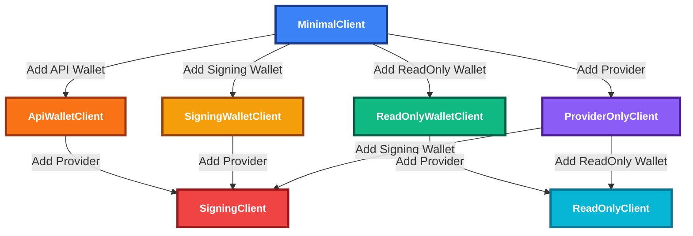

# Evolution SDK Client Module

A specification for the client architecture and behavior.

## Quick Overview

The Evolution SDK provides different types of clients that you can progressively enhance:



## Client Types

| Client | Can Query Blockchain | Can Sign | Can Submit | Use Case |
|--------|---------------------|----------|------------|----------|
| **MinimalClient** | ❌ | ❌ | ❌ | Starting point |
| **ProviderOnlyClient** | ✅ | ❌ | ✅ | Read blockchain data |
| **SigningWalletClient** | ❌ | ✅ | ❌ | Sign-only (seed/private key) |
| **ReadOnlyWalletClient** | ❌ | ❌ | ❌ | Wallet-only (address monitoring) |
| **ApiWalletClient** | ❌ | ✅ | ✅ | Browser wallets (CIP-30) |
| **ReadOnlyClient** | ✅ | ❌ | ✅ | Monitor addresses |
| **SigningClient** | ✅ | ✅ | ✅ | Full functionality |

> **Type Safety**: Separate interfaces ensure compile-time guarantees about submission capabilities.

## Detailed Capabilities Matrix

### Core Methods Available

| Method/Capability | MinimalClient | ProviderOnlyClient | SigningWalletClient | ReadOnlyWalletClient | ApiWalletClient | ReadOnlyClient | SigningClient |
|-------------------|---------------|--------------------|---------------------|----------------------|-----------------|----------------|---------------|
| **Network Access** |
| `networkId` | ✅ | ✅ | ✅ | ✅ | ✅ | ✅ | ✅ |
| **Provider Operations** |
| `getProtocolParameters()` | ❌ | ✅ | ❌ | ❌ | ❌ | ✅ | ✅ |
| `getUtxos(address)` | ❌ | ✅ | ❌ | ❌ | ❌ | ✅ | ✅ |
| `getUtxosWithUnit(address, unit)` | ❌ | ✅ | ❌ | ❌ | ❌ | ✅ | ✅ |
| `getUtxoByUnit(unit)` | ❌ | ✅ | ❌ | ❌ | ❌ | ✅ | ✅ |
| `getUtxosByOutRef(outRefs)` | ❌ | ✅ | ❌ | ❌ | ❌ | ✅ | ✅ |
| `getDelegation(rewardAddress)` | ❌ | ✅ | ❌ | ❌ | ❌ | ✅ | ✅ |
| `getDatum(datumHash)` | ❌ | ✅ | ❌ | ❌ | ❌ | ✅ | ✅ |
| `awaitTx(txHash)` | ❌ | ✅ | ❌ | ❌ | ❌ | ✅ | ✅ |
| `evaluateTx(tx)` | ❌ | ✅ | ❌ | ❌ | ❌ | ✅ | ✅ |
| `submitTx(tx)` | ❌ | ✅ | ❌ | ❌ | ✅ | ✅ | ✅ |
| **Wallet Operations** |
| `address()` | ❌ | ❌ | ✅ | ✅ | ✅ | ✅ | ✅ |
| `rewardAddress()` | ❌ | ❌ | ✅ | ✅ | ✅ | ✅ | ✅ |
| `getWalletUtxos()` | ❌ | ❌ | ❌ | ❌ | ❌ | ✅ | ✅ |
| `getWalletDelegation()` | ❌ | ❌ | ❌ | ❌ | ❌ | ✅ | ✅ |
| `signTx(tx)` | ❌ | ❌ | ✅ | ❌ | ✅ | ❌ | ✅ |
| `signMessage(address, payload)` | ❌ | ❌ | ✅ | ❌ | ✅ | ❌ | ✅ |
| **Transaction Building** |
| `newTx()` | ❌ | ❌ | ❌ | ❌ | ❌ | ✅ | ✅ |
| **Client Composition** |
| `attachProvider()` | ✅ | ❌ | ✅ | ✅ | ✅ | ❌ | ❌ |
| `attachWallet()` | ❌ | ✅ | ❌ | ❌ | ❌ | ❌ | ❌ |
| `attach(provider, wallet)` | ✅ | ❌ | ❌ | ❌ | ❌ | ❌ | ❌ |

### Transaction Builder Capabilities

| Builder Method | ReadOnlyClient | SigningClient | Notes |
|----------------|----------------|---------------|--------|
| `build()` | ✅ → `Transaction` | ✅ → `SignBuilder` | ReadOnlyClient returns unsigned transaction, SigningClient returns builder with signing capabilities |

> **Note**: Transaction building requires protocol parameters from a provider. Only `ReadOnlyClient` and `SigningClient` have provider access and can build transactions. `ApiWalletClient` cannot build transactions directly - it must be upgraded to `SigningClient` by attaching a provider first.

### Provider Support

| Provider Type | Description | Supported Operations |
|---------------|-------------|---------------------|
| **Blockfrost** | API-based provider | All provider operations |
| **Kupmios** | Kupo + Ogmios | All provider operations |
| **Maestro** | Maestro API | All provider operations |
| **Koios** | Koios API | All provider operations |
| **Multi-Provider** | Failover support | All provider operations with redundancy (see [Provider Failover Specification](./provider-failover.md)) |

### Wallet Support

| Wallet Type | Client Types | Description | Capabilities |
|-------------|-------------|-------------|--------------|
| **Seed Wallet** | SigningWalletClient, SigningClient | HD wallet from mnemonic | Sign only (no submit without provider) |
| **Private Key** | SigningWalletClient, SigningClient | Single key wallet | Sign only (no submit without provider) |
| **Read-Only** | ReadOnlyWalletClient, ReadOnlyClient | Address monitoring | Query only, no signing |
| **API Wallet (CIP-30)** | ApiWalletClient, SigningClient | Browser extension | Sign + submit via extension |

### Error Handling

| Client Type | Error Types | Effect Support |
|-------------|-------------|----------------|
| All clients | `ProviderError`, `WalletError` | ✅ Retry, timeout, fallback |
| Multi-Provider | `MultiProviderError` | ✅ Automatic failover |
| Transaction Builder | `TransactionBuilderError` | ✅ Validation errors |

### Upgrade Paths

#### Creation Methods

**Progressive Enhancement (starting from MinimalClient):**
- `createClient()` → `MinimalClient` → `attachProvider()` → `attachWallet()`

**Direct Creation (bypassing MinimalClient):**
- `createClient({ network, provider })` → `ProviderOnlyClient`
- `createClient({ network, wallet: seedWallet })` → `SigningWalletClient`
- `createClient({ network, wallet: apiWallet })` → `ApiWalletClient`
- `createClient({ network, provider, wallet })` → `ReadOnlyClient` or `SigningClient`

## Creating Clients

### Simple Creation
```typescript
// Start with minimal client
const client = createClient()

// Add provider for blockchain access
const providerClient = client.attachProvider({
  type: "blockfrost",
  apiKey: "your-key"
})

// Add wallet for signing
const signingClient = providerClient.attachWallet({
  type: "seed",
  mnemonic: "your mnemonic"
})
```

### Direct Creation
```typescript
// Create fully configured client directly
const client = createClient({
  network: "mainnet",
  provider: { type: "blockfrost", apiKey: "your-key" },
  wallet: { type: "seed", mnemonic: "your mnemonic" }
})
```

### Browser Wallet (CIP-30)
```typescript
// API wallet without provider (limited)
const apiClient = createClient({
  network: "mainnet",
  wallet: { type: "api", api: window.cardano.nami }
})

// Upgrade to full client by adding provider
const fullClient = apiClient.attachProvider({
  type: "blockfrost", 
  apiKey: "your-key"
})
```

## Architecture

The SDK uses Effect-TS for complex operations and provides Promise APIs for convenience. See the [Effect-Promise Architecture Guide](./effect-promise-architecture.md) for detailed information.

### Two Ways to Use

**Simple (Promise API):**
```typescript
// Familiar async/await
const result = await client.signTx(transaction)
```

**Advanced (Effect API):**
```typescript
// When you need retries, timeouts, etc.
const program = client.Effect.signTx(transaction).pipe(
  Effect.retry({ times: 3 }),
  Effect.timeout(30000)
)
const result = await Effect.runPromise(program)
```

## Multi-Provider Support

For production apps, use multiple providers for reliability. See the [Provider Failover Specification](./provider-failover.md) for detailed failover strategies and error handling.

```typescript
const client = createClient({
  network: "mainnet",
  provider: {
    type: "multi",
    strategy: "priority", // try providers in order
    providers: [
      { 
        type: "kupmios", 
        kupoUrl: "wss://ogmios.example.com", 
        ogmiosUrl: "https://kupo.example.com",
        retryPolicy: {
          maxRetries: 3,
          retryDelayMs: 1000,
          backoffMultiplier: 2,
          maxRetryDelayMs: 30000
        }
      },
      { 
        type: "blockfrost", 
        apiKey: "backup-key",
        baseUrl: "https://cardano-mainnet.blockfrost.io/api/v0",
        retryPolicy: {
          maxRetries: 2,
          retryDelayMs: 500,
          backoffMultiplier: 1.5,
          maxRetryDelayMs: 10000
        }
      }
    ]
  },
  wallet: { type: "seed", mnemonic: "your mnemonic" }
})
```

## Common Patterns

### Signing-Only Wallet (Seed/Private Key)
```typescript
// Create signing wallet client for offline signing
const signingWallet = createClient({
  network: "mainnet",
  wallet: { type: "seed", mnemonic: "your mnemonic" }
})

// Get wallet address
const address = await signingWallet.address()

// Sign a transaction that was built elsewhere
const signedTx = await signingWallet.signTx(preBuiltTransaction)

// Sign a message
const signature = await signingWallet.signMessage(address, "Hello World")

// ❌ Cannot submit - no submitTx method available
// signingWallet.submitTx() // TypeScript error!
```

### API Wallet (CIP-30)
```typescript
// Create API wallet client for browser wallet
const apiWallet = createClient({
  network: "mainnet",
  wallet: { type: "api", api: window.cardano.nami }
})

// Can sign AND submit
const signedTx = await apiWallet.signTx(preBuiltTransaction)
const txId = await apiWallet.submitTx(signedTx) // ✅ Available for API wallets
```

### Read-Only Wallet (Address Only)
```typescript
// Create read-only wallet client for address-only operations
const readOnlyWallet = createClient({
  network: "mainnet",
  wallet: { type: "read-only", address: "addr1..." }
})

// Get wallet address and reward address
const address = await readOnlyWallet.address()
const rewardAddress = await readOnlyWallet.rewardAddress()

// ❌ Cannot query blockchain - no provider
// readOnlyWallet.getWalletUtxos() // TypeScript error!

// ❌ Cannot sign - read-only wallet
// readOnlyWallet.signTx() // TypeScript error!

// ❌ Cannot submit - no provider
// readOnlyWallet.submitTx() // TypeScript error!

// ✅ Can upgrade to ReadOnlyClient by attaching provider
const readOnlyClient = readOnlyWallet.attachProvider({
  type: "blockfrost",
  apiKey: "your-key"
})

// Now can query blockchain with the address
const utxos = await readOnlyClient.getWalletUtxos()
```

### Monitor an Address
```typescript
const client = createClient({
  network: "mainnet",
  provider: { type: "blockfrost", apiKey: "key" },
  wallet: { type: "read-only", address: "addr1..." }
})

const utxos = await client.getWalletUtxos()
```

### Browser dApp
```typescript
// Connect to user's wallet
const client = createClient({
  network: "mainnet",
  wallet: { type: "api", api: window.cardano.nami }
})

// Sign and submit (no provider needed)
const txId = await client.submitTx(transaction)
```

### Server Application
```typescript
const client = createClient({
  network: "mainnet",
  provider: { type: "kupmios", kupoUrl: "...", ogmiosUrl: "..." },
  wallet: { type: "seed", mnemonic: process.env.MNEMONIC }
})

const tx = await client.newTx()
  .payToAddress("addr1...", { lovelace: 1000000n })
  .complete()

const signed = await client.signTx(tx)
const txId = await client.submitTx(signed)
```

## Key Concepts

- **MinimalClient**: Starting point, just knows about network
- **Providers**: Connect to Cardano blockchain (Blockfrost, Kupmios, etc.)
- **Wallets**: Handle signing (seed phrase, private key, or browser extension)
- **API Wallets**: Browser extensions like Nami, Eternl (CIP-30 standard)
- **Effect**: Advanced features like retries and timeouts
- **Promise**: Simple async/await for basic usage