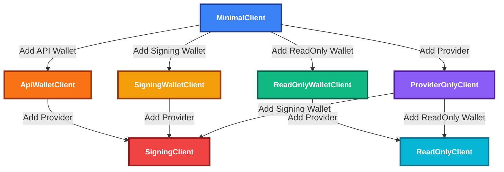

# Evolution SDK Client Module

## Abstract

This document specifies the Evolution SDK client architecture and normative behaviors for composing provider and wallet capabilities in TypeScript applications. It defines client roles, available operations, upgrade semantics, transaction building constraints, and the error model. Examples illustrate key usage patterns; detailed feature matrices are provided in the Appendix.

## Purpose and Scope

This specification describes how clients are constructed and enhanced with providers and wallets, what operations are available for each client role, and how transaction building and submission behave. It does not define provider-specific protocols, CIP-30 details, or internal implementation; those are covered by code and provider-specific documents. Multi-provider behavior is specified at a high level here and in detail in the Provider Failover specification. For Effect-based vs Promise-based usage, see the [Effect-Promise Architecture Guide](./effect-promise-architecture.md).

## Introduction

The Evolution SDK offers a progressive client model: start with a minimal client and add a provider and/or wallet to unlock read, sign, and submit capabilities. The goal is clear separation of concerns and compile-time safety for what a given client can do.



Summary:
- MinimalClient: no read/sign/submit
- ProviderOnlyClient: read and submit (where applicable), no signing
- SigningWalletClient: sign only
- ReadOnlyWalletClient: address/rewardAddress only
- ApiWalletClient: CIP-30 sign and submit via wallet API
- ReadOnlyClient: provider + read-only wallet; can query wallet data
- SigningClient: provider + signing wallet or API wallet; full capability

Matrices summarizing exact method availability appear in the Appendix.

## Functional Specification (Normative)

Requirements language: The key words MUST, MUST NOT, SHOULD, SHOULD NOT, and MAY are to be interpreted as described in RFC 2119 and RFC 8174 when, and only when, they appear in all capitals.

### 1. Client roles and conformance

An Evolution SDK client instance conforms to exactly one role at a time:
- MinimalClient
- ProviderOnlyClient
- SigningWalletClient
- ReadOnlyWalletClient
- ApiWalletClient
- ReadOnlyClient
- SigningClient

For each role, the following MUST hold:
- MinimalClient MUST NOT expose provider or wallet operations; it MAY be upgraded.
- ProviderOnlyClient MUST expose provider operations and MAY submit transactions if the provider supports submission; it MUST NOT expose signing.
- SigningWalletClient MUST expose signing and message signing; it MUST NOT expose submission or provider queries.
- ReadOnlyWalletClient MUST expose address() and rewardAddress(); it MUST NOT expose signing, provider queries, or submission.
- ApiWalletClient MUST expose signing and MAY expose submission via the wallet API; it MUST NOT expose provider queries unless upgraded with a provider.
- ReadOnlyClient MUST expose provider queries scoped to the configured address and MUST NOT expose signing.
- SigningClient MUST expose provider queries, transaction building, signing, and submission.

### 2. Network and provider operations

- A client configured with a provider (ProviderOnlyClient, ReadOnlyClient, SigningClient) MUST provide `networkId` and provider query methods (e.g., `getProtocolParameters`, `getUtxos`, `awaitTx`, `evaluateTx`) as listed in the Appendix.
- `submitTx` MUST be available on clients with a provider or API wallet capable of submission (ProviderOnlyClient, ReadOnlyClient, SigningClient, ApiWalletClient).
- Provider implementations and their supported operations are out of scope here; see provider-specific docs. A multi-provider MUST follow the strategy defined in the [Provider Failover specification](./provider-failover.md).

### 3. Wallet operations

- A client configured with a wallet MUST provide `address()` and `rewardAddress()` where the wallet type supports them.
- SigningWalletClient and SigningClient MUST provide `signTx(tx)` and `signMessage(address, payload)`.
- ReadOnlyWalletClient and ReadOnlyClient MUST NOT provide signing methods.
- ApiWalletClient MUST provide signTx and SHOULD provide submitTx if the wallet API supports submission.

### 4. Transaction building

- `newTx()` MUST be exposed only on clients that have a provider (ReadOnlyClient, SigningClient).
- Building a transaction MUST require provider protocol parameters.
- `build()`/`complete()` on ReadOnlyClient MUST produce an unsigned `Transaction`.
- `build()`/`complete()` on SigningClient MUST produce a `SignBuilder` (or equivalent) that can be signed and submitted.
- ApiWalletClient MUST be upgraded to SigningClient (by attaching a provider) before it can build transactions.

### 5. Attachment and upgrade semantics

- `createClient()` without arguments MUST return a MinimalClient.
- `attachProvider(provider)` and `attachWallet(wallet)` MUST return new client instances (i.e., the API is immutable) with upgraded roles as per the Introduction diagram.
- `createClient({ network, provider })` MUST produce a ProviderOnlyClient.
- `createClient({ network, wallet })` MUST produce SigningWalletClient, ReadOnlyWalletClient, or ApiWalletClient depending on wallet type.
- `createClient({ network, provider, wallet })` MUST produce ReadOnlyClient or SigningClient depending on wallet type.

### 6. Error model and effect semantics

- Methods that interact with external systems MUST reject/raise with typed errors: ProviderError for provider failures, WalletError for wallet failures, MultiProviderError for strategy/exhaustion failures, and TransactionBuilderError for builder validation issues.
- The Effect API MUST preserve the same error categories as typed causes; callers MAY use retries, timeouts, and fallbacks. The Promise API MUST be semantically equivalent to running the corresponding Effect program to completion.
- Multi-provider failover MUST adhere to the [Provider Failover specification](./provider-failover.md).

### 7. API equivalence (Effect vs Promise)

For every Promise-returning method, an equivalent Effect program MUST exist under the `client.Effect` namespace with identical semantics regarding success values and error categories.

### 8. Examples (Informative)

Simple creation and upgrade:
```typescript
const client = createClient()
const providerClient = client.attachProvider({ type: "blockfrost", apiKey: "your-key" })
const signingClient = providerClient.attachWallet({ type: "seed", mnemonic: "your mnemonic" })
```

Direct creation:
```typescript
const client = createClient({
  network: "mainnet",
  provider: { type: "blockfrost", apiKey: "your-key" },
  wallet: { type: "seed", mnemonic: "your mnemonic" }
})
```

Browser wallet (CIP-30) with upgrade:
```typescript
const apiClient = createClient({ network: "mainnet", wallet: { type: "api", api: window.cardano.nami } })
const fullClient = apiClient.attachProvider({ type: "blockfrost", apiKey: "your-key" })
```

Signing-only wallet (no submit without provider):
```typescript
const signingWallet = createClient({ network: "mainnet", wallet: { type: "seed", mnemonic: "your mnemonic" } })
// await signingWallet.submitTx(...) // not available
```

Effect usage (retries, timeouts):
```typescript
const program = client.Effect.signTx(tx).pipe(Effect.retry({ times: 3 }), Effect.timeout(30000))
const signed = await Effect.runPromise(program)
```

## Appendix (Informative)

### A. Core methods by role

| Method/Capability | MinimalClient | ProviderOnlyClient | SigningWalletClient | ReadOnlyWalletClient | ApiWalletClient | ReadOnlyClient | SigningClient |
|-------------------|---------------|--------------------|---------------------|----------------------|-----------------|----------------|---------------|
| **Network Access** |
| `networkId` | ✅ | ✅ | ✅ | ✅ | ✅ | ✅ | ✅ |
| **Provider Operations** |
| `getProtocolParameters()` | ❌ | ✅ | ❌ | ❌ | ❌ | ✅ | ✅ |
| `getUtxos(address)` | ❌ | ✅ | ❌ | ❌ | ❌ | ✅ | ✅ |
| `getUtxosWithUnit(address, unit)` | ❌ | ✅ | ❌ | ❌ | ❌ | ✅ | ✅ |
| `getUtxoByUnit(unit)` | ❌ | ✅ | ❌ | ❌ | ❌ | ✅ | ✅ |
| `getUtxosByOutRef(outRefs)` | ❌ | ✅ | ❌ | ❌ | ❌ | ✅ | ✅ |
| `getDelegation(rewardAddress)` | ❌ | ✅ | ❌ | ❌ | ❌ | ✅ | ✅ |
| `getDatum(datumHash)` | ❌ | ✅ | ❌ | ❌ | ❌ | ✅ | ✅ |
| `awaitTx(txHash)` | ❌ | ✅ | ❌ | ❌ | ❌ | ✅ | ✅ |
| `evaluateTx(tx)` | ❌ | ✅ | ❌ | ❌ | ❌ | ✅ | ✅ |
| `submitTx(tx)` | ❌ | ✅ | ❌ | ❌ | ✅ | ✅ | ✅ |
| **Wallet Operations** |
| `address()` | ❌ | ❌ | ✅ | ✅ | ✅ | ✅ | ✅ |
| `rewardAddress()` | ❌ | ❌ | ✅ | ✅ | ✅ | ✅ | ✅ |
| `getWalletUtxos()` | ❌ | ❌ | ❌ | ❌ | ❌ | ✅ | ✅ |
| `getWalletDelegation()` | ❌ | ❌ | ❌ | ❌ | ❌ | ✅ | ✅ |
| `signTx(tx)` | ❌ | ❌ | ✅ | ❌ | ✅ | ❌ | ✅ |
| `signMessage(address, payload)` | ❌ | ❌ | ✅ | ❌ | ✅ | ❌ | ✅ |
| **Transaction Building** |
| `newTx()` | ❌ | ❌ | ❌ | ❌ | ❌ | ✅ | ✅ |
| **Client Composition** |
| `attachProvider()` | ✅ | ❌ | ✅ | ✅ | ✅ | ❌ | ❌ |
| `attachWallet()` | ❌ | ✅ | ❌ | ❌ | ❌ | ❌ | ❌ |
| `attach(provider, wallet)` | ✅ | ❌ | ❌ | ❌ | ❌ | ❌ | ❌ |

### B. Transaction builder capabilities

| Builder Method | ReadOnlyClient | SigningClient | Notes |
|----------------|----------------|---------------|--------|
| `build()` | ✅ → `Transaction` | ✅ → `SignBuilder` | ReadOnlyClient returns unsigned transaction; SigningClient returns a builder with signing capabilities |

Note: Transaction building requires protocol parameters from a provider. ApiWalletClient MUST be upgraded before building.

### C. Provider support (categories)

| Category | Description | Supported Operations |
|----------|-------------|---------------------|
| REST API provider | External REST service | All provider operations |
| Node-backed stack | Local/remote node stack (e.g., indexer + node) | All provider operations |
| Cloud API provider | Managed blockchain API | All provider operations |
| Alternative REST provider | Another REST-based service | All provider operations |
| Multi-provider (strategy) | Failover/hedged strategy | All provider operations with redundancy (see [Provider Failover Specification](./provider-failover.md)) |

### D. Wallet support

| Wallet Type | Client Types | Description | Capabilities |
|-------------|-------------|-------------|--------------|
| **Seed Wallet** | SigningWalletClient, SigningClient | HD wallet from mnemonic | Sign only (no submit without provider) |
| **Private Key** | SigningWalletClient, SigningClient | Single key wallet | Sign only (no submit without provider) |
| **Read-Only** | ReadOnlyWalletClient, ReadOnlyClient | Address monitoring | Query only, no signing |
| **API Wallet (CIP-30)** | ApiWalletClient, SigningClient | Browser extension | Sign + submit via extension |
