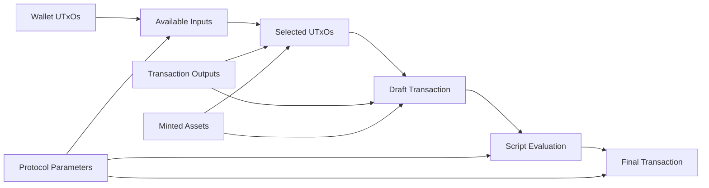

# CompleteTxBuilder Workflow Diagram

```mermaid
graph TD
    A["Start: complete() Function"] --> B["Phase 1: Setup & Validation"]
    B --> B1["Fetch Wallet UTxOs"]
    B --> B2["Derive Change Address"]
    B --> B3["Validate Options"]
    
    B1 --> C["Phase 2: Initial Coin Selection"]
    B2 --> C
    B3 --> C
    
    C --> C1["Calculate Asset Delta<br/>outputs + fee - collected - minted"]
    C1 --> C2["Filter Required Assets<br/>positive amounts only"]
    C2 --> C3["Recursive UTxO Selection<br/>largest-first strategy"]
    
    C3 --> D{"Has Plutus Scripts?"}
    
    D -->|No| F["Phase 5: Skip Script Evaluation"]
    D -->|Yes| E["Phase 3: Script Evaluation"]
    
    E --> E1["Build Evaluation Transaction<br/>CML.build_for_evaluation()"]
    E1 --> E2{"Local UPLC?"}
    
    E2 -->|Yes| E3["WASM UPLC Evaluation<br/>evalTransaction()"]
    E2 -->|No| E4["Provider Evaluation<br/>evalTransactionProvider()"]
    
    E3 --> E5["Apply UPLC Results<br/>applyUPLCEval()"]
    E4 --> E6["Apply Provider Results<br/>applyUPLCEvalProvider()"]
    
    E5 --> G["Phase 4: Refined Coin Selection"]
    E6 --> G
    
    G --> G1["Recalculate Fee with Script Costs"]
    G1 --> G2["Check if Additional UTxOs Needed"]
    G2 --> G3{"Need More UTxOs?"}
    
    G3 -->|Yes| G4["Select Additional UTxOs"]
    G3 -->|No| H["Phase 5: Collateral Management"]
    
    G4 --> G5{"Script Budget Changed?"}
    G5 -->|Yes| E1
    G5 -->|No| H
    
    H --> H1["Calculate Collateral Amount<br/>150% of estimated fee"]
    H1 --> H2["Find Collateral UTxOs<br/>ADA-only, max 3"]
    H2 --> H3["Apply Collateral to Transaction"]
    
    H3 --> I["Phase 6: Final Assembly"]
    
    I --> I1["Complete Partial Programs<br/>Build redeemers with indices"]
    I1 --> I2["Final CML Transaction Build"]
    I2 --> I3["Apply Final ExUnits"]
    
    I3 --> J["Return Built Transaction"]
    
    F --> I
    
    style A fill:#4a90e2,color:#ffffff,stroke:#2171b5,stroke-width:3px
    style B fill:#9b59b6,color:#ffffff,stroke:#8e44ad,stroke-width:3px
    style C fill:#27ae60,color:#ffffff,stroke:#229954,stroke-width:3px
    style D fill:#f39c12,color:#ffffff,stroke:#e67e22,stroke-width:3px
    style E fill:#e74c3c,color:#ffffff,stroke:#c0392b,stroke-width:3px
    style F fill:#95a5a6,color:#ffffff,stroke:#7f8c8d,stroke-width:3px
    style G fill:#1abc9c,color:#ffffff,stroke:#16a085,stroke-width:3px
    style H fill:#f1c40f,color:#2c3e50,stroke:#f39c12,stroke-width:3px
    style I fill:#34495e,color:#ffffff,stroke:#2c3e50,stroke-width:3px
    style J fill:#2ecc71,color:#ffffff,stroke:#27ae60,stroke-width:4px
    
    classDef phaseBox fill:#ecf0f1,stroke:#34495e,stroke-width:3px,color:#2c3e50
    classDef decision fill:#fff3cd,stroke:#856404,stroke-width:3px,color:#856404
    classDef subprocess fill:#e8f4f8,stroke:#2980b9,stroke-width:2px,color:#2c3e50
    classDef success fill:#d4edda,stroke:#155724,stroke-width:3px,color:#155724
    
    class B,C,E,G,H,I phaseBox
    class D,E2,G3,G5 decision
    class B1,B2,B3,C1,C2,C3,E1,E3,E4,E5,E6,G1,G2,G4,H1,H2,H3,I1,I2,I3 subprocess
    class J success
```



## Detailed Flow Explanation

### Phase Transitions and Decision Points

1. **Setup → Initial Selection**: Always proceeds after validation
2. **Initial Selection → Script Check**: Determines if script evaluation needed
3. **Script Evaluation → Refined Selection**: Only for Plutus script transactions  
4. **Refined Selection Loop**: Continues until stable UTxO selection achieved
5. **Collateral Management**: Only applies to script transactions
6. **Final Assembly**: Always completes the transaction building

### Critical Decision Points

#### Script Detection (`Has Plutus Scripts?`)
```typescript
// Determines evaluation path
if (hasPlutusScriptExecutions) {
  // Proceed to script evaluation
} else {
  // Skip to collateral/final assembly
}
```

#### UPLC vs Provider Evaluation (`Local UPLC?`)
```typescript
if (localUPLCEval !== false) {
  // Use WASM UPLC evaluation
  applyUPLCEval(uplcResults, txBuilder)
} else {
  // Use external provider evaluation
  applyUPLCEvalProvider(providerResults, txBuilder)
}
```

#### UTxO Selection Stability (`Need More UTxOs?`)
```typescript
// Check if script costs require additional funds
if (newEstimatedFee > currentCapacity) {
  // Select more UTxOs and potentially re-evaluate scripts
  return selectAdditionalUTxOs()
}
```

#### Script Budget Changes (`Script Budget Changed?`)
```typescript
// If new inputs change script execution context
if (inputSetChanged && hasSignificantBudgetChange) {
  // Re-evaluate scripts with new input context
  return reEvaluateScripts()
}
```

### Error Paths (Not Shown in Diagram)

Each phase can fail with specific error types:
- **Phase 1**: Wallet access errors, configuration validation errors
- **Phase 2**: Insufficient funds errors, UTxO availability errors  
- **Phase 3**: Script evaluation errors, UPLC compilation errors
- **Phase 4**: Fee calculation errors, UTxO selection errors
- **Phase 5**: Collateral selection errors, protocol limit errors
- **Phase 6**: Redeemer building errors, transaction assembly errors

### Performance Considerations

#### Iterative Loops
- **Coin Selection Loop**: May iterate multiple times for complex asset requirements
- **Script Evaluation Loop**: May re-evaluate if input set changes significantly
- **Minimum ADA Loop**: Continues until change outputs meet minimum requirements

#### Expensive Operations
- **Script Evaluation**: Most expensive operation, especially for complex scripts
- **UTxO Sorting**: O(n log n) for large UTxO sets
- **Recursive Selection**: May examine many UTxO combinations

### State Dependencies



This workflow represents one of the most complex transaction building systems in the Cardano ecosystem, with sophisticated handling of script evaluation, UTxO management, and fee calculation.