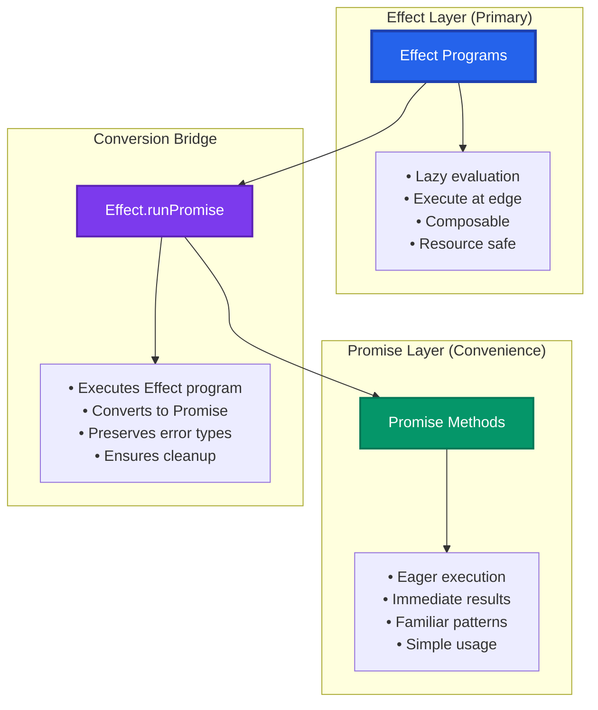
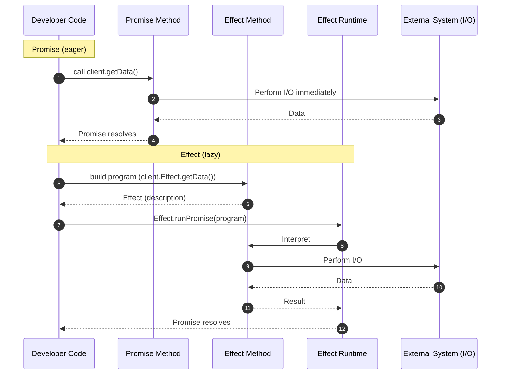
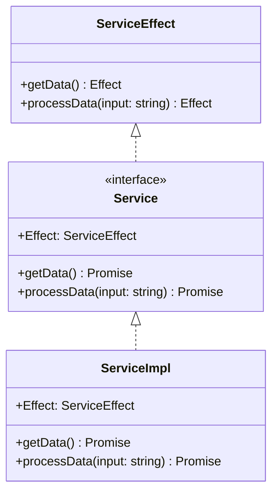
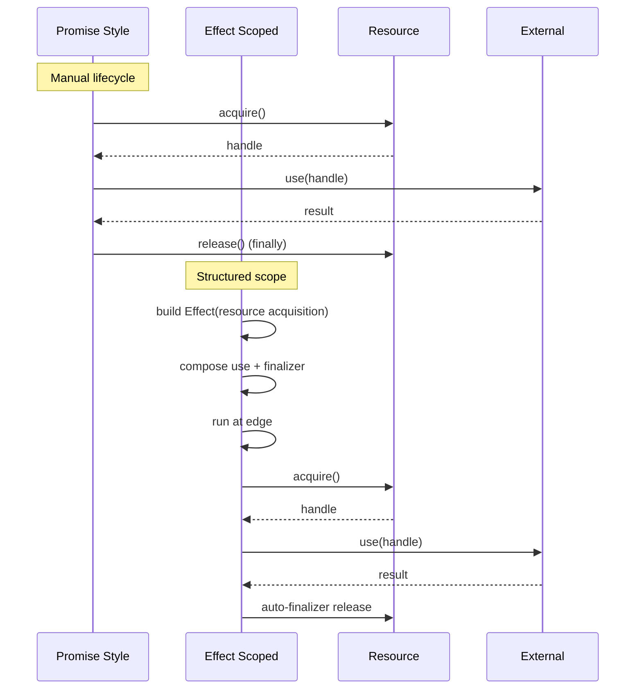

<!--
  Evolution SDK: Effect-TS and Promise Architecture Specification
  Version: 1.0.1-draft
  Status: DRAFT (Normative + Informative Appendices)
  Last-Updated: 2025-09-22
  Stability: Experimental
  Revision-Policy: Semantic Versioning (breaking changes increment MAJOR; normative additions MINOR; clarifications PATCH)
-->

# Evolution SDK: Effect / Promise Dual Interface Specification {#spec-top}

## 1. Abstract (Normative) {#abstract}
This specification defines the dual interface architecture of the Evolution SDK. Each conforming module SHALL expose: (a) a primary Effect-based API comprised of lazily constructed program descriptions, and (b) a derived Promise API comprised of eagerly executed adaptor methods invoking the primary API through an approved interpreter. The objective is to guarantee consistent execution semantics, centralized policy application, and safe resource handling while enabling ergonomic incremental adoption.

## 2. Scope (Normative) {#scope}
This specification applies to all publicly exported SDK modules that perform I/O, resource acquisition, computation orchestration, or policy-controlled execution. It excludes purely synchronous utility functions that have no side effects and no dependency on Effect runtime features.

## 3. Definitions (Normative) {#definitions}
| Term | Definition |
|------|------------|
| Effect Program | Lazy description of a computation constructed with Effect-TS; produces no external side effects until interpreted. |
| Execution Edge | Deliberate boundary where an Effect program is interpreted (e.g. CLI entry point, HTTP handler, worker loop). |
| Promise Wrapper | Eager adaptor method that invokes a corresponding Effect program via the interpreter, returning a native Promise. |
| Primary API | The namespace / property (named `Effect`) containing Effect-returning functions. |
| Convenience API | The set of Promise wrapper functions mapped 1:1 to primary Effect functions. |
| Interpreter | Approved runtime function (e.g. `Effect.runPromise`) that executes an Effect program. |
| Lazy | Property of not performing I/O or irreversible side effects during construction. |
| Eager | Immediate execution semantics at call time (Promise / async function). |

## 4. Architectural Model (Normative) {#architecture}
1. The primary API MUST consist solely of functions that, when invoked, return Effect program descriptions.
2. Each Promise wrapper MUST correspond exactly to one primary function differing only in return type (Promise of success value). 
3. The Promise layer MUST NOT introduce additional business logic, control flow, or side effects beyond argument normalization and interpretation.
4. All external side effects (network, filesystem, time, randomness, environment) MUST occur only during interpretation at an execution edge.

### 4.1 Execution Timing {#execution-timing}
Effect construction MUST be side-effect free with respect to external systems. Observable external interactions MUST be deferred until interpretation via an interpreter function at an execution edge.

### 4.2 Wrapper Delegation {#wrapper-delegation}
Promise wrappers MUST invoke exactly one interpreter call per user invocation and MUST propagate both success values and classified errors without modification except for structural mapping into native Promise rejection channels.

## 5. Interface Contract (Normative) {#interface-contract}
The dual interface SHALL follow the canonical structure:

```ts
interface ModuleEffect { /* Effect-returning functions only */ }
type EffectToPromiseAPI<T> = { readonly [K in keyof T]: T[K] extends (...a: infer P) => Effect.Effect<infer A, any> ? (...a: P) => Promise<A> : never }
interface Module extends EffectToPromiseAPI<ModuleEffect> { readonly Effect: ModuleEffect }
```

Constraints:
1. The `Effect` property MUST be immutable after construction.
2. Wrapper methods MUST retain original parameter ordering and parameter count.
3. Wrapper methods SHOULD avoid allocating intermediate data structures unless required for type adaptation.
4. The mapping MUST be total for all public Effect methods (no omissions).

## 6. Execution Semantics (Normative) {#execution-semantics}
1. Interpretation MAY occur only at explicitly designated edges under caller control.
2. Implementations MUST support cancellation / interruption semantics provided by the Effect runtime for any in-flight interpreted program.
3. Timeouts, retries, or circuit breakers MUST be modeled as Effect-level combinators or layers, not ad-hoc Promise logic.

## 7. Resource & Lifecycle Semantics (Normative) {#resource-lifecycle}
1. Resource acquisition MUST be expressed within Effect scopes or structured resource combinators ensuring deterministic finalization.
2. Implementations MUST NOT leak resources if Promise wrappers are abandoned after resolution or rejection.
3. Any resource requiring cleanup MUST provide an Effect-based acquisition that registers a finalizer in the managed scope.

## 8. Concurrency & Policy Semantics (Normative) {#concurrency-policy}
1. Parallelism MUST be expressed with Effect concurrency combinators (e.g. `Effect.all`, `Effect.forEach` with explicit concurrency options).
2. Policies (retry, timeout, rate limiting) MUST be applied at the Effect layer prior to interpretation.
3. Wrapper methods MUST NOT embed hidden concurrency (no implicit parallel side effects beyond the single interpreted Effect chain).

## 9. Error Model (Normative) {#error-model}
1. Effect functions SHOULD model domain and infrastructure failures via typed errors or tagged error channels.
2. Promise wrappers MUST surface these failures as Promise rejections preserving discriminability (e.g. tagged object instances or error subclasses).
3. Wrappers MUST NOT swallow or transform errors except to satisfy language-level Promise rejection semantics.
4. Implementations SHOULD avoid throwing synchronously inside wrapper functions (prefer failing the underlying Effect and interpreting).

## 10. Observability (Normative) {#observability}
1. Structured logging, metrics, and tracing SHOULD be implemented as Effect layers or scoped combinators.
2. Promise wrappers MAY add tracing context only if such addition is transparent and does not alter execution ordering or error taxonomy.

## 11. Security & Reliability (Normative) {#security-reliability}
1. Construction of Effect programs MUST NOT perform network or filesystem I/O.
2. Inputs MUST be validated either lazily within the Effect program or eagerly in wrappers without performing side effects.
3. Secrets (credentials, private keys) MUST be injected through Effect services / layers rather than captured as module-level mutable state.
4. Implementations SHOULD ensure reproducibility by isolating nondeterminism (time, randomness) behind Effect services.
5. Wrappers MUST NOT cache mutable shared results unless specified by a higher-level module policy.

## 12. Conformance (Normative) {#conformance}
Each requirement below is binding. A module claiming conformance MUST satisfy all MUST / SHALL items and SHOULD items unless a documented justification is provided.

| ID | Requirement |
|----|-------------|
| R1 | Module MUST expose a primary Effect API (`Effect` namespace) of Effect-returning functions only. |
| R2 | Every public Effect function MUST have a 1:1 Promise wrapper counterpart. |
| R3 | Promise wrappers MUST delegate via a single interpreter call (e.g. `Effect.runPromise`). |
| R4 | No external side effects MAY occur during Effect construction (lazy purity w.r.t I/O). |
| R5 | Resource acquisition MUST register deterministic finalizers (scoped). |
| R6 | Policies (retry, timeout, etc.) MUST be implemented as Effect combinators, not inline Promise logic. |
| R7 | Wrapper methods MUST NOT introduce business logic beyond delegation. |
| R8 | Error taxonomy exposed by Effect functions MUST be preserved through Promise rejection. |
| R9 | Concurrency MUST be explicit via Effect primitives; wrappers MUST remain sequential delegators. |
| R10 | Observability concerns SHOULD be implemented via Effect layers; wrappers MAY only add transparent context. |
| R11 | Secrets / credentials MUST NOT be stored in mutable global state; use Effect services. |
| R12 | Wrapper parameter order and parameter count MUST match corresponding Effect functions. |
| R13 | The `Effect` namespace MUST be immutable post-construction. |
| R14 | Synchronous throws in wrappers SHOULD be avoided (prefer failing underlying Effect). |
| R15 | Modules SHOULD provide typed or tagged error channels for classification. |

## 13. Backwards Compatibility (Normative) {#backwards-compatibility}
Additions of new Effect functions MUST be accompanied by Promise wrappers in the same release. Deprecations SHOULD follow a documented schedule providing both layers until removal. Behavioral changes to wrapper methods MUST reflect underlying Effect changes and MUST NOT introduce divergent semantics.

## 14. Appendices (Informative) {#appendices}
The following appendices are non-normative and provided for clarification, examples, and rationale.

### Appendix A: Rationale & Principles (Informative) {#appendix-a}
Effect layer advantages: composability, centralized policy, resource safety, typed errors, deterministic construction, concurrency, testability. Core principles: Effect is primary; Promise is convenience; Execute at edge; Lazy vs eager separation; Composability; Resource safety.

### Appendix B: Selection Guidelines (Informative) {#appendix-b}
Prefer Effect for multi-stage workflows, policy needs, cancellation, advanced recovery, deterministic cleanup, anticipated evolution. Prefer Promise for trivial linear tasks, prototyping, third-party integration, incremental migration, or constrained team expertise.

### Appendix C: Architecture Diagram (Informative) {#appendix-c}


### Appendix D: Execution & Selection Diagrams (Informative) {#appendix-d}






### Appendix E: Representative Code Examples (Informative) {#appendix-e}
#### Simple Operation
```ts
const service = createService()
const data = await service.getData()
const program = service.Effect.getData()
const data2 = await Effect.runPromise(program)
```

#### Complex Workflow with Error Handling
```ts
const processAllDataProgram = Effect.gen(function* () {
  const service = createService()
  const data = yield* service.Effect.getData()
  const results = yield* Effect.forEach(
    data,
    (item) => service.Effect.processData(item).pipe(
      Effect.retry({ times: 3, delay: '1 second' })
    ),
    { concurrency: 3 }
  )
  return results
}).pipe(
  Effect.tapError(error => 
    Effect.sync(() => console.error('Processing failed:', error))
  )
)
```

#### Resource Management
```ts
const withResourceProgram = Effect.gen(function* () {
  return yield* acquireResourceEffect.pipe(
    Effect.flatMap(resource => useResourceEffect(resource)),
    Effect.scoped
  )
})
```

#### Concurrent Operations
```ts
const service2 = createService()
const concurrentProgram = Effect.gen(function* () {
  const [data1, data2, data3] = yield* Effect.all([
    service2.Effect.getData(),
    service2.Effect.getData(),
    service2.Effect.getData()
  ], { concurrency: "unbounded" })
  return { data1, data2, data3 }
})
```

### Appendix F: Testing Strategy (Informative) {#appendix-f}
```ts
const mockService: ServiceEffect = {
  getData: Effect.succeed(['mock-data-1', 'mock-data-2']),
  processData: (input: string) => Effect.succeed({ processed: input, timestamp: Date.now() })
}
```

### Appendix G: Migration Guidance (Informative) {#appendix-g}
Recommended phases: (1) Promise adoption; (2) Mixed bridge; (3) Effect refactor; (4) Policy centralization; (5) Advanced observability. (Timeline diagram removed from normative body.)

### Appendix H: Traceability Matrix (Informative) {#appendix-h}
| Requirement | Defined / Primary Section | Notes |
|-------------|---------------------------|-------|
| R1 | §5, §4 | Effect namespace requirement |
| R2 | §5, §12 | 1:1 mapping obligation |
| R3 | §4.2, §12 | Single interpreter call |
| R4 | §4.1, §6 | No side effects during construction |
| R5 | §7 | Scoped finalization |
| R6 | §8, §12 | Policies via combinators |
| R7 | §4, §12 | No added business logic in wrappers |
| R8 | §9, §12 | Error taxonomy preservation |
| R9 | §8 | Explicit concurrency only |
| R10 | §10 | Observability via layers |
| R11 | §11 | Secrets handling |
| R12 | §5 | Parameter order/count stability |
| R13 | §5 | Immutability of Effect namespace |
| R14 | §9 | Avoid sync throws in wrappers |
| R15 | §9 | Typed/tagged error channels |

---
This concludes the specification. Informative appendices do not impose conformance requirements.