# Evolution SDK Effect-Promise Dual Interface Specification

## Abstract

The Evolution SDK implements a dual interface architecture providing both Effect-based and Promise-based APIs for all I/O operations and resource management. This specification defines the architectural requirements ensuring consistent execution semantics, safe resource handling, and compositional program construction while maintaining familiar Promise interfaces for traditional async/await patterns.

## Purpose and Scope

**Purpose**: Establish architectural requirements for dual Effect/Promise interfaces that ensure consistent execution semantics, centralized policy application, and safe resource handling across all SDK modules.

**Scope**: Applies to all publicly exported SDK modules that perform I/O, resource acquisition, computation orchestration, or policy-controlled execution. Excludes purely synchronous utility functions with no side effects or Effect runtime dependencies.

**Target Architecture**: Dual-layer interface design where Effect programs serve as the primary composable API with Promise wrappers providing convenience access for immediate execution patterns.

## Introduction

The Effect-Promise dual interface architecture addresses the need for both composable functional programming patterns and familiar async/await integration within the Evolution SDK. The system maintains a strict separation where Effect programs remain lazy descriptions until interpretation, while Promise methods provide immediate execution semantics.

```mermaid
graph TB
    subgraph "Effect Layer (Primary)"
        E1[Effect Programs]
        E2["• Lazy evaluation<br/>• Execute at edge<br/>• Composable<br/>• Resource safe"]
    end
    subgraph "Promise Layer (Convenience)"
        P1[Promise Methods]
        P2["• Eager execution<br/>• Immediate results<br/>• Familiar patterns<br/>• Simple usage"]
    end
    subgraph "Conversion Bridge"
        Bridge[Effect.runPromise]
        Bridge2["• Executes Effect program<br/>• Converts to Promise<br/>• Preserves error types<br/>• Ensures cleanup"]
    end
    E1 --> Bridge
    Bridge --> P1
    E1 --> E2
    P1 --> P2
    Bridge --> Bridge2
    
    classDef effect fill:#89b4fa,stroke:#74c7ec,stroke-width:3px,color:#11111b
    classDef promise fill:#a6e3a1,stroke:#94e2d5,stroke-width:3px,color:#11111b
    classDef bridge fill:#f38ba8,stroke:#fab387,stroke-width:3px,color:#11111b
    
    class E1,E2 effect
    class P1,P2 promise
    class Bridge,Bridge2 bridge
```



The architecture enables hybrid composition where Effect-based modules can build upon other Effect modules while still providing Promise convenience APIs for non-Effect developers.

## Functional Specification (Normative)

The following requirements are specified using RFC 2119/8174 keywords: MUST (absolute requirement), SHOULD (recommended), MAY (optional).

### 1. Interface Architecture

**1.1**: The primary API **MUST** consist solely of functions that return Effect program descriptions.

**1.2**: Each Promise wrapper **MUST** correspond exactly to one primary function differing only in return type.

**1.3**: The Promise layer **MUST NOT** introduce additional business logic beyond delegation and interpretation.

**1.4**: All external side effects **MUST** occur only during interpretation at execution edges.

### 2. Execution semantics

**2.1**: Effect construction **MUST** be side-effect free with respect to external systems.

**2.2**: Observable external interactions **MUST** be deferred until interpretation at execution edges.

**2.3**: Promise wrappers **MUST** invoke exactly one interpreter call per user invocation.

**2.4**: Error propagation **MUST** preserve both success values and classified errors without modification.

**2.5**: Effect programs **MUST** be lazy descriptions that defer execution until interpretation.

**2.6**: Promise wrappers **MUST** execute immediately upon invocation.

**2.7**: Effect programs **MUST** be composable without triggering side effects during composition.

**2.8**: Both interfaces **MUST** preserve identical business logic and error semantics.

**2.9**: Effect programs **MUST** support compositional reasoning without external dependencies.

**2.10**: Promise wrappers **MUST** maintain referential transparency for the same Effect program.

### 3. Interface contracts

**3.1**: The dual interface **SHALL** follow the canonical structure defined in the Appendix (A.1).

**3.2**: The `Effect` property **MUST** be immutable after construction.

**3.3**: Promise wrappers **MUST** retain original parameter ordering and count.

**3.4**: The mapping **MUST** be total for all public Effect methods (no omissions).

### 4. Resource management and reliability

**4.1**: Interpretation **MAY** occur only at explicitly designated execution edges.

**4.2**: Implementations **MUST** support Effect runtime cancellation semantics.

**4.3**: Timeouts, retries, and circuit breakers **MUST** be Effect-level combinators, not Promise logic.

**4.4**: Resource acquisition **MUST** use Effect scopes ensuring deterministic finalization.

**4.5**: Promise wrappers **MUST NOT** leak resources after resolution or rejection.

**4.6**: Parallelism **MUST** use Effect concurrency combinators with explicit options.

### 5. Security constraints

**5.1**: Effect construction **MUST NOT** perform network or filesystem I/O.

**5.2**: Secrets **MUST** be injected through Effect services, not module-level state.

**5.3**: Implementations **SHOULD** isolate nondeterminism behind Effect services.

**5.4**: Promise wrappers **MUST NOT** cache mutable shared results without explicit policy.

### 6. Error handling

**6.1**: Effect functions **SHOULD** model domain and infrastructure failures via typed error channels.

**6.2**: Promise wrappers **MUST** surface failures as Promise rejections preserving error discriminability.

**6.3**: Wrappers **MUST NOT** swallow or transform errors except for Promise rejection semantics.

**6.4**: Implementations **SHOULD** avoid synchronous throws in Promise wrappers.

**6.5**: Structured logging, metrics, and tracing **SHOULD** be implemented as Effect layers.

**6.6**: Promise wrappers **MAY** add tracing context only if transparent and non-invasive.

**6.7**: Error context **MUST** preserve original failure source and execution path.

## Appendix (Informative) {#appendix}

### A.1. Canonical Interface Structure

```typescript
interface ModuleEffect { 
  /* Effect-returning functions only */ 
}

type EffectToPromiseAPI<T> = { 
  readonly [K in keyof T]: T[K] extends (...a: infer P) => Effect.Effect<infer A, any> 
    ? (...a: P) => Promise<A> 
    : never 
}

interface Module extends EffectToPromiseAPI<ModuleEffect> { 
  readonly Effect: ModuleEffect 
}
```

### A.2. Hybrid Module Composition Flow

```mermaid
flowchart TD
    subgraph CompositionLayer["⚡ Effect Composition Layer"]
        direction LR
        A_Module["🔵 Module A<br/>Effect&lt;User, UserError&gt;<br/>Effect&lt;Valid, ValidationError&gt;<br/>Effect&lt;void, StoreError&gt;<br/><br/>📝 Typed error channels"]
        
        B_Module["🔵 Module B<br/>Effect&lt;User, RegisterError&gt;<br/>Effect&lt;Profile, UpdateError&gt;<br/>Effect&lt;void, DeactivateError&gt;<br/><br/>🔗 Composes A's errors"]
        
        C_Module["🔵 Module C<br/>Effect&lt;Results, BulkError&gt;<br/>Effect&lt;Audit, AuditError&gt;<br/><br/>🔗 Composes A+B errors"]
        
        A_Module ===|"Compose & Chain"| B_Module
        B_Module ===|"Compose & Chain"| C_Module
        
        Composition["🔗 Composition Logic<br/>registerUser =<br/>  validateUser >>= <br/>  storeUser >>= <br/>  sendWelcomeEmail<br/><br/>🚫 No execution until interpreted<br/>✅ Errors as typed values<br/>🔧 Compile-time guarantees"]
        A_Module -.-> Composition
        B_Module --> Composition
    end
    
    subgraph ExecutionLayer["🎯 Promise Execution Layer"]
        direction TB
        Interface_A["🟢 Interface A<br/>Promise&lt;User&gt;<br/>Promise&lt;Valid&gt;<br/>Promise&lt;void&gt;<br/><br/>⚡ Execute Immediately<br/>❌ Runtime exceptions<br/>🚨 try/catch required"]
        
        Interface_B["🟢 Interface B<br/>Promise&lt;User&gt;<br/>Promise&lt;Profile&gt;<br/>Promise&lt;void&gt;<br/><br/>⚡ Execute Immediately<br/>❌ Runtime exceptions<br/>🚨 try/catch required"]
        
        Interface_C["🟢 Interface C<br/>Promise&lt;Results&gt;<br/>Promise&lt;Audit&gt;<br/><br/>⚡ Execute Immediately<br/>❌ Runtime exceptions<br/>🚨 try/catch required"]
    end
    
    subgraph Developers["👥 Developer Approaches"]
        Effect_Path["🎯 Effect-Based Development<br/>━━━━━━━━━━━━━<br/>• Errors as typed values<br/>• Compile-time guarantees<br/>• Compose error handling<br/>• No runtime surprises<br/>• Control execution timing<br/>• Resource safety<br/>• Cancellation support"]
        
        Promise_Path["⚡ Promise-Based Development<br/>- - - - - - - - - - - - -<br/>• Runtime exceptions<br/>• try/catch everywhere<br/>• Immediate execution<br/>• Familiar async/await<br/>• Simple integration<br/>• No composition control<br/>• Runtime error handling"]
    end
    
    %% Layer connections
    A_Module ===> Interface_A
    B_Module ===> Interface_B  
    C_Module ===> Interface_C
    
    %% Developer paths
    CompositionLayer -.->|"Use Effect namespace"| Effect_Path
    ExecutionLayer -.->|"Use Promise methods"| Promise_Path
    
    classDef compositionLayer fill:#89b4fa,stroke:#74c7ec,stroke-width:3px,color:#11111b
    classDef executionLayer fill:#a6e3a1,stroke:#94e2d5,stroke-width:3px,color:#11111b
    classDef module fill:#313244,stroke:#89b4fa,stroke-width:2px,color:#cdd6f4
    classDef interface fill:#313244,stroke:#a6e3a1,stroke-width:2px,color:#cdd6f4
    classDef composition fill:#f9e2af,stroke:#fab387,stroke-width:2px,color:#11111b
    classDef developerPath fill:#cba6f7,stroke:#f38ba8,stroke-width:2px,color:#11111b
    
    class CompositionLayer compositionLayer
    class ExecutionLayer executionLayer
    class A_Module,B_Module,C_Module module
    class Interface_A,Interface_B,Interface_C interface
    class Composition composition
    class Effect_Path,Promise_Path developerPath
```



### A.3. Key Architectural Benefits

- **Composability**: Effect namespaces enable modules to build upon each other's functionality without execution boundaries
- **Lazy Evaluation**: Effect programs are constructed but not executed until interpretation, allowing complex composition without side effects
- **Developer Choice**: Promise APIs provide immediate execution for developers who don't need Effect's advanced composition features
- **Resource Control**: Effect composition maintains proper resource scoping and cleanup across module boundaries

### A.4. System Responsibilities Matrix

| Component | Responsibilities |
|-----------|------------------|
| **Module** | Expose both Effect and Promise interfaces with 1:1 mapping; Ensure Effect programs remain lazy until interpretation; Implement proper resource scoping and cleanup; Maintain consistent error handling across both interfaces |
| **Effect Layer** | Provide composable, lazy program descriptions; Handle resource acquisition with automatic finalization; Implement cancellation and interruption semantics; Support structured concurrency and policy application |
| **Promise Layer** | Delegate to Effect programs via single interpreter calls; Preserve error taxonomy in Promise rejection channels; Avoid introducing additional business logic or side effects; Maintain parameter compatibility with Effect counterparts |

### A.5. Key Abstractions

**Effect Program**: Lazy description of a computation that produces no external side effects until interpreted. Programs are composable and resource-safe by construction.

**Execution Edge**: Deliberate boundary where Effect programs are interpreted (CLI entry points, HTTP handlers, worker loops). External side effects occur only at these boundaries.

**Promise Wrapper**: Eager adapter method that invokes corresponding Effect programs via interpreter, returning native Promises. Maintains 1:1 mapping with Effect methods.

**Primary API**: The `Effect` namespace containing Effect-returning functions. This is the authoritative interface for all module operations.

**Interpreter**: Approved runtime function (e.g. `Effect.runPromise`) that executes Effect programs and handles resource management, error propagation, and cleanup.

### A.6. Error Classification and Behavior

**Typed Error Channels**: Effect programs use tagged error types to distinguish between domain failures, infrastructure failures, and system errors.

**Promise Error Mapping**: Promise wrappers preserve error taxonomy through Promise rejection channels using tagged object instances or error subclasses.

**Error Preservation**: System maintains complete error context and classification through the Effect-Promise boundary without loss of diagnostic information.

**Validation Handling**: Input validation occurs either lazily within Effect programs or eagerly in wrappers without side effects.

**Resource Error Recovery**: Failed resource acquisition triggers automatic cleanup through Effect scoped combinators.

**Cancellation Errors**: System properly handles and propagates Effect runtime cancellation and interruption signals through Promise interfaces.

