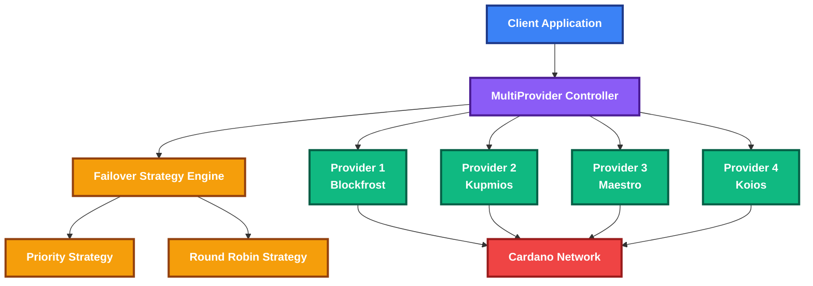
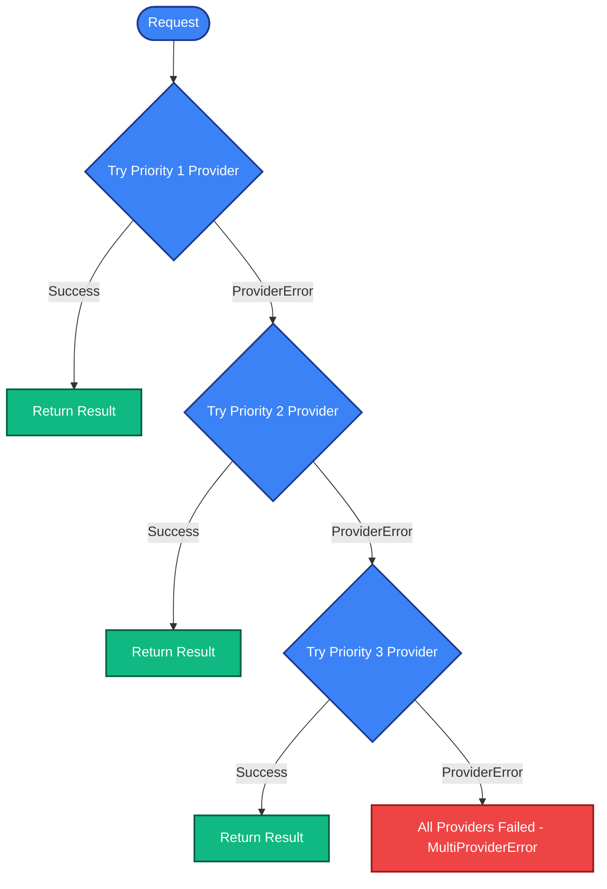
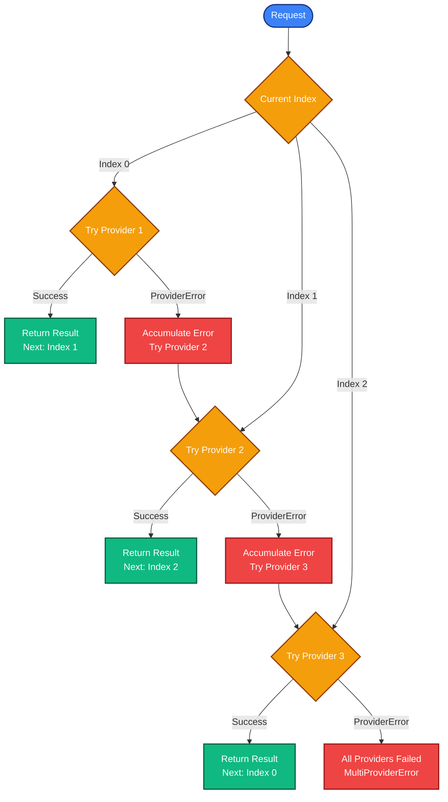
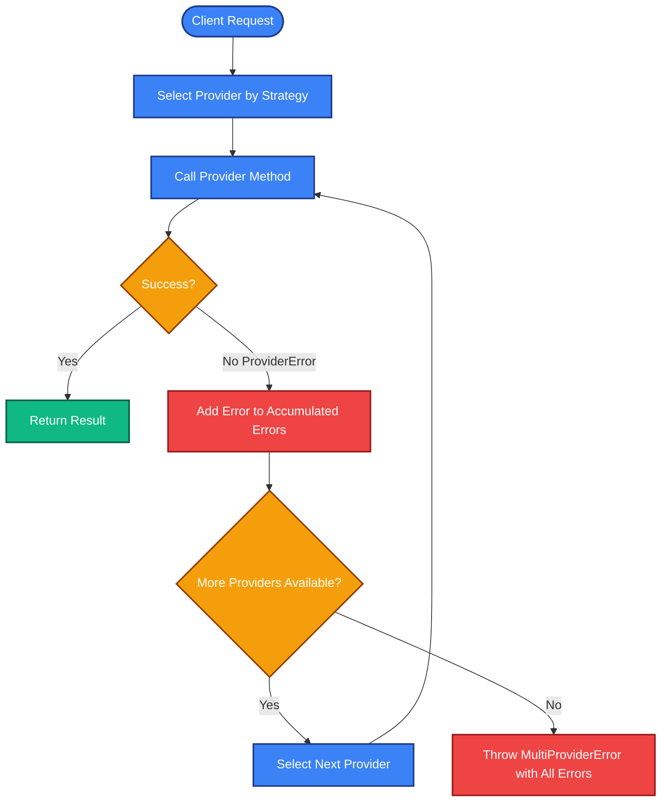

# Evolution SDK Provider Failover Specification

Technical specification for multi-provider failover strategies and error handling in the Evolution SDK.

## Overview

This specification defines the multi-provider failover system architecture, strategies, and error handling mechanisms for Cardano blockchain provider interactions.

### Features

- Multiple failover strategies: priority-based and round-robin selection
- Request-level retry mechanisms via Effect.retry
- Immediate failover on provider errors
- Comprehensive error handling and accumulation

## Architecture



## Provider Types

| Provider | Network Support | API Key Required | Pagination |
|----------|-----------------|------------------|------------|
| **Blockfrost** | Mainnet, Preprod, Preview | ✅ | Cursor-based |
| **Kupmios** | Mainnet, Preprod, Preview | ❌ (self-hosted) | Offset-based |
| **Maestro** | Mainnet, Preprod | ✅ | Cursor-based |
| **Koios** | Mainnet, Preprod, Preview | Optional | Offset-based |

## Failover Strategies

### 1. Priority Strategy

Routes requests to providers based on configured priority levels, failing over to lower priority providers when higher priority ones fail.

```typescript
interface PriorityStrategy {
  type: "priority"
  providers: Array<{
    provider: ProviderConfig
    priority: number // Lower number = higher priority (1 = highest)
  }>
}
```

#### Priority Strategy Workflow



### 2. Round Robin Strategy

Distributes requests evenly across all providers in sequential order.

```typescript
interface RoundRobinStrategy {
  type: "round-robin" 
  providers: Array<ProviderConfig>
}
```

#### Round Robin Strategy Workflow



## Request Flow and Failover

### High-Level Workflow



The system configures retry policies at provider construction time and switches providers immediately on ProviderError:

1. **Provider Construction**: Each provider is created with retry policy configured via `setRetryPolicy(config)`
2. **Provider Selection**: MultiProvider selects provider based on strategy
3. **Method Execution**: Call provider method (uses pre-configured retry policy with internal Effect.retry)
4. **Success**: Return result immediately
5. **ProviderError**: Provider has exhausted internal retries - immediately switch to next provider
6. **Error Accumulation**: Add provider's error to accumulated error list
7. **Failover**: Move to next provider and repeat the process
8. **Final Error**: Throw `MultiProviderError` with all accumulated errors if all providers fail

### Effect-Based Workflow Conditions

The MultiProvider maintains internal state and delegates retry logic to individual provider methods:

#### State Management
```typescript
interface MultiProviderState {
  readonly providers: ReadonlyArray<Provider>
  readonly strategy: FailoverStrategy
  // currentProviderIndex stored internally, accessed via method
}

// MultiProvider API for accessing internal state
interface MultiProvider {
  // Get current provider index (for debugging/monitoring)
  readonly getCurrentProviderIndex: () => number
  
  // ... provider methods
  readonly getProtocolParameters: () => Effect.Effect<ProtocolParameters, MultiProviderError>
  readonly getUtxos: (address: Address) => Effect.Effect<Array<UTxO>, MultiProviderError>
  // ... other provider methods
}
```

#### Provider Configuration Interface
```typescript
// Provider configuration with immutable retry policy
interface ProviderConfig {
  readonly type: "blockfrost" | "kupmios" | "maestro" | "koios"
  readonly baseUrl: string
  readonly apiKey?: string
  readonly projectId?: string
  readonly retryPolicy: RetryConfig
  // ... other provider-specific config
}

// Providers accept retry policy at construction time (immutable)
interface ProviderConstruction {
  readonly createProvider: (config: ProviderConfig) => Provider
}
```

#### Error Accumulation Pattern
```typescript
// MultiProviderError with accumulated child provider errors
interface MultiProviderError {
  readonly message: string
  readonly cause: unknown
  readonly failedProviders: ReadonlyArray<{
    readonly providerType: string
    readonly providerConfig: ProviderConfig
    readonly error: ProviderError
    readonly attemptTime: Date
    readonly retriesAttempted: number
  }>
  readonly allProvidersFailed: boolean
  readonly totalAttempts: number
}
```

#### Workflow Conditions
```typescript
// Minimal failover decision logic - immediate failover on ProviderError
interface FailoverConditions {
  // Should failover to next provider (always true on ProviderError)
  readonly shouldFailover: (
    providerIndex: number,
    error: ProviderError
  ) => boolean
}
```

#### Error-Driven State Transitions
```typescript
// Effect patterns for provider selection and error accumulation
interface StateTransitions {
  // Select next provider based on strategy
  readonly selectNextProvider: (
    currentIndex: number,
    strategy: FailoverStrategy,
    totalProviders: number
  ) => Effect.Effect<number, MultiProviderError>
  
  // Create MultiProviderError with all accumulated provider errors
  readonly createMultiProviderError: (
    accumulatedErrors: ReadonlyArray<ProviderFailureInfo>
  ) => MultiProviderError
}

interface ProviderFailureInfo {
  readonly providerType: string
  readonly providerConfig: ProviderConfig
  readonly error: ProviderError
  readonly attemptTime: Date
}
```

### Retry Configuration

```typescript
interface RetryConfig {
  maxRetries: number          // Configured at provider construction time
  retryDelayMs: number        // Base delay between retries
  backoffMultiplier: number   // Exponential backoff multiplier
  maxRetryDelayMs: number     // Maximum delay cap
}
```

### Example Flow

```typescript
// 1. Provider Construction - retry policy configured at construction time
const blockfrostConfig: ProviderConfig = {
  type: "blockfrost",
  baseUrl: "https://cardano-mainnet.blockfrost.io/api/v0",
  projectId: "your-project-id",
  retryPolicy: {
    maxRetries: 3,
    retryDelayMs: 1000,
    backoffMultiplier: 2,
    maxRetryDelayMs: 30000
  }
}

const blockfrostProvider = new BlockfrostProvider(blockfrostConfig)

// 2. Provider Implementation - internal Effect.retry using configured policy
class BlockfrostProvider implements Provider {
  constructor(private config: ProviderConfig) {
    this.Effect = {
      getProtocolParameters: Effect.retry(
        this.makeProtocolParametersRequest(),
        Schedule.exponential(`${this.config.retryPolicy.retryDelayMs} millis`)
          .pipe(
            Schedule.intersect(Schedule.recurs(this.config.retryPolicy.maxRetries)),
            Schedule.jittered() // Add jitter to prevent thundering herd
          )
      ),
      // ... other methods with same retry pattern
    }
  }
}

// 3. MultiProvider usage flow for getProtocolParameters()
// - MultiProvider.getProtocolParameters() called
// - Select provider by strategy (e.g., index 0 for priority strategy)
// - provider.Effect.getProtocolParameters() -> internal Effect.retry handles all retries
// - If provider method succeeds -> return result
// - If provider method fails with ProviderError -> accumulate error, select next provider
// - Repeat process with next provider
// - If all providers fail -> throw MultiProviderError with accumulated errors
```

## Usage Examples

### MultiProvider Construction

```typescript
// Example: Priority-based MultiProvider with custom retry policies
const multiProvider = MultiProvider.create({
  strategy: FailoverStrategy.Priority,
  providers: [
    {
      type: "blockfrost",
      baseUrl: "https://cardano-mainnet.blockfrost.io/api/v0",
      projectId: "mainnet_abc123",
      retryPolicy: {
        maxRetries: 3,
        retryDelayMs: 1000,
        backoffMultiplier: 2,
        maxRetryDelayMs: 30000
      }
    },
    {
      type: "kupmios", 
      baseUrl: "wss://ogmios.example.com",
      apiKey: "backup-key",
      retryPolicy: {
        maxRetries: 2,
        retryDelayMs: 500,
        backoffMultiplier: 1.5,
        maxRetryDelayMs: 10000
      }
    },
    {
      type: "maestro",
      baseUrl: "https://api.maestro.org/v1",
      apiKey: "maestro-key",
      retryPolicy: {
        maxRetries: 1,  // Fast failover for tertiary provider
        retryDelayMs: 200,
        backoffMultiplier: 1,
        maxRetryDelayMs: 200
      }
    }
  ]
})

// Usage with Effect API
const protocolParamsEffect = multiProvider.Effect.getProtocolParameters()
const protocolParams = await Effect.runPromise(protocolParamsEffect)

// Usage with Promise API (auto-generated)
const protocolParams2 = await multiProvider.getProtocolParameters()

// Debugging: Check which provider is currently active
const currentIndex = multiProvider.getCurrentProviderIndex()
console.log(`Currently using provider at index: ${currentIndex}`)
```

### Round-Robin Example

```typescript
// Example: Round-robin MultiProvider for load balancing
const loadBalancedProvider = MultiProvider.create({
  strategy: FailoverStrategy.RoundRobin,
  providers: [
    {
      type: "blockfrost",
      baseUrl: "https://cardano-mainnet.blockfrost.io/api/v0", 
      projectId: "project_1",
      retryPolicy: { maxRetries: 2, retryDelayMs: 1000, backoffMultiplier: 2, maxRetryDelayMs: 10000 }
    },
    {
      type: "blockfrost",
      baseUrl: "https://cardano-mainnet.blockfrost.io/api/v0",
      projectId: "project_2", 
      retryPolicy: { maxRetries: 2, retryDelayMs: 1000, backoffMultiplier: 2, maxRetryDelayMs: 10000 }
    },
    {
      type: "maestro",
      baseUrl: "https://api.maestro.org/v1",
      apiKey: "load-balance-key",
      retryPolicy: { maxRetries: 2, retryDelayMs: 800, backoffMultiplier: 1.8, maxRetryDelayMs: 15000 }
    }
  ]
})
```

## Error Handling

### MultiProviderError Structure

```typescript
class MultiProviderError extends Data.TaggedError("MultiProviderError") {
  readonly message: string
  readonly cause: unknown
  readonly failedProviders: ReadonlyArray<{
    readonly providerType: string
    readonly providerConfig: ProviderConfig
    readonly error: ProviderError
    readonly attemptTime: Date
  }>
  readonly allProvidersFailed: boolean
  readonly totalAttempts: number
}
```

### Error Recovery Strategies

```typescript
// Immediate Failover (no retries at provider level)
interface ImmediateFailover {
  maxRetries: 0
  retryDelayMs: 0
}

// Retry with Backoff (retries handled internally by provider methods)
interface RetryWithBackoff {
  maxRetries: number
  retryDelayMs: number
  backoffMultiplier: number
  maxRetryDelayMs: number
}
```

