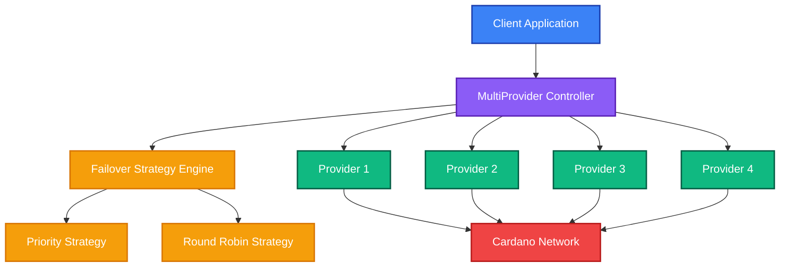
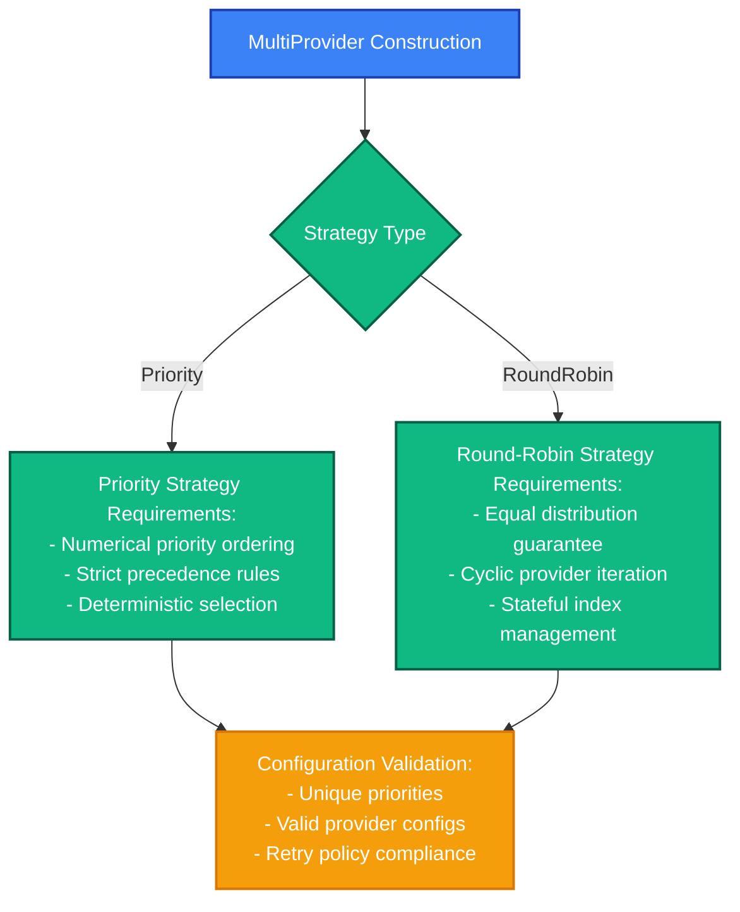

# Evolution SDK Provider Failover Specification

## Abstract

The Evolution SDK implements a multi-provider failover system enabling resilient blockchain interactions through automatic provider switching when failures occur. This specification defines the architecture, strategies, and error handling mechanisms for orchestrating failover between multiple Cardano data providers, supporting both priority-based and round-robin selection strategies with comprehensive error accumulation and debugging capabilities.

## Purpose and Scope

**Purpose**: Enable resilient blockchain interactions by automatically switching between multiple data providers when failures occur, ensuring high availability and fault tolerance for critical blockchain operations.

**Scope**: Defines the architecture, behavioral contracts, and technical requirements for multi-provider failover system within Evolution SDK. Covers MultiProvider controller, failover strategies, error handling mechanisms, and integration contracts between providers and client applications.

**Target Architecture**: Multi-provider orchestration system with pluggable failover strategies, immediate error-based switching, and comprehensive error accumulation for debugging and observability.

## Introduction

The provider failover system addresses the inherent unreliability of individual blockchain data providers by orchestrating requests across multiple providers with automatic failover on errors. The system supports multiple failover strategies optimized for different operational goals while maintaining comprehensive error tracking for debugging purposes.



The system provides immediate failover on provider errors while preserving comprehensive error context for debugging and maintains strategy-specific state for consistent provider selection patterns.

## Functional Specification (Normative)

The following requirements are specified using RFC 2119/8174 keywords: MUST (absolute requirement), SHOULD (recommended), MAY (optional).

### 1. Failover strategies

**1.1**: Priority strategy **MUST** attempt providers in strict priority order (lowest priority number first).

**1.2**: Applications **SHOULD** use priority strategy when providers have different cost, reliability, or feature characteristics.

**1.3**: Priority configuration **MUST** assign unique priority numbers to avoid ambiguous ordering.

**1.4**: Round-robin strategy **MUST** distribute requests evenly across all configured providers.

**1.5**: Applications **SHOULD** use round-robin strategy for load balancing when all providers have equivalent capabilities.

**1.6**: Round-robin **MAY** be preferred in high-throughput scenarios to prevent provider overload.

**1.7**: Priority strategy **MUST** support arbitrary priority ordering with numerical priority values.

**1.8**: Round-robin strategy **MUST** maintain equal distribution across all providers over time.

**1.9**: Strategy selection **MUST** be determined at MultiProvider construction time and remain immutable.

### 2. Request flow and failover orchestration

**2.1**: MultiProvider **MUST** attempt immediate failover when a provider returns a `ProviderError`.

**2.2**: Individual providers **SHOULD** handle internal retries before returning errors to MultiProvider.

**2.3**: Error accumulation **MUST** preserve all provider failure details for debugging purposes.

**2.4**: MultiProviderError **MUST** contain details from all failed provider attempts.

**2.5**: Error timestamps **SHOULD** enable debugging of timing-related issues.

**2.6**: Applications **MAY** use provider error details to implement custom recovery logic.

**2.7**: Retry policies **MUST** be configured at provider construction time and remain immutable.

**2.8**: Applications **SHOULD** tune retry policies based on provider characteristics and SLA requirements.

### 3. Interface contracts and integration

**3.1**: MultiProvider **MUST** implement the complete Provider interface while managing multiple underlying providers.

**3.2**: MultiProvider **MUST** maintain immutable configuration after construction.

**3.3**: MultiProvider state transitions **MUST** be thread-safe and deterministic.

**3.4**: All providers **MUST** implement consistent error handling with `ProviderError` types.

**3.5**: Provider methods **MUST** complete internal retries before returning to MultiProvider.

**3.6**: Providers **SHOULD** implement Effect-based APIs with Promise adapters for compatibility.

**3.7**: FailoverStrategy implementations **MUST** be deterministic for identical input sequences.

**3.8**: Strategy state mutations **MUST** be isolated per MultiProvider instance.

**3.9**: Strategy selection algorithms **MUST** complete in O(1) time complexity.

### 4. Performance and reliability constraints

**4.1**: Failover operations **MUST** complete within 100ms excluding network operations.

**4.2**: Strategy selection **MUST** not block concurrent requests to different MultiProvider instances.

**4.3**: Memory usage **SHOULD** remain constant regardless of error accumulation count.

**4.4**: Provider configurations **MUST** be validated at construction time, not runtime.

### 5. Error handling and classification

**5.1**: MultiProviderError **MUST** distinguish between network failures, authentication failures, and provider unavailability.

**5.2**: Error propagation **MUST** preserve original error context while adding failover metadata.

**5.3**: System **MUST** continue failover attempts until all providers exhausted, regardless of error types.

## Appendix (Informative) {#appendix}

### A.1. Strategy Configuration Workflows



### A.2. Priority Strategy Flow


### A.3. Round Robin Strategy Flow


### A.4. High-Level Request Flow


### A.5. Provider Ecosystem Matrix

| Provider | Network Support | API Key Required | Pagination | Cost Model | Reliability Notes |
|----------|-----------------|------------------|------------|------------|------------------|
| **Blockfrost** | Mainnet, Preprod, Preview | ✅ | Cursor-based | Freemium | High SLA on paid tiers |
| **Kupmios** | Mainnet, Preprod, Preview | ❌ (self-hosted) | Offset-based | Free | Variable, depends on host |
| **Maestro** | Mainnet, Preprod | ✅ | Cursor-based | Subscription | Enterprise-grade |
| **Koios** | Mainnet, Preprod, Preview | Optional | Offset-based | Donation-based | Community-maintained |

### A.6. Interface Definitions

```typescript
interface PriorityStrategy {
  type: "priority"
  providers: Array<{
    provider: ProviderConfig
    priority: number // Lower number = higher priority (1 = highest)
  }>
}

interface RoundRobinStrategy {
  type: "round-robin" 
  providers: Array<ProviderConfig>
}

interface MultiProviderContract extends Provider {
  readonly getCurrentProviderIndex: () => number
  readonly getFailoverStrategy: () => FailoverStrategy
  readonly getProviderConfigurations: () => ReadonlyArray<ProviderConfig>
}

interface FailoverStrategyContract {
  readonly selectProvider: (
    providers: ReadonlyArray<Provider>,
    currentIndex: number,
    previousErrors: ReadonlyArray<ProviderError>
  ) => number
  
  readonly updateState: (
    selectedIndex: number,
    result: Either<ProviderError, unknown>
  ) => FailoverStrategyState
}

interface RetryConfig {
  maxRetries: number          // Configured at provider construction time
  retryDelayMs: number        // Base delay between retries
  backoffMultiplier: number   // Exponential backoff multiplier
  maxRetryDelayMs: number     // Maximum delay cap
}
```

### A.7. System Responsibilities Matrix

| Component | Responsibilities |
|-----------|------------------|
| **MultiProvider** | Provider selection and failover orchestration; Error accumulation and MultiProviderError construction; Strategy state management and coordination; Request routing and response aggregation |
| **Provider** | Internal retry logic and backoff handling; Network communication and protocol implementation; Provider-specific error classification and reporting; Resource management and connection pooling |
| **Strategy** | Provider selection algorithm implementation; Internal state management for selection logic; Deterministic behavior for identical input sequences |

### A.8. Key Abstractions

**Provider failover** is an automatic mechanism that switches between multiple blockchain data providers when one becomes unavailable or returns errors. Think of it as having multiple routes to the same destination - if one route is blocked, you automatically take an alternative path.

**MultiProvider**: A controller that manages multiple individual providers and orchestrates failover logic. It presents a single interface while internally handling provider selection and error recovery.

**Failover Strategy**: The algorithm that determines which provider to try next when the current one fails. Each strategy optimizes for different goals:
- **Priority Strategy**: Optimizes for provider preference (cost, reliability, features)
- **Round-Robin Strategy**: Optimizes for load distribution across providers

**Retry vs Failover**: 
- **Retry**: Attempting the same request on the same provider multiple times with delays
- **Failover**: Switching to a different provider immediately when the current one fails

### A.9. Essential Workflows

**Request Lifecycle**: Request → Provider Selection → Execution → Success/Error → (Failover if needed) → Final Result

**Error Accumulation**: When providers fail, their errors are collected rather than discarded, providing complete debugging information in the final `MultiProviderError`.

**State Management**: Each strategy maintains internal state (current provider index) that evolves with each request, enabling consistent provider selection patterns.

### A.10. Implementation Architecture Notes

**State Management**: MultiProvider maintains internal provider state and selection logic. See `MultiProvider` implementation in `src/sdk/provider/MultiProvider.ts` for complete interface definitions.

**Provider Configuration**: Each provider is configured with retry policies at construction time. Provider configurations are immutable after creation. See `ProviderConfig` and related types in `src/sdk/provider/Provider.ts`.

**Error Accumulation**: Failed provider attempts are accumulated with timestamps and retry counts, enabling comprehensive debugging information. See `MultiProviderError` and error types in `src/sdk/provider/MultiProvider.ts`.

**Failover Logic**: The system uses immediate failover on `ProviderError` - no additional retry logic at the MultiProvider level. Individual providers handle internal retries using Effect.retry patterns.

### A.11. Error Recovery Patterns

**Immediate Failover**: Configure `maxRetries: 0` for fast switching between providers without individual retry delays.

**Retry with Backoff**: Configure exponential backoff parameters for providers that may have transient failures. See `RetryConfig` interface in `src/sdk/provider/Provider.ts` for configuration options.

**Network Error Handling**: System continues failover on connectivity issues without modification to retry policies.

**Authentication Error Handling**: Provider authentication failures trigger immediate failover without retries on that specific provider.

**Rate Limiting Behavior**: Provider rate limit responses trigger failover and mark provider temporarily unavailable per retry policy configuration.

