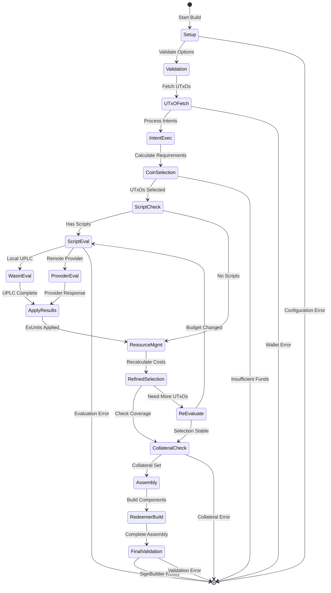
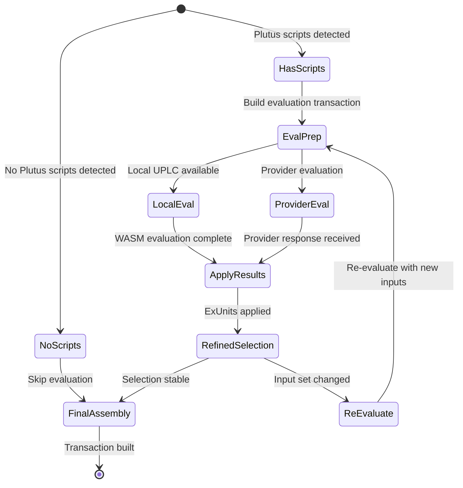

# Transaction Build Process Specification

**Version**: 1.0.0  
**Status**: DRAFT  
**Created**: September 24, 2025  
**Authors**: Evolution SDK Team  
**Reviewers**: [To be assigned]

---

## Abstract

This specification defines the comprehensive transaction build process for the Evolution SDK, establishing the normative requirements for constructing valid Cardano transactions. The build process implements a sophisticated multi-phase workflow that coordinates UTxO selection, script evaluation, fee calculation, collateral management, and transaction assembly. Key innovations include iterative coin selection with script cost integration, dual UPLC/provider evaluation strategies, automatic collateral selection, and comprehensive error recovery mechanisms. The specification ensures deterministic transaction construction while maintaining flexibility for complex use cases including multi-signature workflows, script interactions, and transaction chaining.

---

## Purpose and Scope

This specification establishes the authoritative requirements for transaction building within the Evolution SDK ecosystem. It serves as the definitive reference for implementers of the build process and provides behavioral contracts for developers using the transaction building system.

**Target Audience**: Core SDK maintainers, transaction builder implementers, DApp developers integrating with the build system, and auditors reviewing transaction construction logic.

**Scope**: This specification covers the complete transaction build workflow from intent accumulation through final transaction assembly. It includes coin selection algorithms, script evaluation protocols, fee calculation methods, collateral management, UTxO state transitions, and error handling strategies. It does not cover wallet-specific signing processes, network submission protocols, or provider-specific data access patterns.

---

## Introduction

Transaction building in Cardano requires sophisticated coordination between multiple subsystems to produce valid, optimized transactions. The Evolution SDK build process addresses the inherent complexity through a carefully orchestrated multi-phase approach that ensures correctness while maintaining performance and usability.

### Fundamental Challenges Addressed

1. **Chicken-and-Egg Problem**: Script evaluation requires a complete transaction, but building a transaction requires knowing script execution costs
2. **UTxO Selection Optimization**: Selecting optimal UTxO sets while satisfying minimum ADA requirements and protocol constraints
3. **Fee Calculation Complexity**: Accurately estimating fees across base transaction costs, script execution costs, and reference script fees
4. **Script Evaluation Integration**: Supporting both local WASM evaluation and external provider evaluation with consistent results
5. **State Management**: Maintaining consistent state across multiple build phases with proper error recovery

### Design Philosophy

The build process follows these core principles:

1. **Deterministic Construction**: Given identical inputs, the build process produces identical transactions
2. **Progressive Refinement**: Start with estimates, refine through evaluation, converge on optimal solution
3. **Fail-Fast Validation**: Detect and report errors as early as possible in the build process
4. **Resource Efficiency**: Minimize computational overhead while ensuring correctness
5. **Composable Architecture**: Enable complex workflows through well-defined phase boundaries

### Integration Context

The build process integrates with the Evolution SDK architecture through:
- **Intent Accumulation**: Collects transaction operations from the fluent API
- **UTxO Management**: Coordinates with wallet and provider systems for UTxO access
- **Script System**: Manages Plutus script evaluation and witness generation
- **Fee System**: Calculates comprehensive fee estimates including all cost components
- **Error System**: Provides detailed error information with recovery guidance

### Transaction Build Process Workflow

```mermaid
graph TD
    A[Start: Build Process] --> B[Phase 1: Setup & Validation]
    
    B --> B1[Validate Build Options]
    B --> B2[Fetch Wallet UTxOs]
    B --> B3[Derive Change Address]
    B --> B4[Initialize Build State]
    
    B1 --> C[Phase 2: Intent Execution]
    B2 --> C
    B3 --> C
    B4 --> C
    
    C --> C1[Process Payment Intents]
    C1 --> C2[Process Input Collection]
    C2 --> C3[Process Minting Operations]
    C3 --> C4[Calculate Asset Delta<br/>Outputs + Fee - Inputs - Minted]
    C4 --> C5[Detect Script Usage]
    
    C5 --> D[Phase 3: Initial Coin Selection]
    
    D --> D1[Apply Coin Selection Algorithm<br/>Largest-First / Random-Improve / Custom]
    D1 --> D2[Recursive UTxO Selection]
    D2 --> D3[Handle Minimum ADA Requirements]
    D3 --> D4{Selection<br/>Successful?}
    
    D4 -->|No| D5[Insufficient Funds Error]
    D4 -->|Yes| E{Has Plutus<br/>Scripts?}
    
    E -->|No| I[Phase 5: Skip Script Evaluation]
    E -->|Yes| F[Phase 4: Script Evaluation]
    
    F --> F1[Build Evaluation Transaction<br/>Dummy ExUnits & Invalid Hash]
    F1 --> F2{Evaluation<br/>Strategy?}
    
    F2 -->|WASM| F3[Local UPLC Evaluation]
    F2 -->|Provider| F4[External Provider Evaluation]
    
    F3 --> F5[Apply UPLC Results<br/>Update ExUnits & Script Hash]
    F4 --> F5
    
    F5 --> G[Phase 5: Refined Resource Management]
    
    G --> G1[Recalculate Fee with Script Costs]
    G1 --> G2[Check Current UTxO Coverage]
    G2 --> G3{Need Additional<br/>UTxOs?}
    
    G3 -->|Yes| G4[Select Additional UTxOs]
    G3 -->|No| G7[Calculate Collateral Requirements]
    
    G4 --> G5{Script Budget<br/>Changed?}
    G5 -->|Yes| G6[Re-evaluate Scripts]
    G5 -->|No| G7
    
    G6 --> F1
    
    G7 --> G8[Select Collateral UTxOs<br/>ADA-only, Max 3]
    G8 --> G9[Apply Collateral to Transaction]
    
    G9 --> H[Phase 6: Transaction Assembly]
    
    H --> H1[Complete Partial Programs]
    H1 --> H2[Build Redeemers with Correct Indices]
    H2 --> H3[Calculate Final Fee & Change]
    H3 --> H4[Construct Transaction Body]
    H4 --> H5[Build Witness Set Structure]
    H5 --> H6[Final Validation<br/>Size, Balance, Protocol]
    
    H6 --> J[Return SignBuilder]
    
    I --> G7
    
    D5 --> K[Build Error]
    F5 --> L{Evaluation<br/>Failed?}
    L -->|Yes| K
    L -->|No| G
    
    G8 --> M{Collateral<br/>Available?}
    M -->|No| K
    M -->|Yes| G9
    
    H6 --> N{Validation<br/>Passed?}
    N -->|No| K
    N -->|Yes| J
    
    style A fill:#4a90e2,color:#ffffff,stroke:#2171b5,stroke-width:3px
    style B fill:#9b59b6,color:#ffffff,stroke:#8e44ad,stroke-width:3px
    style C fill:#27ae60,color:#ffffff,stroke:#229954,stroke-width:3px
    style D fill:#f39c12,color:#ffffff,stroke:#e67e22,stroke-width:3px
    style E fill:#f1c40f,color:#2c3e50,stroke:#f39c12,stroke-width:3px
    style F fill:#e74c3c,color:#ffffff,stroke:#c0392b,stroke-width:3px
    style G fill:#1abc9c,color:#ffffff,stroke:#16a085,stroke-width:3px
    style H fill:#34495e,color:#ffffff,stroke:#2c3e50,stroke-width:3px
    style I fill:#95a5a6,color:#ffffff,stroke:#7f8c8d,stroke-width:3px
    style J fill:#2ecc71,color:#ffffff,stroke:#27ae60,stroke-width:4px
    style K fill:#e74c3c,color:#ffffff,stroke:#c0392b,stroke-width:4px
    
    classDef phaseBox fill:#ecf0f1,stroke:#34495e,stroke-width:3px,color:#2c3e50
    classDef decision fill:#fff3cd,stroke:#856404,stroke-width:3px,color:#856404
    classDef error fill:#f8d7da,stroke:#721c24,stroke-width:3px,color:#721c24
    classDef success fill:#d4edda,stroke:#155724,stroke-width:3px,color:#155724
    
    class B,C,D,F,G,H,I phaseBox
    class E,D4,F2,G3,G5,L,M,N decision
    class D5,K error
    class J success
```



### Build Process State Flow



---

## Functional Specification

### Build Process Architecture (Normative)

The transaction build process SHALL implement a six-phase workflow with well-defined phase boundaries, state transitions, and error handling protocols.

#### Phase Overview

The build process MUST execute the following phases in order:

1. **Setup and Validation Phase**: Initialize build environment and validate configuration
2. **Intent Execution Phase**: Process accumulated transaction intents into concrete requirements
3. **Initial Coin Selection Phase**: Select UTxOs without script execution costs
4. **Script Evaluation Phase**: Determine script execution costs and apply to transaction
5. **Refined Resource Management Phase**: Adjust coin selection and collateral for final costs
6. **Transaction Assembly Phase**: Construct final transaction with all components

Each phase MUST complete successfully before proceeding to the next phase. Phase failures MUST trigger appropriate error handling with detailed diagnostics.

### Phase 1: Setup and Validation (Normative)

#### Purpose
Initialize the build environment, validate configuration parameters, and establish the foundation for transaction construction.

#### Required Operations

The setup phase MUST perform the following operations:

1. **Configuration Validation**:
   ```typescript
   // Validate build options
   if (options.coinSelection && typeof options.coinSelection === 'object') {
     validateCoinSelectionOptions(options.coinSelection)
   }
   
   if (options.collateral && options.collateral.length > 3) {
     throw new BuildError("Collateral inputs cannot exceed 3 UTxOs")
   }
   
   if (options.uplcEval?.type === "wasm" && !options.uplcEval.wasmModule) {
     throw new BuildError("WASM module required for WASM UPLC evaluation")
   }
   ```

2. **UTxO Set Acquisition**:
   ```typescript
   // Automatic UTxO fetching if not provided
   const availableUtxos = providedUtxos ?? await wallet.getUtxos()
   
   // Filter out UTxOs with reference scripts (excluded from coin selection)
   const coinSelectionUtxos = availableUtxos.filter(utxo => 
     !hasReferenceScript(utxo)
   )
   
   if (coinSelectionUtxos.length === 0) {
     throw new BuildError("No UTxOs available for coin selection")
   }
   ```

3. **Address Resolution**:
   ```typescript
   // Derive change address
   const changeAddress = options.changeAddress ?? 
     await wallet.getChangeAddress() ??
     await wallet.getAddress()
   
   // Validate address format and network compatibility
   validateAddressNetwork(changeAddress, network)
   ```

4. **State Initialization**:
   ```typescript
   interface BuildState {
     availableUtxos: UTxO[]
     changeAddress: Address
     selectedUtxos: UTxO[]
     requiredAssets: Assets
     estimatedFee: Coin
     hasScripts: boolean
     scriptEvaluationResults?: EvaluationResults
     collateralUtxos?: UTxO[]
   }
   ```

#### Error Conditions

The setup phase MUST fail with specific error types for the following conditions:
- Invalid build options configuration
- Wallet access failures
- Network compatibility errors
- Insufficient UTxO availability

### Phase 2: Intent Execution (Normative)

#### Purpose
Process all accumulated transaction intents into concrete transaction requirements including outputs, inputs, minting operations, and metadata.

#### Required Processing

The intent execution phase MUST process intents in the following order:

1. **Output Requirements Calculation**:
   ```typescript
   // Process all payToAddress intents
   const outputRequirements = intents
     .filter(intent => intent.type === 'payToAddress')
     .reduce((total, intent) => mergeAssets(total, intent.assets), emptyAssets())
   
   // Add minimum ADA requirements for each output
   const outputsWithMinAda = outputs.map(output => 
     ensureMinimumAda(output, protocolParameters.coinsPerUtxoByte)
   )
   ```

2. **Input Commitments Processing**:
   ```typescript
   // Process collectFrom intents
   const explicitInputs = intents
     .filter(intent => intent.type === 'collectFrom')
     .flatMap(intent => intent.inputs)
   
   // Calculate assets provided by explicit inputs
   const explicitInputAssets = sumAssetsFromInputs(explicitInputs)
   ```

3. **Minting/Burning Operations**:
   ```typescript
   // Process mint/burn intents
   const mintingOperations = intents
     .filter(intent => intent.type === 'mintTokens' || intent.type === 'burnTokens')
   
   // Calculate net asset changes from minting/burning
   const netMintedAssets = calculateNetMinting(mintingOperations)
   ```

4. **Script Detection**:
   ```typescript
   // Detect Plutus script usage
   const hasPlutusScripts = intents.some(intent => 
     intent.type === 'spendFromScript' ||
     (intent.type === 'mintTokens' && intent.redeemer) ||
     (intent.type === 'payToScript')
   )
   ```

#### Asset Delta Calculation

The phase MUST calculate the net asset requirements using the formula:

```
Required Assets = Outputs + Estimated Fee - Explicit Inputs - Net Minted Assets
```

Where:
- **Outputs**: Total assets required by all transaction outputs
- **Estimated Fee**: Initial fee estimate without script costs
- **Explicit Inputs**: Assets provided by explicitly specified inputs
- **Net Minted Assets**: Net assets created through minting minus burning

#### Validation Requirements

The intent execution phase MUST validate:
- All required parameters are present for each intent type
- Asset amounts are non-negative and within protocol limits
- Script references are valid and accessible
- Metadata conforms to protocol standards

### Phase 3: Initial Coin Selection (Normative)

#### Purpose
Select UTxOs to satisfy transaction requirements without considering script execution costs. This provides the foundation for script evaluation in subsequent phases.

#### Coin Selection Algorithm Requirements

The coin selection implementation MUST support the following algorithms:

1. **Largest-First Algorithm**:
   ```typescript
   interface LargestFirstStrategy {
     // Sort UTxOs by total value in descending order
     sortBy: (utxo: UTxO) => bigint // Total ADA value
     
     // Select UTxOs until requirements met
     selectUntil: (accumulated: Assets, required: Assets) => boolean
     
     // Handle multi-asset requirements
     assetPriority: "ada" | "required" // Prioritize ADA or required assets
   }
   ```

2. **Random-Improve Algorithm**:
   ```typescript
   interface RandomImproveStrategy {
     // Initial random selection
     initialSelection: (utxos: UTxO[], required: Assets) => UTxO[]
     
     // Improvement iterations
     maxIterations: number // Default: 20
     
     // Improvement criteria
     improvementThreshold: number // Minimum improvement to accept change
   }
   ```

3. **Custom Selection Function**:
   ```typescript
   type CoinSelectionFunction = (
     availableUtxos: ReadonlyArray<UTxO>,
     requiredAssets: Assets,
     options: CoinSelectionOptions
   ) => Effect<CoinSelectionResult, CoinSelectionError>
   ```

#### Recursive Selection Protocol

The coin selection MUST implement recursive selection to handle minimum ADA requirements:

```typescript
interface RecursiveSelectionProtocol {
  // Phase 1: Select for required assets
  initialSelection(required: Assets): UTxO[]
  
  // Phase 2: Calculate minimum ADA for change
  calculateMinimumAda(changeAssets: Assets): Coin
  
  // Phase 3: Select additional UTxOs if needed
  selectForMinimumAda(additionalRequired: Coin): UTxO[]
  
  // Phase 4: Iterate until stable
  iterateUntilStable(): CoinSelectionResult
}
```

#### Selection Criteria

The coin selection algorithm MUST apply the following filtering criteria:

1. **Reference Script Exclusion**:
   ```typescript
   const eligibleUtxos = availableUtxos.filter(utxo => 
     !hasReferenceScript(utxo)
   )
   ```

2. **Asset Availability Filtering**:
   ```typescript
   const relevantUtxos = eligibleUtxos.filter(utxo =>
     hasRequiredAssets(utxo, requiredAssets) || 
     hasAda(utxo) // Always include ADA-bearing UTxOs
   )
   ```

3. **Maximum Input Limit**:
   ```typescript
   if (selectedUtxos.length > (options.maxInputs ?? 50)) {
     throw new CoinSelectionError("Maximum input limit exceeded")
   }
   ```

#### Minimum ADA Calculation

The coin selection MUST implement accurate minimum ADA calculation:

```typescript
const calculateMinimumAda = (
  assets: Assets, 
  coinsPerUtxoByte: bigint,
  hasScriptRef?: boolean
): Coin => {
  // Create temporary output to calculate size
  const tempOutput = createTransactionOutput({
    address: dummyAddress,
    assets,
    scriptRef: hasScriptRef ? dummyScriptRef : undefined
  })
  
  // Calculate CBOR size
  const cborSize = calculateCborSize(tempOutput)
  
  // Apply minimum ADA formula
  return coinsPerUtxoByte * BigInt(cborSize)
}
```

### Phase 4: Script Evaluation (Normative)

#### Purpose
Evaluate Plutus scripts to determine execution units and associated costs, enabling accurate fee calculation and refined coin selection.

#### Two-Phase Script Evaluation Protocol

The script evaluation MUST implement a two-phase protocol to handle the chicken-and-egg problem:

#### Phase 4A: Evaluation Transaction Construction

```typescript
interface EvaluationTransactionRequirements {
  // MUST create transaction with dummy ExUnits
  createWithDummyExUnits(): Transaction
  
  // MUST set invalid script_data_hash to prevent submission
  setDummyScriptDataHash(): void
  
  // MUST include all transaction components for evaluation
  includeAllComponents(): void
  
  // MUST be suitable for script evaluation but invalid for submission
  ensureEvaluationOnly(): boolean
}
```

The evaluation transaction construction MUST:
1. Use placeholder ExUnits for all redeemers: `{ cpu: 0, memory: 0 }`
2. Set `script_data_hash` to all zeros to invalidate submission
3. Include all inputs, outputs, and redeemers required for evaluation
4. Calculate temporary fee estimate for transaction size

#### Phase 4B: Script Execution and Results Application

The script evaluation MUST support dual evaluation strategies:

1. **WASM UPLC Evaluation**:
   ```typescript
   interface WasmUplcEvaluation {
     // Execute scripts locally using WASM UPLC interpreter
     evaluate(
       transaction: Transaction,
       wasmModule: UplcWasmModule,
       timeout?: number
     ): Promise<UplcEvaluationResult[]>
     
     // Apply results to transaction builder
     applyResults(results: UplcEvaluationResult[]): void
   }
   ```

2. **Provider Evaluation**:
   ```typescript
   interface ProviderEvaluation {
     // Submit to external provider for evaluation
     evaluate(
       transaction: Transaction,
       additionalUtxos?: UTxO[]
     ): Promise<ProviderEvaluationResult>
     
     // Apply structured results
     applyResults(results: ProviderEvaluationResult): void
   }
   ```

#### Evaluation Result Processing

The evaluation results MUST be processed according to the following protocol:

```typescript
interface EvaluationResultProcessing {
  // Validate evaluation results
  validateResults(results: EvaluationResult[]): void
  
  // Apply ExUnits to corresponding redeemers
  applyExUnitsToRedeemers(results: EvaluationResult[]): void
  
  // Calculate script execution costs
  calculateScriptCosts(results: EvaluationResult[]): Coin
  
  // Update transaction with real ExUnits
  updateTransactionExUnits(): void
  
  // Recalculate script_data_hash
  recalculateScriptDataHash(): ScriptDataHash
}
```

#### Error Recovery Protocol

Script evaluation failures MUST be handled according to the following protocol:

1. **Evaluation Timeout**: Retry with increased timeout or fallback to provider
2. **Script Failure**: Provide detailed error with script context and input data  
3. **Provider Unavailable**: Fallback to local evaluation if WASM module available
4. **Invalid Results**: Validate ExUnits are within protocol limits

### Phase 5: Refined Resource Management (Normative)

#### Purpose
Adjust coin selection and resource allocation based on actual script execution costs and finalize collateral requirements.

#### Refined Coin Selection Protocol

After script evaluation, the build process MUST perform refined coin selection:

```typescript
interface RefinedCoinSelectionProtocol {
  // Recalculate total fee with script costs
  calculateFinalFee(
    baseFee: Coin,
    scriptCosts: Coin,
    referenceScriptFees: Coin
  ): Coin
  
  // Check if current UTxOs cover final costs
  validateCurrentSelection(
    selectedUtxos: UTxO[],
    finalRequirements: Assets
  ): boolean
  
  // Select additional UTxOs if needed
  selectAdditionalUtxos(
    remainingUtxos: UTxO[],
    additionalRequired: Assets
  ): UTxO[]
  
  // Validate final selection stability
  validateSelectionStability(): boolean
}
```

#### Script Budget Recalculation

The refined selection MUST handle script budget changes:

```typescript
interface ScriptBudgetManagement {
  // Detect if new inputs affect script execution
  detectBudgetChanges(
    originalInputs: UTxO[],
    newInputs: UTxO[]
  ): boolean
  
  // Re-evaluate scripts if significant changes
  requiresReEvaluation(budgetChange: BudgetChange): boolean
  
  // Implement re-evaluation protocol
  reEvaluateScripts(
    newInputSet: UTxO[]
  ): Promise<EvaluationResult[]>
}
```

#### Collateral Selection Protocol

For transactions with Plutus scripts, the build process MUST implement collateral selection:

```typescript
interface CollateralSelectionProtocol {
  // Calculate required collateral amount
  calculateCollateralAmount(
    estimatedFee: Coin,
    collateralPercentage: number,
    minimumCollateral?: Coin
  ): Coin
  
  // Select suitable collateral UTxOs
  selectCollateralUtxos(
    availableUtxos: UTxO[],
    requiredAmount: Coin
  ): UTxO[]
  
  // Validate collateral requirements
  validateCollateral(
    collateralUtxos: UTxO[],
    requirements: CollateralRequirements
  ): boolean
}
```

#### Collateral Selection Criteria

Collateral UTxOs MUST meet the following requirements:

1. **ADA-Only Constraint**:
   ```typescript
   const isAdaOnly = (utxo: UTxO): boolean => 
     Object.keys(utxo.output.amount).length === 1 &&
     utxo.output.amount.lovelace > 0n
   ```

2. **No Reference Scripts**:
   ```typescript
   const hasNoReferenceScript = (utxo: UTxO): boolean =>
     !utxo.output.scriptRef
   ```

3. **Maximum Count Limit**:
   ```typescript
   if (collateralUtxos.length > 3) {
     throw new BuildError("Collateral cannot exceed 3 UTxOs")
   }
   ```

4. **Sufficient Value**:
   ```typescript
   const totalCollateralValue = collateralUtxos.reduce(
     (sum, utxo) => sum + utxo.output.amount.lovelace, 0n
   )
   
   if (totalCollateralValue < requiredCollateralAmount) {
     throw new BuildError("Insufficient collateral value")
   }
   ```

### Phase 6: Transaction Assembly (Normative)

#### Purpose
Construct the final transaction with all components including inputs, outputs, witnesses, metadata, and proper fee allocation.

#### Assembly Protocol

The transaction assembly MUST follow this protocol:

```typescript
interface TransactionAssemblyProtocol {
  // Build transaction body with all components
  buildTransactionBody(): TransactionBody
  
  // Calculate final fee and change outputs
  calculateFinalFeeAndChange(): { fee: Coin, changeOutputs: TransactionOutput[] }
  
  // Apply final fee to transaction
  applyFinalFee(fee: Coin): void
  
  // Build complete witness set structure
  buildWitnessSet(): TransactionWitnessSet
  
  // Construct final transaction
  assembleTransaction(): Transaction
}
```

#### Redeemer Index Management

The assembly process MUST implement accurate redeemer index management:

```typescript
interface RedeemerIndexManagement {
  // Map UTxOs to their transaction input indices
  createInputIndexMap(
    inputs: UTxO[]
  ): Map<string, number> // UTxO ID -> Input Index
  
  // Build redeemers with correct indices
  buildRedeemers(
    partialPrograms: PartialProgram[],
    inputIndexMap: Map<string, number>
  ): Redeemer[]
  
  // Validate redeemer indices are unique and valid
  validateRedeemerIndices(redeemers: Redeemer[]): void
}
```

#### Change Output Calculation

The assembly process MUST implement comprehensive change calculation:

```typescript
interface ChangeCalculationProtocol {
  // Calculate total available assets
  calculateTotalAvailable(
    selectedUtxos: UTxO[],
    mintedAssets: Assets
  ): Assets
  
  // Calculate total required assets
  calculateTotalRequired(
    outputs: TransactionOutput[],
    fee: Coin,
    burnedAssets: Assets
  ): Assets
  
  // Calculate change assets
  calculateChange(
    available: Assets,
    required: Assets
  ): Assets
  
  // Create change outputs with minimum ADA
  createChangeOutputs(
    changeAssets: Assets,
    changeAddress: Address,
    coinsPerUtxoByte: bigint
  ): TransactionOutput[]
}
```

#### Final Validation Protocol

Before returning the built transaction, the assembly MUST perform final validation:

```typescript
interface FinalValidationProtocol {
  // Validate transaction size limits
  validateTransactionSize(transaction: Transaction): void
  
  // Validate input/output balance
  validateAssetBalance(transaction: Transaction): void
  
  // Validate script data hash consistency
  validateScriptDataHash(transaction: Transaction): void
  
  // Validate protocol parameter compliance
  validateProtocolCompliance(
    transaction: Transaction,
    protocolParameters: ProtocolParameters
  ): void
}
```

### Error Handling and Recovery (Normative)

#### Error Classification

The build process MUST classify errors into specific categories with appropriate recovery strategies:

```typescript
interface BuildErrorTypes {
  // Configuration and setup errors (non-recoverable)
  ConfigurationError: {
    invalidOptions: BuildOptionsError
    walletAccessError: WalletError
    networkMismatch: NetworkError
  }
  
  // Resource availability errors (potentially recoverable)
  ResourceError: {
    insufficientFunds: InsufficientFundsError
    noSuitableUtxos: UTxOAvailabilityError
    collateralUnavailable: CollateralError
  }
  
  // Script evaluation errors (context-dependent)
  ScriptError: {
    evaluationTimeout: TimeoutError
    evaluationFailure: ExecutionError
    invalidExUnits: ValidationError
  }
  
  // Protocol compliance errors (non-recoverable)
  ProtocolError: {
    transactionTooLarge: SizeError
    invalidTransaction: StructureError
    protocolLimitExceeded: LimitError
  }
}
```

#### Recovery Strategies

Each error category MUST implement appropriate recovery strategies:

1. **Resource Errors**: Provide detailed asset breakdown and suggestions
2. **Script Errors**: Fallback evaluation strategies and timeout adjustments
3. **Protocol Errors**: Clear guidance on limit violations and corrections
4. **Network Errors**: Retry logic with exponential backoff

#### Error Context Preservation

All errors MUST preserve context for debugging:

```typescript
interface ErrorContext {
  phase: BuildPhase
  selectedUtxos: UTxO[]
  requiredAssets: Assets
  availableAssets: Assets
  scriptEvaluationResults?: EvaluationResult[]
  partialTransaction?: Transaction
}
```

### Performance and Resource Management (Normative)

#### Performance Requirements

The build process MUST meet the following performance requirements:

1. **Coin Selection Time**: O(n log n) where n is the number of available UTxOs
2. **Script Evaluation Timeout**: Configurable with default 30 seconds per script
3. **Memory Usage**: Bounded by UTxO set size and transaction complexity
4. **Network Calls**: Minimized through efficient provider interaction

#### Resource Limits

The build process MUST enforce the following resource limits:

1. **Maximum Inputs**: Default 50, configurable up to protocol limit
2. **Maximum Outputs**: Unlimited but subject to transaction size limits
3. **Maximum Transaction Size**: 16KB as per protocol parameters
4. **Maximum Script Size**: 25KB per reference script as per protocol

#### Optimization Strategies

The build process SHOULD implement the following optimizations:

1. **UTxO Set Filtering**: Pre-filter UTxOs by relevance to reduce search space
2. **Parallel Script Evaluation**: Evaluate independent scripts concurrently
3. **Caching**: Cache evaluation results for identical script/input combinations
4. **Early Termination**: Stop coin selection when requirements are met

### Integration Contracts (Normative)

#### Wallet Integration

The build process MUST interact with wallets through the following interface:

```typescript
interface WalletBuildInterface {
  // UTxO access
  getUtxos(): Promise<UTxO[]>
  
  // Address derivation
  getAddress(): Promise<Address>
  getChangeAddress(): Promise<Address>
  
  // Network information
  getNetwork(): Network
  
  // Signing preparation (for SignBuilder)
  prepareSigningContext(transaction: Transaction): SigningContext
}
```

#### Provider Integration

The build process MUST interact with providers through the following interface:

```typescript
interface ProviderBuildInterface {
  // Protocol parameters
  getProtocolParameters(): Promise<ProtocolParameters>
  
  // Script evaluation
  evaluateTransaction(
    transaction: Transaction,
    additionalUtxos?: UTxO[]
  ): Promise<ProviderEvaluationResult>
  
  // UTxO queries (for explicit input validation)
  getUtxosByOutRef(outRefs: OutRef[]): Promise<UTxO[]>
}
```

#### Effect-Promise Bridge

All build operations MUST provide both Effect and Promise interfaces:

```typescript
interface BuildInterface {
  // Promise-based interface
  build(options?: BuildOptions): Promise<SignBuilder>
  
  // Effect-based interface  
  Effect: {
    build(options?: BuildOptions): Effect<SignBuilder, BuildError>
  }
}
```

---

## Appendix

### Build Phase Transition Matrix

| From Phase | To Phase | Conditions | Possible Failures |
|------------|----------|------------|------------------|
| Setup → Intent Execution | Always | Configuration valid | Wallet errors, validation failures |
| Intent Execution → Initial Coin Selection | Always | Intents processed | Asset calculation errors |
| Initial Coin Selection → Script Evaluation | Has Plutus scripts | UTxOs selected | Insufficient funds |
| Initial Coin Selection → Refined Management | No scripts | UTxOs selected | Skip script evaluation |
| Script Evaluation → Refined Management | Always | Scripts evaluated | Evaluation failures |
| Refined Management → Assembly | Always | Resources allocated | Collateral failures |

### Coin Selection Algorithm Comparison

| Algorithm | Time Complexity | Space Complexity | Best Use Case | Limitations |
|-----------|----------------|------------------|---------------|-------------|
| Largest-First | O(n log n) | O(1) | Simple payments | May not minimize inputs |
| Random-Improve | O(n²) | O(n) | Privacy-focused | Slower convergence |
| Optimal | O(2ⁿ) | O(n) | Fee optimization | Exponential worst case |
| Custom | Variable | Variable | Specialized needs | Implementation dependent |

### Script Evaluation Workflow States



### Error Recovery Decision Tree

```
Build Error Occurs
├── Configuration Error
│   ├── Invalid Options → Fail with guidance
│   └── Wallet Access → Retry with backoff
├── Resource Error  
│   ├── Insufficient Funds → Detailed breakdown
│   ├── No Suitable UTxOs → Filter adjustment suggestions
│   └── Collateral Unavailable → Manual collateral guidance
├── Script Error
│   ├── Evaluation Timeout → Increase timeout or fallback
│   ├── Execution Failure → Script debug information
│   └── Invalid ExUnits → Protocol limit guidance
└── Protocol Error
    ├── Transaction Too Large → Size optimization suggestions
    ├── Invalid Structure → Specific validation failures
    └── Limit Exceeded → Protocol parameter guidance
```

### Build Configuration Examples

#### Basic Configuration
```typescript
const basicBuild = await client.newTx()
  .payToAddress(recipient, { coin: 1000000n })
  .build()  // Uses default options
```

#### Advanced Configuration
```typescript
const advancedBuild = await client.newTx()
  .payToAddress(recipient, { coin: 1000000n })
  .build({
    coinSelection: "random-improve",
    coinSelectionOptions: {
      maxInputs: 10,
      excludeUtxos: [reservedUtxo]
    },
    uplcEval: {
      type: "wasm",
      wasmModule: aikenUplc,
      timeout: 45000
    },
    collateral: manualCollateral,
    feeMultiplier: 1.2
  })
```

#### Custom Coin Selection
```typescript
const customSelector: CoinSelectionFunction = (utxos, required, options) => {
  // Prefer UTxOs without native tokens
  const adaOnlyUtxos = utxos.filter(isAdaOnly)
  
  // Select largest UTxOs first
  const sorted = adaOnlyUtxos.sort((a, b) => 
    Number(b.output.amount.coin - a.output.amount.coin)
  )
  
  let selected: UTxO[] = []
  let accumulated = emptyAssets()
  
  for (const utxo of sorted) {
    selected.push(utxo)
    accumulated = mergeAssets(accumulated, utxo.output.amount)
    
    if (satisfiesRequirements(accumulated, required)) {
      break
    }
  }
  
  return Effect.succeed({
    selectedUtxos: selected,
    changeOutput: calculateChange(accumulated, required),
    totalFee: estimateFee(selected.length)
  })
}
```

### Performance Benchmarks

#### Target Performance Metrics

| Operation | Target Time | Acceptable Time | Failure Time |
|-----------|-------------|-----------------|--------------|
| Simple payment build | < 100ms | < 500ms | > 2s |
| Script transaction build | < 2s | < 10s | > 30s |
| Large UTxO set (1000+) | < 1s | < 5s | > 15s |
| Multi-script evaluation | < 5s | < 20s | > 60s |

#### Resource Usage Guidelines

| Resource | Target Usage | Maximum Usage |
|----------|-------------|---------------|
| Memory | < 50MB per build | < 200MB |
| CPU | < 80% single core | < 100% |
| Network calls | < 5 per build | < 20 |
| Disk I/O | Minimal | < 10MB |

### Implementation Validation Checklist

#### Phase 1 Validation
- [ ] Configuration validation covers all option combinations
- [ ] UTxO filtering excludes reference scripts correctly
- [ ] Address validation checks network compatibility
- [ ] Error messages provide actionable guidance

#### Phase 2 Validation  
- [ ] Intent processing handles all supported operations
- [ ] Asset delta calculation accounts for all sources/sinks
- [ ] Script detection covers all script usage patterns
- [ ] Validation catches malformed intents early

#### Phase 3 Validation
- [ ] Coin selection algorithms meet complexity requirements
- [ ] Recursive selection handles minimum ADA correctly
- [ ] UTxO filtering applies all required criteria
- [ ] Error handling provides detailed asset breakdowns

#### Phase 4 Validation
- [ ] Evaluation transaction has dummy ExUnits and hash
- [ ] WASM and provider evaluation produce consistent results
- [ ] ExUnits application updates all redeemers correctly
- [ ] Error recovery handles evaluation failures gracefully

#### Phase 5 Validation
- [ ] Refined selection adjusts for script costs accurately
- [ ] Collateral selection meets protocol requirements
- [ ] Budget change detection triggers re-evaluation appropriately
- [ ] Resource allocation is stable and optimal

#### Phase 6 Validation
- [ ] Transaction assembly includes all required components
- [ ] Redeemer indices match transaction input order
- [ ] Change calculation handles all asset types correctly
- [ ] Final validation catches protocol violations

This specification establishes the complete requirements for implementing a robust, efficient, and correct transaction build process that can handle the full complexity of Cardano transactions while maintaining usability and performance.